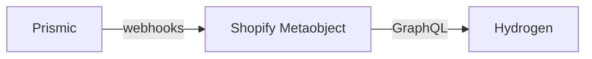
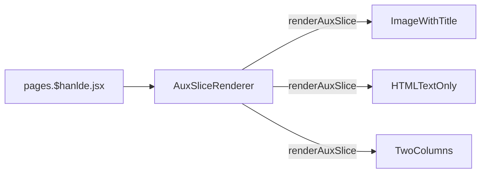

# About us

[[toc]]

## 数据源

该界面的数据源为 `Prismic`，[`#aux-aboutus`](https://aftershockpc.prismic.io/builder/pages/YECxIRAAACcAA8zx?s=published)




## 组件引用结构链

该界面的入口文件为 pages.$hanlde.jsx



>[!NOTE]
>`renderAuxSlice` 方法是 AuxSliceRenderer 组件的一个方法，负责分发所有组件，最后拼接为一个界面。

```bash
app\components\Slices\AuxPagesSlices\ImageWithTitle\index.jsx
app\components\Slices\AuxPagesSlices\HTMLTextOnly\index.jsx
app\components\Slices\AuxPagesSlices\TwoColumns\index.jsx
```

图中黄色文字表示颜色组件名称。


