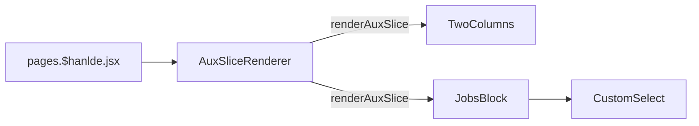

# Careers

[[toc]]

## 数据源

数据在 `Prismic` 中, [`#aux-careers`](https://aftershockpc.prismic.io/builder/pages/YGUBARAAACMAJdl4?s=published)

## 组件引用结构链

核心组件为 JobsBlock 组件，主要负责查看 aftershock 的招聘信息。



```bash
app\components\Slices\AuxPagesSlices\JobsBlock\index.jsx
app\components\Slices\AuxPagesSlices\JobsBlock\CustomSelect\index.jsx
```