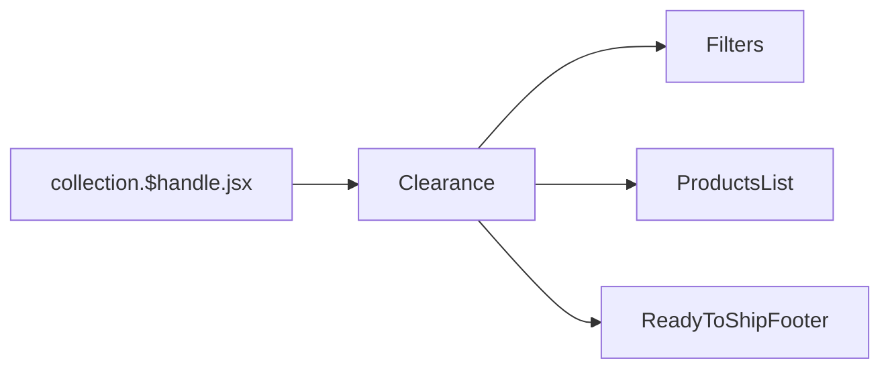

# Collection

[[toc]]

该界面主要展示 `现货` 的一些配件等。

## 数据源

是从 `Shopify` 获取到的现货信息，直接从 `Shopify` 中通过 `GraphQL` 查询。

> [!NOTE]
> 业务逻辑和 `RTS` 的差不多。

核心代码如下：

```javascript
const variables = {
  handle: `collection-clearance`,
};

// Выполняем первый запрос для получения коллекции и метаполей
const collectionData = await storefront.query(GetCollectionWithMetafields, {
  variables,
  cache: storefront.CacheLong(),
});

// Достаем значения из метаполей, проверяя, является ли значение JSON
const metafieldValues = collectionData.collectionByHandle?.metafields
  ?.map((mf) => {
    if (!mf?.value) return [];

    try {
      // Проверяем, является ли значение JSON (начинается с [ или { )
      if (mf.value.trim().startsWith("{") || mf.value.trim().startsWith("[")) {
        const parsed = JSON.parse(mf.value);
        return Array.isArray(parsed) ? parsed : [parsed]; // Всегда массив
      } else {
        return []; // Если это просто строка, игнорируем
      }
    } catch (error) {
      console.error(`Ошибка парсинга метаполя "${mf.key}":`, mf.value, error);
      return [];
    }
  })
  .flat() // Распаковываем массивы
  .filter((id) => id?.startsWith("gid://shopify/Metaobject/")); // Оставляем только корректные GID

// Запрашиваем метаобъекты по их GID
const metaobjectsData = await storefront.query(GetMetaobjectsByIds, {
  variables: { ids: metafieldValues },
  cache: storefront.CacheLong(),
});
```
## 组件引用结构链



```bash
app\components\Clearance\*
```

>[!NOTE]
>该页面的内容和 [Ready To Ship](./data-ready-to-ship.md) 神似