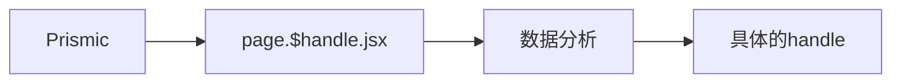
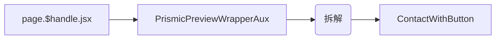

# Contact us 联系我们

[[toc]]

## 数据流

数据保存在 `Prismic` 中，[`#aux-contactus`](https://aftershockpc.prismic.io/builder/pages/ZMdk_REAACQAnDmw?s=published)

在 page.$handle.jsx 文件中与其他/page/页面一样统一调入数据。



> [!NOTE]
> 这里要注意的是，这里的数据实际上都是通过 hooks 的方式同步在了 shopify 的 metaobjects 上面，然后调用的。

## 组件引用结构链



- **PrismicPreviewWrapperAux**

  作为 wrapper 组件进行包裹

- **AuxSliceRenderer**

  AuxSliceRenderer 有一个机制就是拆解 pages 当中的所有 handle 然后根据 handle 引用了 ContactWithButton 组件

- **ContactWithButton**

  > [!INFO]
  > 该界面使用了 Live Chat 插件：[@frontapp/plugin-sdk](https://dev.frontapp.com/reference/installation)

  > [!WARNING]
  > 另外，从 root.jsx 入口文件中可以看到，该界面隐藏了右下角的聊天信息

  ```jsx
  useEffect(() => {
    if (isKnowledgeHub) {
      loadChatBot();
    } else {
      cleanupChatBot();
    }

    return () => {
      cleanupChatBot();
    };
  }, [isKnowledgeHub, location.pathname]);
  ```

  该组件的数据源头是 page.$handle.jsx.loader
