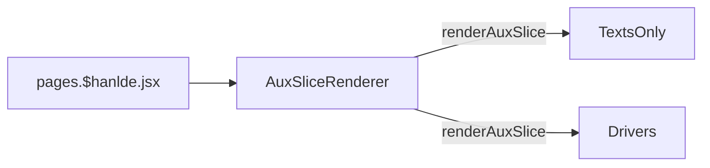

# Drivers 驱动下载

[[toc]]

## 数据源

数据在 `Prismic` 中维护以后，通过 `webhook` 保存到 `Shopify Metaobjects`，而后使用 `Storefront API` 调用，[`#aux-drivers`](https://aftershockpc.prismic.io/builder/pages/YGUNZBAAACAAJhCu?s=published)


## 组件引用结构链


```bash
app\components\Slices\AuxPagesSlices\TextsOnly\index.jsx
app\components\Slices\AuxPagesSlices\Drivers\index.jsx

```
