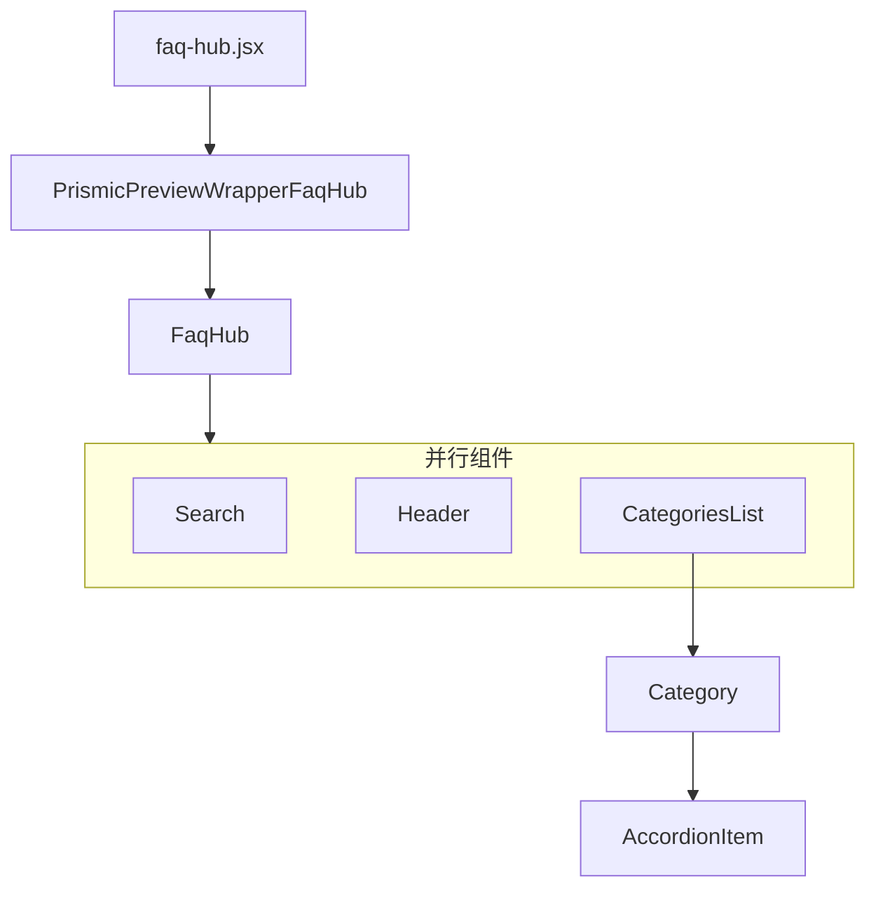

# FAQ Hub

[[toc]]

## 数据流

该界面数据依旧保留在 Prismic 当中。通过 webhooks 监听数据变更然后同步到 metaobjects 当中，而后通过网站调用。


获取数据的核心代码：

```jsx
if (previewData) {
  // code
} else {
  // Загружаем данные из Shopify только если нет preview данных
  const variables = {
    handle: { handle: "faq-hub", type: "prismic_cache_landing_page" },
  };

  const tempData = await storefront.query(GET_METAOBJECTS_BY_HANDLE, {
    variables,
    cache: storefront.CacheShort(),
  });

  prismicData = JSON.parse(
    tempData?.metaobject?.fields?.find((field) => field.key === "data")?.value
  );
}
```

> [!DANGER]
> 是不是可以使用环境变量解决这个问题，太烦了，好多生产环境无用的代码

**引用流程**

- 在 [Prismic](https://prismic.io/) 更新数据源
- 更新以后通过 [Prismic](https://prismic.io/) 的 [Webhooks](https://prismic.io/docs/webhooks) 调用 api（api 地址应该是在 admin app 当中开发过）
- 更新到 shopify 的 [Metaobjects](https://admin.shopify.com/store/aftershockpcau/content/metaobjects/entries/prismic_cache_global_data/99848782004)
- 然后在 [Hydrogen](https://hydrogen.shopify.dev/) 项目使用 [storefront Api](https://shopify.dev/docs/storefronts/headless/hydrogen/data-fetching)
- 最后在网站调用

> [!INFO]
> 值得注意的是，该界面一次性加载完了所有 FAQ。

## 组件引用结构链



```jsx
return (
  <PrismicPreviewWrapperFaqHub isPreviewMode={isPreview}>
    <>
      <FaqHub data={content.body} />
      {hiddenArticle}
    </>
  </PrismicPreviewWrapperFaqHub>
);
```

> [!WARNING]
> 这里有显示 hiddenArticle , 它是作为 SEO 优化的点，因为这种内容 SEO 比较容易抓取

- faq-hub.jsx 作为入口文件
- PrismicPreviewWrapperFaqHub 是外层包裹的 wrapper
  ```
  app\components\PrismicPreviewModes\PrismicPreviewWrapperFaqHub.jsx
  ```
- FaqHub 实际上是主要内容的入口

  ```
  app\components\FaqHub\index.jsx
  ```

  组件内部对于 FAQ 的信息进行了分组处理，并设定为可搜索。

  这里的搜索使用的是 filter，而不是 fuse.js，代码片段如下：

  ```jsx
  const filteredData = data
    .map((category) => {
      const filteredItems = category.items.filter((item) =>
        item.question.toLowerCase().includes(searchQuery.toLowerCase())
      );

      return {
        ...category,
        items: filteredItems,
      };
    })
    .filter((category) => category.items.length > 0);
  ```

  - Search 组件实际上就是一个 UI 组件，功能性比较单一，在产生搜索操作的时候返回方法到 FaqHub 组件，在 html 中进行回显。
    ::: code-group
    ```bash
    app\components\FaqHub\Search\index.jsx
    ```

    ```jsx
    Search searchQuery={searchQuery} setSearchQuery={setSearchQuery} />
      {searchQuery && (
        <div className="w-full max-w-[1440px] px-[48px] py-[16px] text-white">
          <div className="flex justify-between items-center font-dinpro text-[16px] text-[#e4e4e4]">
            Results Found:{' '}
            {filteredData.reduce(
              (count, category) => count + category.items.length,
              0,
            )}
            <div
              className="flex justify-center items-center"
              onClick={() => setSearchQuery('')}
            >
              <IoClose size={24} className="cursor-pointer" />
            </div>
          </div>
          <CategoriesList data={filteredData} searchQuery={searchQuery} />
        </div>
      )}
    ```
    :::
    >[!WARNING]
    >为毛没有做成组件呢？
  - Header 该组件主要用来展示分组列表，点击之后切换到指定的分组列表，与左侧 aside 组件是联动效果。

    ```bash
    app\components\FaqHub\Header\index.jsx
    ```
  - CategoriesList 该组件实际上是内容区域，通过在列表中折叠的方式展示FAQ的具体内容
    ```bash
    app\components\FaqHub\CategoriesList\index.jsx
    ```
    - Category 
      该组件就是手风琴效果的ItemCard

      ```bash
      app\components\FaqHub\CategoriesList\Category\index.jsx
      ```
