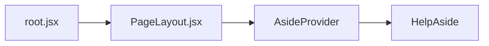
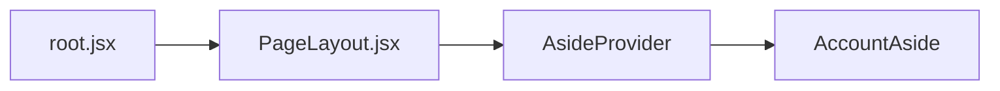
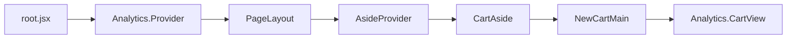
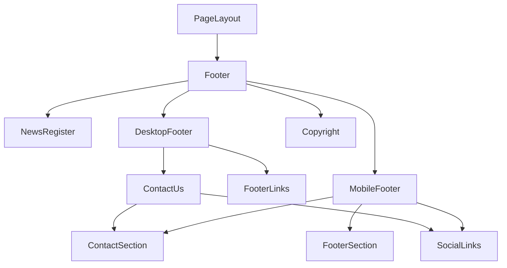

# Layout 全局数据流

[[toc]]

## Layout 头部内容 Header

### 横幅的内容

该组件主要用来提醒用户一些信息，例如促销活动等，点击之后直接进入地址。


#### 数据源

目前在 [Prismic](https://aftershockpc.prismic.io/builder/pages/Zip6gxcAAKUIv3ry?s=published) 维护活动的内容等。


##### 组件引用结构链

组件路径: app\components\Header\ShippingBanner\index.jsx

组件被调用的地方为 Header 组件，但是数据传入的地方为 root.jsx，关键代码如下：

1. 在 root.jsx 的 loader 中加载所有 Metaobjects 数据，其中就包含 shippingBanner 的数据，然后将数据传入到 PageLayout 组件

```jsx
// root.jsx
// 注意：这是代码片段 不是全部
// loader中加载
export async function loader(args) {
  const [criticalData, headerTemp, footerTemp] = await Promise.all([
    loadCriticalData(args),
    storefront.query(GET_METAOBJECTS_BY_HANDLE, {
      variables: headerVariables,
      cache: storefront.CacheLong(),
    }),
    storefront.query(GET_METAOBJECTS_BY_HANDLE, {
      variables: footerVariables,
      cache: storefront.CacheLong(),
    }),
  ]);

  const shippingBanner = header?.data?.body?.filter(
    (item) => item.slice_type === "shipping_banner"
  );

  return {
    shippingBanner: shippingBanner?.[0] || null,
  };
}

// 数据传入PageLayout
<PageLayout {...data}>{children}</PageLayout>;
```

2. 在 PageLayout 组件中调用 Header 组件并将数据传入

**AsideProvider** 是一个全局组件，它记录了很多状态类似于 Vue 的全局状态管理，Vuex 或者 Pinna，做了**全局状态共享**。

**AsideProvider**组件地址：app\components\Aside\AsideProvider\index.jsx

> Tips: [provider](https://react.dev/reference/react/createContext#provider)的使用

```jsx
// PageLayout/index.jsx
// 注意：这里是代码片段，不是全部
// 这里是数据注入的全过程
export function PageLayout({
  shippingBanner
}) {
  return (
    <AsideProvider
      {/* 这里将数据注入到AsideProvider中 */}
      shippingBanner={shippingBanner}
      customerAccessToken={customerAccessToken}
      isCustomerLoggedIn={isCustomerLoggedIn}
    >
      {formattedMenu && (
        <Header
          shippingBanner={shippingBanner}
        />
      )}
    </AsideProvider>
  )
}
```

3. 在 Header 组件的使用

```jsx
// Header/index.jsx
// 注意：这只是代码片段
import {useAside} from '../Aside/useAside';

export function Header({
  shippingBanner,
}) {
  // 使用全局状态
  const {type, close, isBannerVisible, isBannerLoaded, closeBanner} = useAside();
  // 使用shipingBanner组件
  return (
    {isBannerLoaded && isBannerVisible && (
      <ShippingBanner shippingBanner={shippingBanner} onClose={closeBanner} />
    )}
  )
}
```

### Logo

左上角 Logo 相关代码和引用关系

##### 数据源

静态数据，在组件中维护。

##### 组件引用结构链

- app\components\Header\index.jsx 👇
- app\components\Header\LogoLink\index.jsx

<details>
<summary>查看代码</summary>

```jsx
import { Link } from "@remix-run/react";
import { Image } from "@shopify/hydrogen";
import { useAside } from "~/components/Aside/useAside";

export function LogoLink() {
  const { close, setSelectedGamingCategory, setSelectedWorkstationsCategory } =
    useAside();
  const handleLogoClick = () => {
    close();
    setSelectedGamingCategory(null);
    setSelectedWorkstationsCategory(null);
  };
  return (
    <div
      className="flex justify-center items-center w-[147px] md:w-[167px] h-[36px]"
      onClick={handleLogoClick}
    >
      <Link
        to={"/"}
        className="flex items-center w-[167px] h-[36px]"
        prefetch="viewport"
      >
        {/* 图片地址 调用Hydrogen的Image组件 */}
        <Image
          src="https://cdn.shopify.com/s/files/1/0522/3320/7988/files/header_logo_5d52404a-f89d-4a2b-a73e-7b79d8dd8640.svg?v=1723189737"
          alt="Aftershock Logo"
          width={167}
          height={36}
          loading="eager"
        />
      </Link>
    </div>
  );
}
```

> Tips [Image 组件地址](https://shopify.dev/docs/api/checkout-extensions/post-purchase/components/image)

</details>

### Menu 桌面端(菜单栏)


#### 数据源

这里实际上是从[Metaobjects](https://admin.shopify.com/store/aftershockpcau/content/metaobjects/entries/prismic_cache_global_data/99848782004)调取的数据

**引用流程**

- 在 [Prismic](https://prismic.io/) 更新数据源 👇
- 更新以后通过 [Prismic](https://prismic.io/) 的 [Webhooks](https://prismic.io/docs/webhooks) 调用 api（api 地址应该是在 admin app 当中开发过） 👇
- 更新到 shopify 的 [Metaobjects](https://admin.shopify.com/store/aftershockpcau/content/metaobjects/entries/prismic_cache_global_data/99848782004) 👇
- 然后在 [Hydrogen](https://hydrogen.shopify.dev/) 项目使用 [storefront Api](https://shopify.dev/docs/storefronts/headless/hydrogen/data-fetching) 👌

如下图所示：


#### 组件引用结构链

1. app\root.jsx 中的调用以及组装流程 👇

```jsx
/** GET_METAOBJECTS_BY_HANDLE
export const GET_METAOBJECTS_BY_HANDLE = `
  query GetMetaobject($handle: MetaobjectHandleInput!) {
    metaobject(handle: $handle) {
      handle
      type
      fields {
        key
        value
      }
    }
  }
`;
 
*/

export async function loader(args) {
  const { storefront, env, customerAccount } = args.context;
  // code...
  const headerVariables = {
    handle: {
      handle: "navigation-main",
      type: "prismic_cache_global_data",
    },
  };

  // 获取菜单栏信息 -- headerTemp
  const [criticalData, headerTemp, footerTemp] = await Promise.all([
    loadCriticalData(args),
    storefront.query(GET_METAOBJECTS_BY_HANDLE, {
      variables: headerVariables,
      cache: storefront.CacheLong(),
    }),
    storefront.query(GET_METAOBJECTS_BY_HANDLE, {
      variables: footerVariables,
      cache: storefront.CacheLong(),
    }),
  ]);

  // 解析菜单栏信息
  const header = JSON.parse(
    headerTemp?.metaobject?.fields?.find((field) => field.key === "data")?.value
  );

  // 格式化菜单栏信息 menuFormatting的位置 -> helpers\menuFormatting.js
  const formattedMenu = header ? menuFormatting(header) : null;

  // 在loader中返回
  return {
    formattedMenu: formattedMenu || [],
  };
}

// 在PageLayout组件中注入数据 data是解构了数据
export function Layout({ children }) {
  // code
  const data = useRouteLoaderData("root"); // 解析loader的数据
  render(<PageLayout {...data}>{children}</PageLayout>);
  // code
}
```

> Tips [Remix React useRouteLoaderData('root')](https://remix.org.cn/docs/en/main/hooks/use-route-loader-data#userouteloaderdata)

> Tips [Hydrogen storefront 文档](https://shopify.dev/docs/storefronts/headless/hydrogen/data-fetching)

> Tips [createStorefrontClient](https://shopify.dev/docs/api/hydrogen/latest/utilities/createstorefrontclient?utm_source=chatgpt.com)

2. app\components\PageLayout.jsx 中的调用 👇

```jsx
import { Header } from "./Header";

export function PageLayout({
  // other code ...
  formattedMenu,
  // other code ...
}) {
  return (
    <AsideProvider
      shippingBanner={shippingBanner}
      customerAccessToken={customerAccessToken}
      isCustomerLoggedIn={isCustomerLoggedIn}
    >
      <HelpAside />
      <AccountAside
        isLoggedIn={isLoggedIn}
        isCustomerLoggedIn={isCustomerLoggedIn}
      />
      <CartAside />
      <SearchAside />
      <LanguageAside />
      <MobileMenuAside
        header={header}
        publicStoreDomain={publicStoreDomain}
        formattedMenu={formattedMenu}
        isLoggedIn={isLoggedIn}
        isCustomerLoggedIn={isCustomerLoggedIn}
      />
      {/* 调用Header组件，在Header组件中注入数据 formattedMenu */}
      {formattedMenu && (
        <Header
          isLoggedIn={isLoggedIn}
          publicStoreDomain={publicStoreDomain}
          formattedMenu={formattedMenu}
          shippingBanner={shippingBanner}
          isCustomerLoggedIn={isCustomerLoggedIn}
        />
      )}
      <main>{children}</main>
      <Footer
        publicStoreDomain={publicStoreDomain}
        formattedFooter={formattedFooter}
      />
    </AsideProvider>
  );
}
```

3. app\components\Header\index.jsx 中调用 👇

```jsx
// Header 组件接收 formattedMenu 参数
export function Header({
  isLoggedIn,
  publicStoreDomain,
  formattedMenu,
  shippingBanner,
  isCustomerLoggedIn,
}) {
  // other code ...
  return (
    <>
      {isBannerLoaded && isBannerVisible && (
        <ShippingBanner shippingBanner={shippingBanner} onClose={closeBanner} />
      )}
      <header
        className={`flex justify-center items-center w-full h-[66px] p-[5px] mobile-sm:p-[16px] z-20 sticky left-0 transition-all duration-300 ${
          isBannerLoaded && isBannerVisible ? "top-[32px]" : "top-[0]"
        } ${isAsideOpen ? "bg-black tablet-lg:bg-[#242424]" : "bg-[#242424]"}`}
      >
        <div className="flex justify-between items-center py-0 w-full max-w-[1440px]">
          <LogoLink />
          <DesktopMenu
            menuStructure={formattedMenu}
            {/*
              menu={menu}
              primaryDomainUrl={header.shop.primaryDomain.url}
            */}
            publicStoreDomain={publicStoreDomain}
            isAsideOpen={isAsideOpen}
          />
          <HeaderCtas
            isLoggedIn={isLoggedIn}
            cart={cart}
            activeLinkStyle={activeLinkStyle}
            isCustomerLoggedIn={isCustomerLoggedIn}
          />
        </div>
      </header>
    </>
  );
}
```

4. app\components\Header\DesktopMenu\index.jsx 中调用

参数**menuStructure**为菜单栏的数据

```jsx
import { useAside } from "~/components/Aside/useAside";
import { FirstLevelMenu } from "./FirstLevelMenu";
import { memo } from "react";

const DesktopMenu = memo(function DesktopMenu({
  menuStructure,
  menu,
  primaryDomainUrl,
  viewport,
  publicStoreDomain,
  isAsideOpen,
}) {
  return (
    <nav
      className={`hidden tablet-lg:flex w-[60%] h-[66px] justify-evenly items-center text-white ${
        isAsideOpen ? "cursor-default" : ""
      }`}
      role="navigation"
    >
      <FirstLevelMenu menuStructure={menuStructure} />
    </nav>
  );
});

export { DesktopMenu };
```

5. 然后 **FirstLevelMenu** 组件中调用数据，并最终与以下组件完成组合

   - **FirstLevelMenu**

     app\components\Header\DesktopMenu\FirstLevelMenu\index.jsx

     

   - **SecondLevelMenu**

     app\components\Header\DesktopMenu\SecondLevelMenu\index.jsx

     

   - **ThirdLevelMenu**

     app\components\Header\DesktopMenu\ThirdLevelMenu\index.jsx

     

   - **InfoBox**

     app\components\Header\DesktopMenu\InfoBox\index.jsx

     

   - **RTSMenu**

     app\components\Header\DesktopMenu\ThirdLevelMenu\index.jsx

     

   - **DefaultMenu**

     app\components\Header\DesktopMenu\ThirdLevelMenu\DefaultMenu\index.jsx

     

   - **AccessoriesMenu**

     app\components\Header\DesktopMenu\ThirdLevelMenu\AccessoriesMenu\index.jsx

     

### Menu 移动端(菜单栏)


#### 数据源

这里实际上也是从[Metaobjects](https://admin.shopify.com/store/aftershockpcau/content/metaobjects/entries/prismic_cache_global_data/99848782004)调取的数据

#### 组件引用结构链

1. app\root.jsx 中的调用以及组装流程 👇

```jsx
/** GET_METAOBJECTS_BY_HANDLE
export const GET_METAOBJECTS_BY_HANDLE = `
  query GetMetaobject($handle: MetaobjectHandleInput!) {
    metaobject(handle: $handle) {
      handle
      type
      fields {
        key
        value
      }
    }
  }
`;
 
*/

export async function loader(args) {
  const { storefront, env, customerAccount } = args.context;
  // code...
  const headerVariables = {
    handle: {
      handle: "navigation-main",
      type: "prismic_cache_global_data",
    },
  };

  // 获取菜单栏信息 -- headerTemp
  const [criticalData, headerTemp, footerTemp] = await Promise.all([
    loadCriticalData(args),
    storefront.query(GET_METAOBJECTS_BY_HANDLE, {
      variables: headerVariables,
      cache: storefront.CacheLong(),
    }),
    storefront.query(GET_METAOBJECTS_BY_HANDLE, {
      variables: footerVariables,
      cache: storefront.CacheLong(),
    }),
  ]);

  // 解析菜单栏信息
  const header = JSON.parse(
    headerTemp?.metaobject?.fields?.find((field) => field.key === "data")?.value
  );

  // 格式化菜单栏信息 menuFormatting的位置 -> helpers\menuFormatting.js
  const formattedMenu = header ? menuFormatting(header) : null;

  // 在loader中返回
  return {
    formattedMenu: formattedMenu || [],
  };
}

// 在PageLayout组件中注入数据 data是解构了数据
export function Layout({ children }) {
  // code
  const data = useRouteLoaderData("root"); // 解析loader的数据
  render(<PageLayout {...data}>{children}</PageLayout>);
  // code
}
```

> Tips [Remix React useRouteLoaderData('root')](https://remix.org.cn/docs/en/main/hooks/use-route-loader-data#userouteloaderdata)

> Tips [Hydrogen storefront 文档](https://shopify.dev/docs/storefronts/headless/hydrogen/data-fetching)

> Tips [createStorefrontClient](https://shopify.dev/docs/api/hydrogen/latest/utilities/createstorefrontclient?utm_source=chatgpt.com)

2. app\components\PageLayout.jsx 中的调用 👇

```jsx
import { Header } from "./Header";

export function PageLayout({
  // other code ...
  formattedMenu,
  // other code ...
}) {
  return (
    <AsideProvider
      shippingBanner={shippingBanner}
      customerAccessToken={customerAccessToken}
      isCustomerLoggedIn={isCustomerLoggedIn}
    >
      {/* 调用MobileMenuAside组件，并在组件中注入数据 formattedMenu */}
      <MobileMenuAside
        header={header}
        publicStoreDomain={publicStoreDomain}
        formattedMenu={formattedMenu}
        isLoggedIn={isLoggedIn}
        isCustomerLoggedIn={isCustomerLoggedIn}
      />
      <Footer
        publicStoreDomain={publicStoreDomain}
        formattedFooter={formattedFooter}
      />
    </AsideProvider>
  );
}
```

3. app\components\Aside\MobileMenuAside\index.jsx 中使用 👇

```jsx
export function MobileMenuAside({
  // others code
  formattedMenu,
  // others code
}) {
  const mainLinks = formattedMenu
    .filter((item) => item.primary.title.toLowerCase() !== "special offers")
    .map((item) => item.primary);

  const tempMainLinks = formattedMenu
    .filter((item) => item.primary.title.toLowerCase() !== "special offers")
    .map((item) => item);

  const specialOffers = formattedMenu.filter(
    (item) => item.primary.title.toLowerCase() === "special offers"
  );

  // Aside组件内使用
  <Aside type="mobile" heading="MENU" menuStructure={formattedMenu}>
    {/* 使用的业务逻辑 */}
  </Aside>;
}
```

4. 然后与**MobileMenuFooter**组件组合最终完成了菜单栏的设计。

### 搜索栏

该搜索栏在输入内容之后会根据内容查询对应的商品列表


---

#### 组件引用结构链

该组件的调用路径为 root.jsx/PageLayout/Header/HeaderCtas

父组件地址：app\components\Header\HeaderCtas\index.jsx

组件地址有两个：

- PC 端

app\components\Header\HeaderCtas\SearchComponent\index.jsx


- 移动端

app\components\Header\HeaderCtas\SearchToggle\index.jsx


- 最后都调用了 **SearchFormPredictive** 组件

组件地址：app\components\Search\SearchResults\index.jsx

- SearchResults 组件调用了 Remix 的组件

```jsx
import { useFetcher } from "@remix-run/react";

const fetcher = useFetcher({ key: "search" });
```

> Tips: [useFetcher(params)](https://remix.org.cn/docs/en/main/hooks/use-fetcher)

---

#### 数据流

在用户输入了相关的搜索关键词以后开始调用查询，查询的规则如下：

1. 组成查询条件如下：
   - 查询的关键词
   - 最匹配的前五条数据
   - 并开启预查询
2. 组成调用的方法、地址
3. 执行查询

```jsx
export const SEARCH_ENDPOINT = "/search";

function executeSearch(event) {
  event.preventDefault();
  if (inputRef?.current?.value) {
    fetchResults({ target: { value: inputRef.current.value } });
  }
}

function fetchResults(event) {
  fetcher.submit(
    { q: event.target.value || "", limit: 5, predictive: true },
    { method: "GET", action: SEARCH_ENDPOINT }
  );
}
```

4. 接口地址 **/search** 的来源：

组件地址: app\routes\search.jsx

因为 remix 就是服务端语言，因此它在 search.jsx 中做了一个搜索接口去查询内容。

搜索的核心代码如下：

```javascript
async function predictiveSearch({ request, context }) {
  // 代码太多建议直接去看
}
```

> Tips: 这里大量使用了 [Graphql](https://graphql.cn/)

> Tips: 需要去看[search](https://shopify.dev/docs/api/storefront/latest/queries/search)的相关代码

> Tips: 另外还要去查看 [Hydrogen Graphi](https://shopify.dev/docs/storefronts/headless/hydrogen/data-fetching/graphiql#graphiql)

### 地区切换

#### 数据源

数据为静态数据，在项目内维护，做了引用

数据路径: utils\constants\countryLinks.js

```jsx
export const countryLinks = [
  {
    code: "au",
    name: "Australia",
    flag: "https://cdn.shopify.com/s/files/1/0522/3320/7988/files/flag-australia.png?v=1713807308",
  },
  {
    code: "sg",
    name: "Singapore",
    flag: "https://cdn.shopify.com/s/files/1/0522/3320/7988/files/flag-singapore.png?v=1713807333",
    link: "https://www.aftershockpc.com/",
  },
];
```

#### 组件引用结构链

1. 在 PageLayout 中直接引用

```jsx
export function PageLayout() {
  return (
    <AsideProvider>
      <LanguageAside />
    </AsideProvider>
  );
}
```

2. **LanguageAside** 组件

组件地址: app\components\Aside\LanguageAside\index.jsx

具体的业务流程参照具体代码即可，比较简单。

### 即时消息

在点击查看即时消息的时候会有以下选项

- （Live Chat）在线聊天工具，
- （Knowledge Hub）帮助中心
- （Flagship Showroom）展厅信息
- （Contact Us）联系我们
- Check Your Build Status

#### 插件

[@frontapp/plugin-sdk](https://dev.frontapp.com/reference/installation)

其中在线聊天工具就使用到了 [FrontApp](https://front.com/) 这个工具，它是在官网注入相关代码之后，用户在 aftershock 和客服在 frontapp 后台聊天

> [!INFO]
> Tips: 也许我们后续还可以对用户在线聊天的信息进行数据分析，得出一些结论，方便做商业规划，[查看建议方案](./suggestion.md)

> FrontApp 的 ChartId dcccf16bf7f8867dc9516ad40e69defe

> [!DANGER]
> Tips: 这些敏感信息是不是可以存储到 metaobjects 中呢？

<details>
<summary>查看引入的代码</summary>

```jsx
// root.jsx
// 延迟加载过程 优化首页加载速度
return (
  <script
    nonce={nonce}
    dangerouslySetInnerHTML={{
      __html: `
      (function() {
        var isMobile = /Android|webOS|iPhone|iPad|iPod|BlackBerry|IEMobile|Opera Mini/i.test(navigator.userAgent) || window.innerWidth < 768;
        var loadScriptsOnIdle = function() {
          if (!isMobile) return;
          
          var loaded = false;
          var loadOnInteraction = function() {
            if (loaded) return;
            loaded = true;
            
            // Для мобильных - используем requestIdleCallback с большей задержкой для снижения TBT
            var idleCallback = window.requestIdleCallback || function(cb) { return setTimeout(cb, 10000); };
            
            idleCallback(function() {
              // Klaviyo - отложенная загрузка
              var klaviyo = document.createElement('script');
              klaviyo.id = 'klaviyo-js';
              klaviyo.src = 'https://static.klaviyo.com/onsite/js/MvXF9E/klaviyo.js';
              klaviyo.async = true;
              klaviyo.defer = true;
              document.head.appendChild(klaviyo);
              
              // Instant Pixel - отложенная загрузка
              var instant = document.createElement('script');
              instant.id = 'instant-pixel';
              instant.innerHTML = '!function(i,n,s,t,a,u,d){i.InstantConfig=i.InstantConfig||{},d=i.InstantJS=i.InstantJS||{},d.trackQueue=[],d.track=function(){d.trackQueue.push(arguments)},u=n.createElement(s),u.async=!0,u.src=t,a=n.getElementsByTagName(s)[0],a.parentNode.insertBefore(u,a)}(window,document,"script","https://cdn.instant.one/instant.js?siteId=site_d0215b799aeb40159179ee9562bd38c1");';
              document.head.appendChild(instant);
            }, { timeout: 12000 });
          };
          
          // Загружаем при первом взаимодействии или через 12 секунд (увеличено для мобильных)
          window.addEventListener('scroll', loadOnInteraction, {passive: true, once: true});
          window.addEventListener('click', loadOnInteraction, {once: true});
          window.addEventListener('touchstart', loadOnInteraction, {passive: true, once: true});
          setTimeout(loadOnInteraction, 12000);
        };
        
        if (document.readyState === 'loading') {
          document.addEventListener('DOMContentLoaded', loadScriptsOnIdle);
        } else {
          loadScriptsOnIdle();
        }
      })();
    `,
    }}
  />
);
```

</details>

<details>
<summary>查看初始化的代码</summary>

```jsx
useEffect(() => {
  if (isKnowledgeHub) {
    loadChatBot();
  } else {
    cleanupChatBot();
  }

  return () => {
    cleanupChatBot();
  };
}, [isKnowledgeHub, location.pathname]);

useEffect(() => {
  // Отложенная загрузка чата - только после взаимодействия пользователя
  let chatInitialized = false;
  const initializeChat = () => {
    if (chatInitialized) return;
    chatInitialized = true;

    if (!window.FrontChat) {
      const script = document.createElement("script");
      script.src = "https://chat-assets.frontapp.com/v1/chat.bundle.js";
      script.async = true;
      script.onload = () => {
        window.FrontChat("init", {
          chatId: "dcccf16bf7f8867dc9516ad40e69defe",
          useDefaultLauncher: false,
        });
      };
      document.body.appendChild(script);
    } else {
      window.FrontChat("init", {
        chatId: "dcccf16bf7f8867dc9516ad40e69defe",
        useDefaultLauncher: false,
      });
    }
  };

  // Загружаем чат после первого взаимодействия пользователя (scroll, click, touch)
  const loadOnInteraction = () => {
    initializeChat();
    window.removeEventListener("scroll", loadOnInteraction, {
      passive: true,
    });
    window.removeEventListener("click", loadOnInteraction);
    window.removeEventListener("touchstart", loadOnInteraction, {
      passive: true,
    });
  };

  // Загружаем чат с задержкой после загрузки страницы (3 секунды)
  const timeoutId = setTimeout(initializeChat, 3000);

  // Или загружаем при взаимодействии пользователя
  window.addEventListener("scroll", loadOnInteraction, {
    passive: true,
    once: true,
  });
  window.addEventListener("click", loadOnInteraction, { once: true });
  window.addEventListener("touchstart", loadOnInteraction, {
    passive: true,
    once: true,
  });

  return () => {
    clearTimeout(timeoutId);
    window.removeEventListener("scroll", loadOnInteraction);
    window.removeEventListener("click", loadOnInteraction);
    window.removeEventListener("touchstart", loadOnInteraction);
    if (window.FrontChat) {
      window.FrontChat("shutdown");
    }
  };
}, [location.pathname]);

const loadChatBot = () => {
  const script = document.createElement("script");
  script.src = "https://chat-assets.frontapp.com/v1/chat.bundle.js";
  script.async = true;

  script.onload = () => {
    setTimeout(() => {
      if (window.FrontChat) {
        window.FrontChat("init", {
          chatId: "8a72f257b6dd910d3480a3c083486bbc",
          useDefaultLauncher: true,
        });
      }
    }, 500);
  };

  document.body.appendChild(script);
};
```

</details>

在 entry.server.jsx 配置相关头

```jsx
// 包含frontapp的域名信息
// 代码片段
import {
  buildCSPHeader,
  mergeCSPDirectives,
  newDirectives,
  parseCSPHeader,
} from "utils/cspUtils";

export default async function handleRequest() {
  const finalDirectives = mergeCSPDirectives(baseDirectives, newDirectives);
  const finalCSPHeader = buildCSPHeader(finalDirectives);
  responseHeaders.set("Content-Security-Policy", finalCSPHeader);
}
```

#### 数据源

1. Live Chat 的数据源在 [FrontApp](https://front.com/) 但是可以使用 [API](https://dev.frontapp.com/reference/installation) 调用
2. [Knowledge Hub](./data-knowledge-hub.md) 链接到对应的页面，[功能说明](./routes-knowledge-hub.md)
3. [Flagship Showroom](./data-flagship-showroom.md) 点击之后跳转到对应的页面
4. [Contact Us](./data-contact-us.md) 点击之后跳转到联系我们界面
5. Check Your Build Status 在获取到表单数据之后携带数据跳转到 [order-tracker]('./data-order-tracker.md') 界面

#### 组件引用结构链



### 用户中心

#### 数据源

- 登录功能
- 注册功能

### 组件引用结构链



> [!INFO] >**AsideProvider** 组件是数据共享的一个组件，具体可参照 [React 文档](https://react.docschina.org/reference/react/createContext#provider)

- AccountAside 在登录的时候调用组件负责表单提交 LoginForm 组件完成用户登录

  ```jsx
  const handleSubmit = async (e) => {
    e.preventDefault();
    setLoading(true);
    setError("");
    setMessage("");

    try {
      const response = await fetch("/account/login", {
        method: "POST",
        headers: {
          "Content-Type": "application/json",
        },
        body: JSON.stringify({ email, password }),
      });

      const result = await response.json();

      if (result.success) {
        setMessage("Login successful!");
        // setFormState('profile'); // Переключение на профиль или нужный маршрут
        setIsCustomerLoggedIn(true);
        navigate(window.location.pathname);
      } else {
        setError(result.error || "An error occurred during login.");
      }
    } catch (error) {
      setError("An unexpected error occurred.");
    } finally {
      setLoading(false);
    }
  };
  ```

- AccountAside 在注册的时候调用组件负责表单提交 RegisterForm 组件完成用户注册

  ```jsx
  const handleSubmit = async (e) => {
    e.preventDefault();
    setLoading(true);
    setError("");
    setMessage("");

    const isValid = await validateForm();
    if (!isValid) {
      setLoading(false);
      return;
    }

    const formData = {
      firstName: firstName.trim(),
      lastName: lastName.trim(),
      email: email.toLowerCase().trim(),
      password,
      confirmPassword,
      subscribe,
    };

    setMessage("Creating your account... Please wait.");

    try {
      const response = await fetch("/account/register", {
        method: "POST",
        headers: { "Content-Type": "application/json" },
        body: JSON.stringify(formData),
      });

      const result = await response.json();

      if (result.success) {
        setMessage(
          result.message || "Account created successfully! Please log in."
        );

        const verificationTimeout = setTimeout(async () => {
          const checkResult = await checkAccountExists(formData.email);
          if (checkResult.exists && checkResult.customer) {
            setMessage((prev) => prev + " Account verified.");
          } else {
            setMessage(
              (prev) =>
                prev +
                " Account created successfully. Verification may take a few minutes."
            );
          }
        }, 1000);

        const redirectTimeout = setTimeout(() => {
          setFormState("login");
        }, 2500);

        timeoutsRef.current.push(verificationTimeout, redirectTimeout);
      } else {
        setError(result.error || "An error occurred. Please try again.");
      }
    } catch {
      setError("An unexpected error occurred. Please try again later.");
    } finally {
      setLoading(false);
    }
  };
  ```

- AccountAside 在重置密码的时候调用 PasswordResetForm 组件完成用户重置密码

  ```jsx
  <fetcher.Form
    method="post"
    action="/account/passwordReset"
    className="flex flex-col gap-4 w-full"
  >
  <!-- code -->
  </fetcher.Form>
  ```

### 购物车

#### 数据源

1. 在 root.jsx 中先从`contenxt`中获取

```jsx
const { customerAccount, cart } = context;
const customerAccessToken = context.session.get("customerAccessToken");
```

2. 购物车数据 (cartData)

```jsx
async function getCart() {
  return await cart.get();
}
const cartData = await getCart();
```

3. 过滤特定产品的逻辑

```jsx
const nonTracked = cartData.lines.nodes
  .filter(
    (node) =>
      node.merchandise?.product?.handle?.includes("shipping-protection") ||
      node.merchandise?.product?.handle?.includes("payment-fee")
  )
  .map((cl) => cl.id);
```

#### 组件引用结构链

> [!INFO]
> 这里需要特别注意的是使用到了 shopify 的 hydrogen 组件的 [Analytics.Provider](https://shopify.dev/docs/api/hydrogen/2024-04)和[Analytics.CartView](https://shopify.dev/docs/api/hydrogen/2024-04/components/analytics/analytics-cartview)组件



## Footer 组件

### 数据源

footer 组件的数据源实际上跟 header 的一模一样，因为都是从 metaobjects 中取的

```jsx
const [footerTemp] = await Promise.all([
  storefront.query(GET_METAOBJECTS_BY_HANDLE, {
    variables: footerVariables,
    cache: storefront.CacheLong(),
  }),
]);

const footer = JSON.parse(
  footerTemp?.metaobject?.fields?.find((field) => field.key === "data")?.value
);

const formattedFooter = footer ? footerFormatting(footer?.data?.body) : null;

// 然后再 PageLayout 中注入...
<PageLayout {...data}>{children}</PageLayout>;
```

### 组件引用结构链



- NewsRegister 是订阅邮箱的组件，核心代码就是调用表单提交，发起订阅:

::: code-group

```javascript
const handleSubmit = async (e) => {
  e.preventDefault();

  if (
    email.match(
      /^[a-zA-Z0-9.!#$%&’*+/=?^_`{|}~-]+@[a-zA-Z0-9-]+(?:\.[a-zA-Z0-9-]+)*$/
    )
  ) {
    setError(false);
    const response = await fetch("/api/newsRegister", {
      method: "POST",
      headers: {
        "Content-Type": "application/x-www-form-urlencoded",
      },
      body: new URLSearchParams({ email }),
    });

    const result = await response.json();
    if (response.ok) {
      setSuccess(true);
      setEmail("");
    } else {
      setError(true);
      setErrorMessage(result.error || "Subscription failed.");
    }
  } else {
    setError(true);
    setErrorMessage("Please enter a valid e-mail address");
  }
};
```

```
app\components\Footer\NewsRegister\index.jsx
```
:::

其中该服务也开发了订阅的入口接口 app\routes\api.newsRegister.jsx，此处更新了数据到了[instant one](https://www.instant.one/)(我不太确定，因为还是没看到具体的数据流向)

- DesktopFooter PC端展示 Footer 数据
- MobileFooter 移动端展示 Footer 数据
- Copyright 展示版权信息
- SocialLinks 的数据属于静态文件