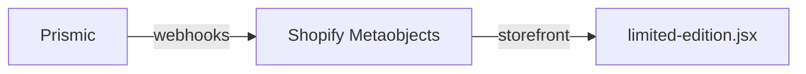
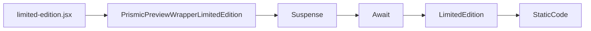

# Limited Edition (限量版)

## 数据源

该界面的数据 `Schema` 在 `Prismic` 当中维护。通过 `Prismic` 的 `webhooks` 同步到 Shopify，而后通过 `storefront API` 调用。[#limited-edition](https://aftershockpc.prismic.io/builder/pages/ZUsBFRYAACYAGr4e?s=published)

调用结构如下：

## 组件引用结构链

>[!NOTE]
>该页面上可以注入静态 html 代码

>[!NOTE]
>插件（组件）文档传送门: [Suspense](https://zh-hans.react.dev/reference/react/Suspense)、[react-loading-skeleton](https://github.com/dvtng/react-loading-skeleton)、[Await](https://remix.org.cn/docs/en/main/components/await)
