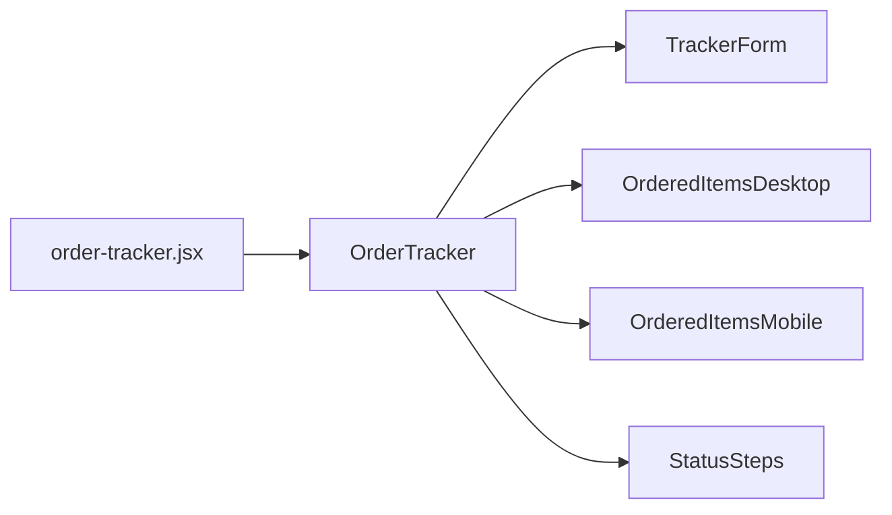

# Order tracker

[[toc]]

订单追踪界面

## 数据源


## 组件引用结构链


>[!NOTE]
>此处使用到了 [Skeleton](https://github.com/dvtng/react-loading-skeleton) 组件，这是一个三方组件。

```bash
app\components\OrderTracker\index.jsx
app\components\OrderTracker\TrackerForm\index.jsx
```

### TrackerForm

- 登录状态

    页面加载时立即查询100个订单 → 缓存到前端 → 用户搜索时在前端查找

    ```mermaid
        flowchart LR
        进入界面 --> 加载前100条 --> 前端查询 --> 返回结果
    ```
    

- 未登录状态
    
    用户输入订单号和邮箱 → 点击查询 → 调用API /api/track-order

    ```mermaid
        flowchart LR
        进入界面 --> OR[Order No] --> API
        进入界面 --> Email --> API

        API --> 前100条 --> 前端查询 --> 返回结果
    ```

>[!CAUTION]
>目前不管是登录或者是未登录状态，都有个问题就是，用户只能从前100条订单中去查询他（她）的订单信息，[查看替代方案](./suggestion#trackerform-缺陷)

### /api/track-order 接口

该接口属于自定义接口，接口业务逻辑的地址在routes当中:

```bash
app\routes\api.track-order.jsx
```