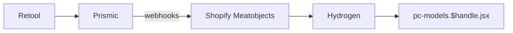
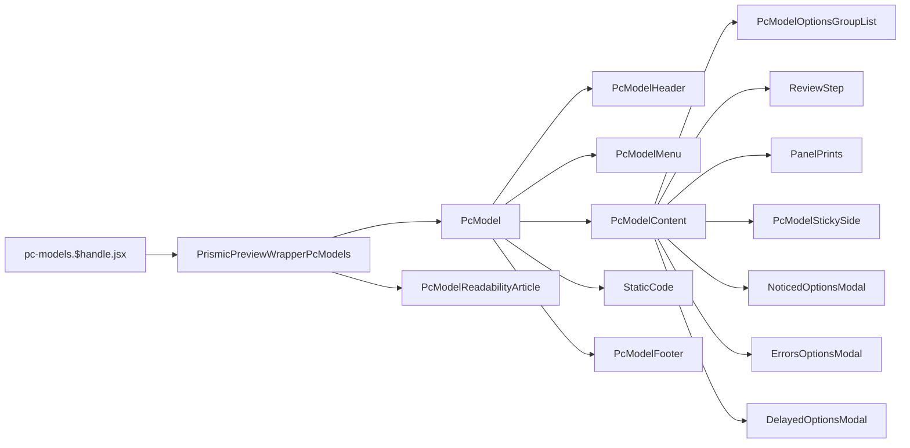

# Custom

[[toc]]

该界面主要为用户展示 `Aftershock` 可定制商品的能力。

## 数据源

pc-models 的数据保存在 `Retool` 当中，但是它会在用户操作了 `Prismic` 之后，同步到 `Prismic` 中去，而后 `Prismic` 通过 `webhooks` 同步到 `Shopify Metaobjects`，最后使用 `Storefront API` 调用到 `Hydrogen` 做渲染。



使用 `Prismic` 数据的地方有：

1. `Shopify Metaobjects` 的 `#custom_pc_search_cache`
2. `Shopify Metaobjects` 的 `#prismic_cache_pc_model_pages`
3. `Shopify Metaobjects` 的 `#prismic_cache_panel_prints`
4. `Shopify Metaobjects` 的 `#custom_pc_cache`
5. `Shopify Metaobjects` 的 `#prismic_cache_panel_prints`

```javascript
// pc-models.$handle.jsx
export async function loader({ params, context }) {
  const query = `
    query GetMetaobject($handle: MetaobjectHandleInput!) {
      metaobject(handle: $handle) {
        handle
        type
        fields {
          key
          value
        }
      }
    }
  `;
  const variables = {
    handle: {handle: params.handle, type: 'custom_pc_search_cache'},
  };

  const tempData = await fetchWithTimeout(// [!code error]
    context.storefront.query(query, {// [!code error]
      variables,// [!code error]
      cache: context.storefront.CacheLong(), //  [!code error]
    }), //  [!code error]
  ); // [!code error]
 // [!code error]
  if (  // [!code error]
    JSON.parse( // [!code error]
      tempData?.metaobject?.fields?.find((field) => field.key === 'data') // [!code error]
        ?.value, // [!code error]
    ).price >= 99999 // [!code error]
  ) { // [!code error]
    return redirect('/404'); // [!code error]
  } // [!code error]


  const prismicVariables = {
    handle: {handle: params.handle, type: 'prismic_cache_pc_model_pages'},
  };

  const tempPrismicData = await context.storefront.query(query, {
    variables: prismicVariables,
    cache: context.storefront.CacheShort(),
  });
}

async function loadCriticalData(params, context, prismicData) {
  const query = `
    query GetMetaobject($handle: MetaobjectHandleInput!) {
      metaobject(handle: $handle) {
        handle
        type
        fields {
          key
          value
        }
      }
    }
  `;

  const variables = {
    handle: {handle: params.handle, type: 'custom_pc_cache'},
  };

  const pcConfigVariables = {
    handle: {handle: 'pc-config', type: 'prismic_cache_global_data'},
  };

  // const prismicVariables = {
  //   handle: {handle: params.handle, type: 'prismic_cache_pc_model_pages'},
  // };

  const panelPrintsVariables = {
    handle: {handle: params.handle, type: 'prismic_cache_panel_prints'},
  };

  const [
    // prismicData,
    pcConfig,
    tempData,
    panelPrintsImages,
  ] = await Promise.allSettled([
    // fetchWithTimeout(
    //   storefront.query(query, {
    //     variables: prismicVariables,
    //     cache: storefront.CacheShort(),
    //   }),
    // ),
    fetchWithTimeout(
      storefront.query(GET_METAOBJECTS_BY_HANDLE, {
        variables: pcConfigVariables,
        cache: storefront.CacheShort(),
      }),
    ),
    fetchWithTimeout(
      storefront.query(query, {variables, cache: storefront.CacheLong()}),
    ),
    fetchWithTimeout(
      storefront.query(GET_METAOBJECTS_BY_HANDLE, {
        variables: panelPrintsVariables,
        cache: storefront.CacheShort(),
      }),
    ),
  ]);
}
```

>[!DANGER]
>注意到上面标红的代码表示如果价格超过 `99999` 则表示不在规则范围内，丢弃。

### 实际、对比价组成

`基础价 + 配件价`

```javascript
// pc-models.$handle.jsx
setDynamicPrice(basePrice + optionsPrice);
setDynamicCompareAt(baseCompareAt + optionsCompareAt);
```

### 定制内容提交

- 第一步：检查是否已存在产品，如果包含已有的组合。
  - `存在`：检查价格是否跟当前一样，如果不一样则更新价格。然后执行搜索。
  - `不存在`：创建产品后执行搜索。

- 第二步：返回存在的产品的 Object，并加入购物车。

这里用到了三个 `API`
```bash
/api/searchProduct --> api.createProduct.jsx
/api/updateProductPrice --> api.updateProductPrice.jsx
/api/createProduct --> api.searchProduct.jsx
```

### 核心内容

#### [Apollo](https://www.apollographql.com/docs/) 

因为用户没有单独创建定制化产品的权限，所以这里使用 `Apollo` 创建了虚拟的admin，调用了 `admin` 服务，做了增、改、查的工作。

这个还是挺有想法的。 

```javascript
import {ApolloClient, InMemoryCache, HttpLink} from '@apollo/client/core';

export const createAdminClient = (shopifyAdminURL, shopifyAccessToken) => {
  return new ApolloClient({
    link: new HttpLink({
      uri: shopifyAdminURL,
      headers: {
        'X-Shopify-Access-Token': shopifyAccessToken,
        'Content-Type': 'application/json',
        Accept: 'application/json',
        'User-Agent': 'MyApp/1.0',
      },
    }),
    cache: new InMemoryCache(),
  });
};

```


### 选配校验逻辑

#### 库存检查 (Out of Stock)

- 检查oosIds数组中是否有缺货组件
- 如果有，自动跳转到第一个缺货组件的配置步骤
- 将所有缺货组件添加到noticedOptions中通知用户
---
#### 错误去重机制

- 使用isDuplicateError防止重复错误
- 基于错误的具体属性（from, to, attrName等）进行比较

#### 选配逻辑检查

---
- ##### 水冷系统与GPU定制检查

  - 检查是否选择了水冷CPU散热系统
  - 检查是否选择了GPU定制
  - 如果选了GPU定制但没选水冷，提示建议升级到水冷

- ##### 高性能GPU电缆提示

  - 检查是否有功耗>650W的GPU
  - 如果有高功耗GPU且没有选择基础电缆，提示缺少电缆套袖

- ##### 操作系统与RAM兼容性

  - 检查操作系统支持的RAM大小是否足够
  - 使用TEMPLATES生成标准化的错误消息

- ##### 组件属性验证（核心逻辑）

  - USB-C头缺失提示
  - 主板散热片与SSD散热需求
  - Gen5 SSD速度限制检查
  - 低端主板搭配Gen5 SSD的性能提示

- ##### 定制项目互斥检查

  - 面板印刷与Ultra-Labs定制不能同时选择


## 组件引用结构链



- PcModelReadabilityArticle 隐藏元素，为SEO做的隐藏html
- PcModelMenu 吸顶效果的tabs
- PcModelContent 选配等内容都在里面。
- PcModelFooter 提交表单内容
