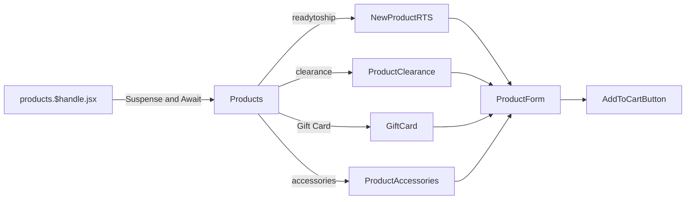
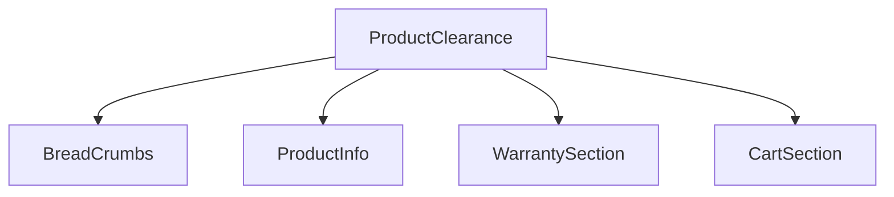
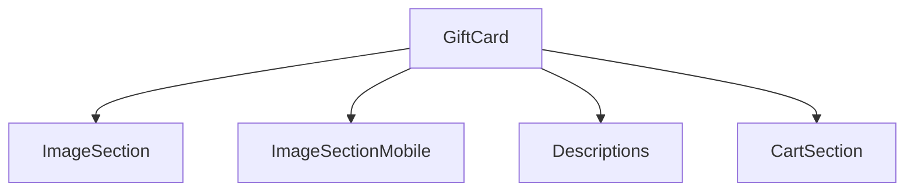
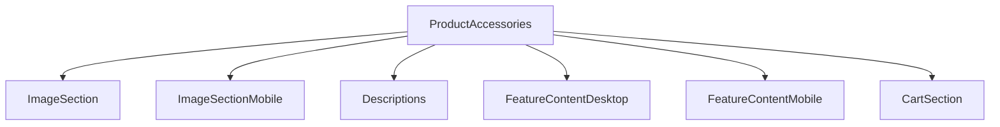

# Products 商品详情页

[[toc]]

该界面涵盖了 `RTS`、`Wokstation`、`Laptop`、`Accessories` 等页面的商品信息。

## 数据源


1. 获取商品信息

```javascript
// 获取商品信息
async function loadCriticalData(context, params) {
  const { storefront } = context;
  const handle = params.handle; // 地址栏params参数
  const variables = {
    productHandle: handle,
  };
  const productData = await storefront.query(PRODUCT_BY_HANDLE_QUERY, {
    variables,
    cache: storefront.CacheLong(), // 保证从缓存中获取
  });

  // 获取 FPS 配置，有且只有 ready to ship 有效
  let fpsAdminPerformance = [];
  if (productData.product.productType?.toLowerCase() === "ready to ship") {
    fpsAdminPerformance = await fetchRtsFpsFromAdmin(storefront, handle);
  }

  //
}
```

2. 根据商品信息获取相关信息
    - RTS
      - `Panel Print`, 
      - `Disclaimer`, 
      - `Configurates`, 
      - `Design Promo Page`, 
      - `Upsell Categories With Products`, 
      - `RTS Bottom Banner`, 
      - `Static Code`
    - Accessories
      - `variants`
      - `recommended builds`
      - `accessories`
3. 继续获取其他商品相关信息并解析、解构。
4. 😂 一大堆查询之后最终到了loader。这个过程简直 `非常过瘾`!

>[!WARNING]
>`toStaticCode` 方法有待优化，[查看优化方案](./suggestion.md#tostaticcode-优化方案)

>[!DANGER]
>强烈建议：此处做业务分离，方便维护。业务代码太吓人了！！[优化建议](./suggestion.md#商品详情业务逻辑优化)

## 组件引用结构链

组件中根据商品的 `productType` 区分组件，然后进行渲染。已知的 `productType` 如下：

- `readytoship`
- `clearance`
- `Gift Card`
- `accessories`

在渲染逻辑上，这里被分为了几个不同的页面并进行了 `抽象` 处理。



```bash
app\components\Products\NewProductRTS\*
app\components\Products\ProductClearance\*
app\components\Products\GiftCard\*
app\components\Products\ProductsAccessories
```

>[!NOTE]
>这里使用了 `Analytics` 组件，[文档传送门](https://shopify.dev/docs/api/hydrogen/2024-04/components/analytics/analytics-productview)

### Clearance

只传入了商品信息，无bundle，直接加入购物车，结算




### GiftCard



### ProductAccessories



### RTS 组件数据更新流向图

#### 核心数据流架构

```
┌─────────────────────────────────────────────────────────────────────────────┐
│                           NewProductRTS (根组件)                            │
│                                                                             │
│  ┌─────────────────────┬─────────────────────┬──────────────────────┐      │
│  │   useState 状态区    │     useRef 引用区     │     Props 接收区      │      │
│  ├─────────────────────┼─────────────────────┼──────────────────────┤      │
│  │ • activeProducts    │ • leftColRef        │ • data              │      │
│  │ • selectedPc        │ • productDetailsRef │ • print             │      │
│  │ • selectedDesign    │ • headingRef        │ • disclaimer        │      │
│  │ • selectedStep      │ • reviewsWidgetRef  │ • fpsPerformance    │      │
│  │ • showCartMobile    │ • cartMobileRef     │ • configurates      │      │
│  │ • imgObj            │                     │ • designs           │      │
│  │ • cartAnimClass     │                     │ • upsellProductsNew │      │
│  │ • bttAnimClass      │                     │ • rtsBottomBanner   │      │
│  │ • cartRendered      │                     │ • staticCode        │      │
│  │ • bttRendered       │                     │                      │      │
│  │ • showBackToTop     │                     │                      │      │
│  └─────────────────────┴─────────────────────┴──────────────────────┘      │
└─────────────────────────────────────────────────────────────────────────────┘
                                  ↓ 状态提升
                                  ↓ 回调传递
                                  ↓ Props 分发
                                  │
┌─────────────────────────────────────────────────────────────────────────────┐
│                          子组件数据接收与操作                                 │
└─────────────────────────────────────────────────────────────────────────────┘
                                  │
        ┌─────────────────────────┼─────────────────────────┐
        │                         │                         │
        ▼                         ▼                         ▼
┌───────────────┐       ┌──────────────────┐       ┌─────────────────┐
│ 配置器相关组件   │       │  产品展示与信息组件   │       │  购物车与交互组件   │
├───────────────┤       ├──────────────────┤       ├─────────────────┤
│ • RtsConfigurator│       │ • ImageSection      │       │ • CartSection       │
│ • RtsDesktopSteps│       │ • InfoSection       │       │ • CartSectionMobile │
│ • PcSummary      │       │ • StickyInfo        │       │ • ScrollToTopButton │
│ • DesignSummary  │       │ • ProductDetails    │       │                     │
│                 │       │ • ProductDetailsMobile│       │                     │
└───────────────┘       └──────────────────┘       └─────────────────┘
        │                         │                         │
        │                         │                         │
        ▼                         ▼                         ▼
┌─────────────────────────────────────────────────────────────────────────────┐
│                       UpsellProducts (追加销售中枢)                           │
│                                                                             │
│      ┌──────────────┬──────────────┬──────────────┬──────────────┐         │
│      │  Coolants    │   Bundles    │ CustomDesign │ Accessories  │         │
│      │  (散热液)     │   (配件包)    │  (自定义设计)  │  (其他配件)   │         │
│      └──────────────┴──────────────┴──────────────┴──────────────┘         │
│                                                                             │
│  接收: upsellProductsNew, activeProducts, setActiveProducts, setImgObj      │
│                                                                             │
│  功能: 分类显示追加销售产品，提供添加/删除到购物车的功能                      │
└─────────────────────────────────────────────────────────────────────────────┘
```

#### 详细数据更新流向

##### 1. 购物车更新流程 (核心联动)

```
用户点击"添加产品" → 触发子组件事件
        ↓
子组件调用 setActiveProducts([...activeProducts, newProduct])
        ↓
setActiveProducts 更新 NewProductRTS 的 activeProducts 状态
        ↓
React 触发 NewProductRTS 重新渲染
        ↓
所有接收 activeProducts 的子组件重新渲染：
    ┌─────────────────────┬─────────────────────┬─────────────────────┐
    │ UpsellProducts      │ CartSection         │ CartSectionMobile   │
    ├─────────────────────┼─────────────────────┼─────────────────────┤
    │ • 显示新添加的产品     │ • 更新购物车数量     │ • 更新移动端购物车   │
    │ • 更新选中状态        │ • 重新计算总价       │ • 重新计算总价       │
    │                     │ • 显示最新产品列表    │ • 显示最新产品列表    │
    └─────────────────────┴─────────────────────┴─────────────────────┘
```

##### 2. RTS配置器流程

```
用户选择 PC 配置 → RtsConfigurator 组件
        ↓
调用 setSelectedPc(newPc) 和 setActiveProducts([newPc])
        ↓
NewProductRTS 更新 selectedPc 和 activeProducts
        ↓
重新渲染触发：
    ┌─────────────────────┬─────────────────────┬─────────────────────┐
    │ PcSummary           │ RtsDesktopSteps     │ CartSection         │
    ├─────────────────────┼─────────────────────┼─────────────────────┤
    │ • 显示选中的PC详情    │ • 更新步骤状态       │ • 更新购物车中的PC    │
    │ • 显示价格和规格      │ • 高亮当前步骤       │ • 重新计算价格        │
    └─────────────────────┴─────────────────────┴─────────────────────┘
        ↓
用户选择设计 → 调用 setSelectedDesign(newDesign)
        ↓
重新渲染触发 DesignSummary 显示设计详情
```

##### 3. 图片对象更新流程

```
用户在 CustomDesign 上传图片
        ↓
CustomDesign 调用 setImgObj(newImgObj)
        ↓
NewProductRTS 更新 imgObj 状态
        ↓
重新渲染相关组件：
    ┌─────────────────────┬─────────────────────┐
    │ ImageSection        │ 其他需要图片的组件    │
    ├─────────────────────┼─────────────────────┤
    │ • 显示自定义图片      │ • 使用更新后的图片    │
    │ • 更新图片预览        │  对象              │
    └─────────────────────┴─────────────────────┘
```

##### 4. 滚动交互流程

```
用户滚动页面
        ↓
useEffect 监听滚动事件
        ↓
根据 headingRef 位置计算 showCartMobile
        ↓
根据 pds-top-sentinel 位置计算 showBackToTop
        ↓
更新状态触发动画：
    ┌─────────────────────┬─────────────────────┐
    │ CartSectionMobile   │ ScrollToTopButton   │
    ├─────────────────────┼─────────────────────┤
    │ • 滑入/滑出动画      │ • 淡入/淡出动画      │
    │ • 条件渲染          │ • 条件渲染          │
    └─────────────────────┴─────────────────────┘
```

#### 数据流向映射表

| 数据状态 | 定义位置 | 主要使用者 | 更新触发器 | 影响范围 |
|:------:|:------:|:------:|:-------:|:-------------|
| `activeProducts` | NewProductRTS | UpsellProducts, CartSection | setActiveProducts | 购物车、总价、产品列表 |
| `selectedPc` | NewProductRTS | RtsConfigurator, PcSummary | setSelectedPc | PC配置器、摘要显示 |
| `selectedDesign` | NewProductRTS | RtsConfigurator, DesignSummary | setSelectedDesign | 设计选择器、摘要显示 |
| `selectedStep` | NewProductRTS | RtsConfigurator, RtsDesktopSteps | setSelectedStep | 步骤导航、UI状态 |
| `imgObj` | NewProductRTS | CustomDesign, ImageSection | setImgObj | 图片显示、自定义设计 |
| `showCartMobile` | NewProductRTS | CartSectionMobile | 滚动监听 | 移动购物车显示 |
| `showBackToTop` | NewProductRTS | ScrollToTopButton | IntersectionObserver | 返回顶部按钮 |

#### 组件通信矩阵

```
┌─────────────────┬─────────────────────────────────────────────────────────────┐
│   子组件         │               可以修改的父组件状态                           │
├─────────────────┼─────────────────────────────────────────────────────────────┤
│ RtsConfigurator │ • setSelectedPc    • setSelectedDesign                     │
│                 │ • setActiveProducts • setSelectedStep                      │
├─────────────────┼─────────────────────────────────────────────────────────────┤
│ UpsellProducts  │ • setActiveProducts (通过子组件)                           │
│   ├─ Coolants   │ • setActiveProducts                                        │
│   ├─ Bundles    │ • setActiveProducts                                        │
│   ├─ CustomDesign│ • setActiveProducts • setImgObj                           │
│   └─ Accessories│ • setActiveProducts                                        │
├─────────────────┼─────────────────────────────────────────────────────────────┤
│ CartSection     │ • setActiveProducts • setSelectedStep                      │
├─────────────────┼─────────────────────────────────────────────────────────────┤
│ CartSectionMobile│ • setActiveProducts • setSelectedStep                     │
└─────────────────┴─────────────────────────────────────────────────────────────┘
```

#### 关键数据流特征

##### 1. **单向数据流强化**
```
父组件状态 → Props → 子组件 → 事件 → 回调函数 → 更新父组件状态
```

##### 2. **状态提升集中管理**
- 所有共享状态都在 `NewProductRTS` 中定义
- 子组件通过 props 获取数据和更新函数
- 避免了 prop drilling 过深的问题

##### 3. **实时同步机制**
- 购物车状态更新立即同步到所有相关组件
- 配置选择实时反映在摘要和购物车中
- 滚动交互即时反馈

##### 4. **分层数据传递**
```
Products (爷爷) → NewProductRTS (父亲) → UpsellProducts (儿子) → Accessories (孙子)
    ↓                     ↓                     ↓                     ↓
数据预处理              状态管理              数据分类              具体操作
```

这种架构确保了：
1. **数据一致性** - 单一数据源，避免状态冲突
2. **可维护性** - 状态逻辑集中，易于调试
3. **扩展性** - 新增功能只需添加新的状态和回调
4. **响应性** - 用户操作即时反馈，体验流畅


### 另外需要注意

所有的商品详情界面，可以注入静态 `html` 用来描述商品的内容

## 三方插件

>[!IMPORTANT]
>这里评论插件使用到了 [Reviews](https://www.reviews.io/)
>
>😂 目前只能使用调取API的行为获取到对应的评论的 html 数据