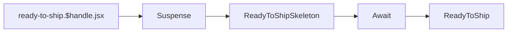
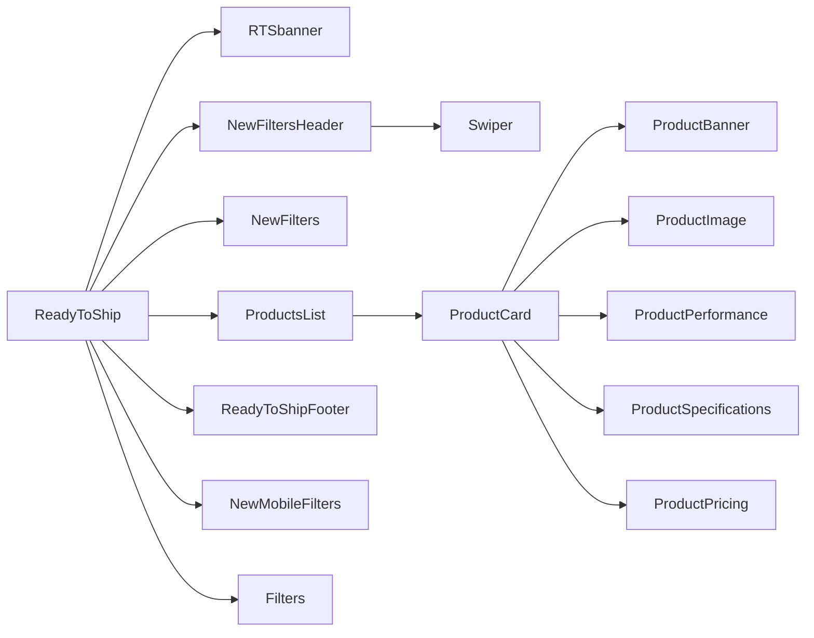

# Ready To Ship

[[toc]]

## 数据源

>[!DANGER]
>注意：RTS 的 `handle` 在 `Shopify` 的 Collections 中维护。其配置方式为 `ready-top-ship/${handle}`

RTS 商品的数据，实际上就是从商城获取到的现货信息，直接从 `Shopify` 中通过 `GraphQL` 查询。

> [!NOTE] 
> `Ready To Ship` 简称 `RTS` 是`现货`的意思。

核心代码

- 查询帧数信息

```javascript
// ready-to-ship.$handle.jsx loadCriticalData
const res = await storefront.query(GET_ADMIN_PANEL_METAOBJECTS, {
  variables: { type: "admin_panel_data", first: 10 },
  cache: storefront.CacheNone(),
});

const panelNode = res?.metaobjects?.nodes?.find(
  (n) => n?.handle === "rts-fps-managment" // [!code error]
);
```

> [!DANGER]
> 这里代码执行结果是有问题的，因为查询到的数据里面不包含 `handle` 字段，导致后面业务逻辑受阻

- 查询商品信息

```javascript
// Выполняем первый запрос для получения коллекции и метаполей
const collectionData = await storefront.query(GetCollectionWithMetafields, {
  variables,
  cache: storefront.CacheLong(),
});

// Достаем значения из метаполей, проверяя, является ли значение JSON
const metafieldValues = collectionData.collectionByHandle?.metafields
  ?.map((mf) => {
    if (!mf?.value) return [];

    try {
      // Проверяем, является ли значение JSON (начинается с [ или { )
      if (mf.value.trim().startsWith("{") || mf.value.trim().startsWith("[")) {
        const parsed = JSON.parse(mf.value);
        return Array.isArray(parsed) ? parsed : [parsed]; // Всегда массив
      } else {
        return []; // Если это просто строка, игнорируем
      }
    } catch (error) {
      console.error(`Ошибка парсинга метаполя "${mf.key}":`, mf.value, error);
      return [];
    }
  })
  .flat() // Распаковываем массивы
  .filter((id) => id?.startsWith("gid://shopify/Metaobject/")); // Оставляем только корректные GID

// Запрашиваем метаобъекты по их GID
const metaobjectsData = await storefront.query(GetMetaobjectsByIds, {
  variables: { ids: metafieldValues },
  cache: storefront.CacheLong(),
});
```
至此，完成了商品信息的查询。

>[!WARNING]
>对于数组的操作，后续还要做大力的优化，因为这会使得性能的明显提升。

## 组件引用结构链

依据handle查询，之后使用 `Suspense`，`Await`，`ReadyToShipSkeleton`，组件做骨架屏，而后使用 `ReadyToShip` 组件渲染。



```bash
app\routes\ready-to-ship.$handle.jsx

```

>[!NOTE]
>插件（组件）文档传送门: [Suspense](https://zh-hans.react.dev/reference/react/Suspense)、[react-loading-skeleton](https://github.com/dvtng/react-loading-skeleton)、[Await](https://remix.org.cn/docs/en/main/components/await)


### ReadyToShip



```bash
app\components\ReadyToShip\RTSbanner\index.jsx
app\components\ReadyToShip\ProductCard\*
app\components\Shared\ReadyToShipFooter\*
app\components\Accessories\NewFilters\*
```

