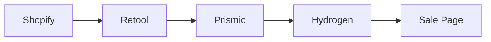
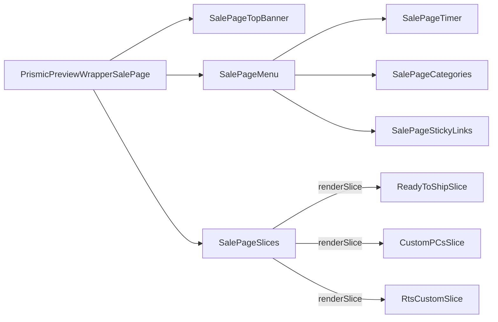

# Sale

[[toc]]

## 数据源

该界面的所有数据来源为 `Prismic`。是一个 `schema` 的数据模板，配置完成以后，`Prismic` 从 [Retool](https://retool.com/) 中选择 PC Model。

>[!WARNING]
>这里还需要了解怎么从Retool获取PC Model



```javascript
// app\routes\sale.$handle.jsx
const page = await prismicClient.getByUID("sale_page", handle, {
  ref: previewRef,
});
```
## 组件引用结构链


>[!NOTE]
>这里动画特效使用了 [gsap.js](https://gsap.com/)，效果还是很漂亮的。

```bash
app\components\PrismicPreviewModes\PrismicPreviewWrapperSalePage.jsx
app\components\SalePage\SalePageTopBanner\index.jsx
app\components\Slices\SalePageSlices\index.jsx
app\components\SalePage\SalePageMenu\SalePageTimer\index.jsx
app\components\SalePage\SalePageMenu\SalePageCategories\index.jsx
app\components\SalePage\SalePageMenu\SalePageStickyLinks\index.jsx
app\components\Slices\SalePageSlices\ReadyToShipSlice\index.jsx
app\components\Slices\SalePageSlices\CustomPCsSlice\index.jsx
app\components\Slices\SalePageSlices\RtsCustomSlice\index.jsx
```