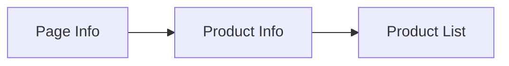
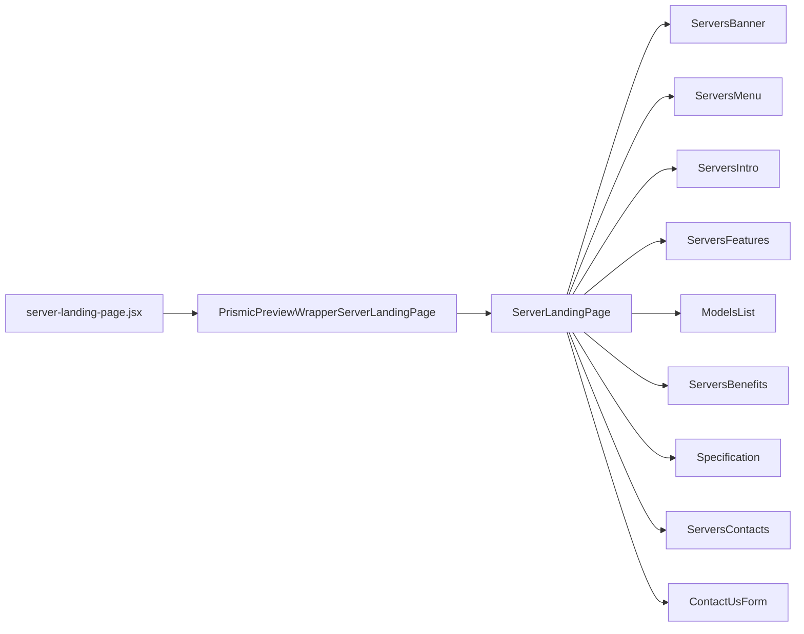

# Custom Servers

[[toc]]

该界面主要展示可定制的服务器信息。

## 数据源




这里数据获取就比较有意思了

1. 第一次请求从 Prismic 获取
2. 数据被缓存在 Hydrogen/Oxygen 中
3. 后续请求都从缓存获取
4. 缓存过期后才再次调用 Prismic API

这里是页面信息的获取
```javascript
prismicData = await fetchWithCache({
  client,
  withCache,
  cacheKey: ['prismic-serverslp', 'server-landing-page'],
  cacheStrategy: storefront.CacheLong(),
  fetcher: () => client.getByUID('serverslp', 'server-landing-page'),
}).catch((error) => {
  console.error(
  'Error fetching server landing page data from Prismic:',
  error,
  );
  return null;
});
```

这里是定制商品信息的获取，具体代码内容跟上面差不多：

```javascript
const featuresData = await fetchWithCache({
  client,
  withCache,
  cacheKey: ['prismic-pc-models-features', ...pcModelsFeaturesIds],
  cacheStrategy: storefront.CacheLong(),
  fetcher: () => client.getAllByIDs(pcModelsFeaturesIds),
}).catch((error) => {
  console.error(
    'Error fetching PC models features data from Prismic:',
    error,
  );
  return null;
});
```

最后使用 `Promise.all` 获取全部商品列表。

```javascript
const pcModelsRedisData = await Promise.all(
  pcModelsSlugs.map(async (slug) => {
    try {
      const response = await storefront.query(query, {
        variables: {
          handle: {
            handle: slug,
            type: 'custom_pc_cache',
          },
        },
        cache: storefront.CacheLong(),
      });

      if (!response?.metaobject?.fields) {
        console.warn(`No fields found for slug: ${slug}`);
        return null;
      }

      return JSON.parse(response.metaobject.fields[1].value);
    } catch (error) {
      console.error(`Error fetch metaobject для slug: ${slug}`, error);
      return null;
    }
  }),
);
```
>[!DANGER]
>这里需要优化，[优化方案直通车](./suggestion.md#Server-页面性能问题处理方案)

>[!NOTE]
>😒 这里使用了 `withCache.run` 方法，还没找到文档~~~

## 组件引用结构链


