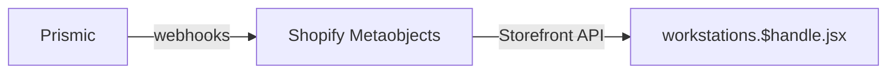
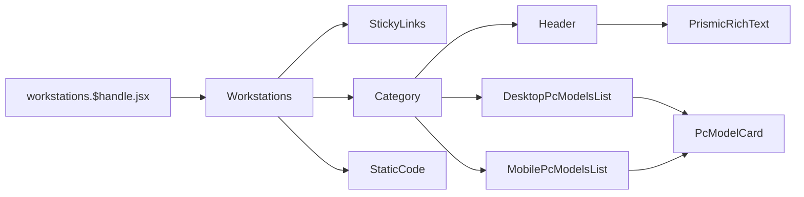

# Workstations

[[toc]]

该界面主要展示 `workstations` 等相关的定制集合产品。

## 数据源

该界面的 Schema 数据模型，在 `Prismic` 完成之后，通过 Prismic 的 `webhook` 更新到 `Shopify Metaobjects` 然后通过 `Storefront API` 调用。而后使用 `Remix+React` 渲染



### 1. 先获取到 Prismic 缓存的页面数据

```javascript
const variables = {
  handle: {
    handle: "ws-" + params.handle,
    type: "prismic_cache_workstations_page",
  },
};

const tempData = await storefront.query(GET_METAOBJECTS_BY_HANDLE, {
  variables,
  cache: storefront.CacheShort(),
});
```

### 2. 获取到所有的 PC Models

```javascript
async function loadCriticalData(context, params, prismicData, previewData) {
  fetchAllPcModels();
}
```

### 3. 通过 Promise.all 获取到所有 对应的 Features List。

`loadCriticalData` 方法一般是本项目中辅助 `loader` 的数据加载函数.

```javascript
async function loadCriticalData(context, params, prismicData, previewData) {
  const METAOBJECT_QUERY = `
      query GetMetaobject($handle: MetaobjectHandleInput!) {
        metaobject(handle: $handle) {
          fields {
            key
            value
          }
        }
      }
    `;
  fetchFeaturesForModels();
}
```

> [!NOTE] 
>`fetchFeaturesForModels` 方法中使用了 `Promise.all` 加载所有相关的 `models` 对应的数据，这里目前使用的是 `METAOBJECT_QUERY` 查询方式可以替换为 `metaobjects`，[**查看替代方案**](./suggestion.md#workstations-页面-fetchfeaturesformodels-方法替代方案)😘

## 组件引用结构链


