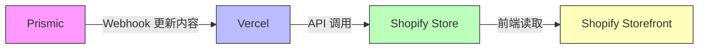

# AftershockPC-AU-Hydrogen

[[toc]]

## 概述

本项目基于 `Shopify Hydrogen` + `Remix + React`，结合多种现代前端工具和第三方服务，实现电商前端的高性能、可扩展开发体验。

## 项目工具

### [Prismic](https://prismic.io/)

`Prismic` 是内容管理系统（CMS），可通过 `API` 与`Shopify` 集成，实现内容与电商功能的结合。

如果把整个数字店铺比作一家实体店，`Shopify` 就是后台的仓库、收银台和库存系统，确保买卖高效可靠；而 `Prismic` 则是前台的橱窗设计、产品陈列和导购手册，负责吸引顾客、讲述品牌故事并提升体验。两者协同工作，共同打造了一家既漂亮又好卖的店铺。

### [Vercel](https://vercel.com/)

`Vercel` 可能部署了一个用作 `webhook` 钩子的项目，目前正在探索中。。。

>[!DANGER]
>这个项目的源码，貌似还没有。

### [Shopify Store](https://admin.shopify.com/store/aftershockpcau)

`Shopify` 存储了核心数据、关键数据，所有业务的最终流向是 `Shopify`。

### [Shopify Storefront API](https://shopify.dev/docs/api/storefront/latest)

通过 `GraphQL` 的方式调用 `Storefront API` 获取 `Shopify` 的相关数据，例如：`Metaobjects`、`RTS` 等数据。

## 项目工具关系图




## NodeJS 环境要求

目前使用的是 `v22.21.0`

``` json
"engines": {
  "node": ">=18.0.0"
}

```

## 快速启动

>[!NOTE]
>[官网快速启动](https://shopify.dev/docs/storefronts/headless/hydrogen/getting-started)

### 1. 先链接到shopify
``` bash
npx shopify hydrogen link
```
### 2. 运行启动指令
``` bash
npm run dev
```

### 3. 发布到 Oxygen
```bash
npx shopify hydrogen deploy
```

>[!WARNING]
>😒目前还不知道怎么发布到测试服。

## 开发工具

建议使用 `vsode`
