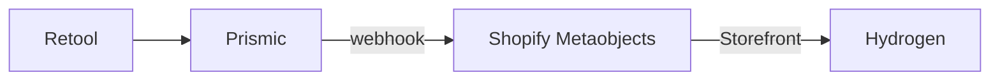
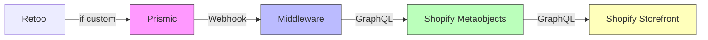

# AftershockPC-AU-Hydrogen

[[toc]]

## 概述

本项目基于 `Shopify Hydrogen` + `Remix + React`，结合多种现代前端工具和第三方服务，实现电商前端的高性能、可扩展开发体验。

## 项目使用到的工具

在开发和浏览之前，我们需要知道项目使用了哪些工具，以及工具的作用，方便我们理解项目。

### [Prismic CMS](https://prismic.io/)

`Prismic` 是内容管理系统（CMS），可通过 `API` 与`Shopify` 集成，实现内容与电商功能的结合。目前 Aftershock 的布局原始数据都存储在这里。

>[!IMPORTANT]
> `运营`：通过页面构造器对网页进行创建、更新和发布。
>
> **`开发者`**：配置网站页面页面、切片、字段。

### Middleware

为了把 `Prismic` 产生的页面数据更新到 `Shopify Metaobjects`，原开发团队在 [`Vercel`](https://vercel.com/) 部署了一个用作接收 `webhook` 产生的数据并通过 `Shopify Admin API` 规范传输到 `Shopify` 的 NestJs(基于NodeJs) 项目作为中间件。**目前正在探索中。。。**

>[!TIP]
>你可以把它理解成为一个 `Prismic` 数据到 `Shopify` 的中转站。

>[!DANGER]
>😒目前还没有拿到这个项目的源码。

### Retool

Aftershock 最大的特色亮点之一就是可以定制你的 PC，这时候需要有地方去存储定制的数据，此时就需要使用 `Retool` 存储定制 PC 的数据。而我们在 Prismic 创建定制 PC 的数据时，会创建为一个切片，再绑定到 PC Models 页面，做为列表的元素之一。此时 Prismic 通过 Webhooks 更新数据到了 Shopify 的 Metaobjects 用以确保数据的安全。最后在 Hydrogen 调取。




### [Shopify Metaobjects](https://admin.shopify.com/store/aftershockpcau)

Metaobjects = Shopify 中的“自定义数据模型（Custom Data Model）”。

>[!IMPORTANT]
>你可以把它理解成：
>
>Shopify 为你提供的一个“无代码 CMS 数据建模系统”，用来创建任意结构的数据表（类似 Prismic、Sanity、Notion Database、Strapi）。

### [Shopify Storefront API](https://shopify.dev/docs/api/storefront/latest)

通过 `GraphQL` 的方式调用 `Storefront API` 获取 `Shopify` 的相关数据，例如：`Metaobjects`、`RTS` 等数据。

## 工具之间的关系图




## NodeJS 环境要求

目前本地使用的是 `v22.21.0`

``` json
"engines": {
  "node": ">=18.0.0"
}

```

## 快速启动

>[!NOTE]
>[官网快速启动](https://shopify.dev/docs/storefronts/headless/hydrogen/getting-started)

### 1. 先链接到shopify

为什么会把这个指令前置呢？因为你说不准什么时候就与 Shopify 断开了关联，且拿不到全局变量，这就很尴尬。所以如果没有把握的话，在运行你的项目之前，绑定一下。

``` bash
npx shopify hydrogen link
```
### 2. 运行启动指令


``` bash
npm run dev
```

### 3. 发布到 `Oxygen` 测试服

每次你推送或合并 Hydrogen 仓库的更改时，Oxygen 都会自动部署到测试服。前提条件是

1. 你创建了新分支
2. 你提交了新分支的代码
3. 你把新分支的代码合并到了对应的分支

>[!IMPORTANT]
>`Oxygen` 会自动发布到测试服，并提供测试服地址。[参考文档](https://shopify.dev/docs/storefronts/headless/hydrogen/deployments/github?utm_source=chatgpt.com)

### 4. 发布到 `Oxygen`
```bash
npx shopify hydrogen deploy
```

## 开发工具

建议使用 `vsode`
