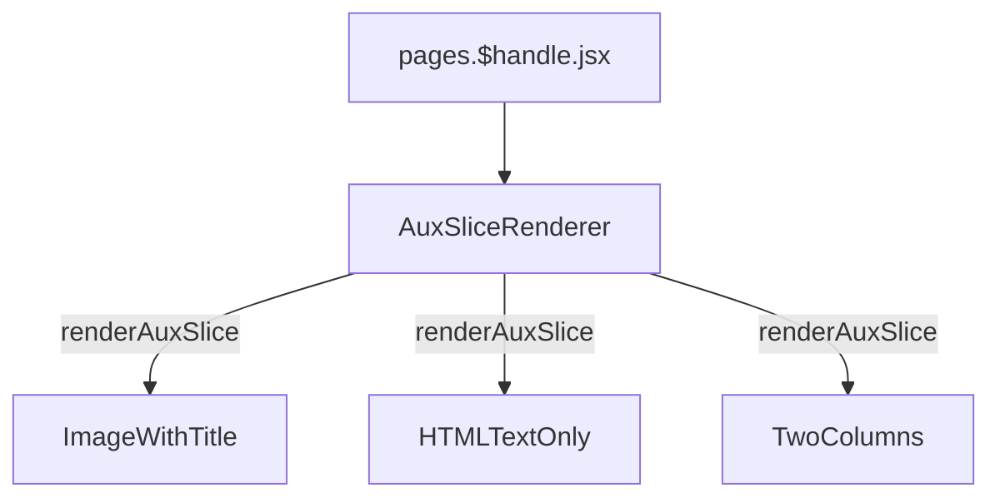

# About Us

[[toc]]

## Data Source

The data source for this interface is `Prismic`, [`#aux-aboutus`](https://aftershockpc.prismic.io/builder/pages/YECxIRAAACcAA8zx?s=published).


## Component Reference Chain

The entry file for this interface is `pages.$handle.jsx`.



>[!NOTE]
>The `renderAuxSlice` method is a method of the `AuxSliceRenderer` component, responsible for distributing all components, which are finally assembled into an interface.

```bash
app\components\Slices\AuxPagesSlices\ImageWithTitle\index.jsx
app\components\Slices\AuxPagesSlices\HTMLTextOnly\index.jsx
app\components\Slices\AuxPagesSlices\TwoColumns\index.jsx
```

The yellow text in the diagram indicates the color component names.

