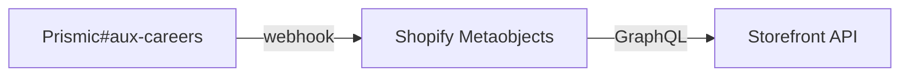
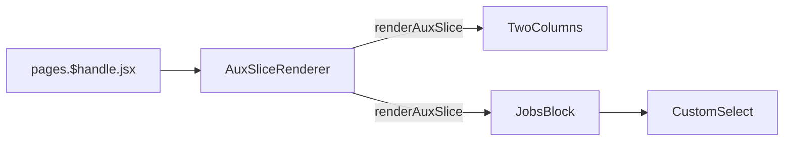

# Careers

[[toc]]

## Data Source

After being maintained in `Prismic`, the data is saved to `Shopify Metaobjects` via `webhook`, and then fetched using the `Storefront API`. [`#aux-careers`](https://aftershockpc.prismic.io/builder/pages/YGUBARAAACMAJdl4?s=published)




## Component Reference Chain

The core component is the JobsBlock component, primarily responsible for displaying Aftershock's recruitment information.



```bash
app\components\Slices\AuxPagesSlices\JobsBlock\index.jsx
app\components\Slices\AuxPagesSlices\JobsBlock\CustomSelect\index.jsx
```