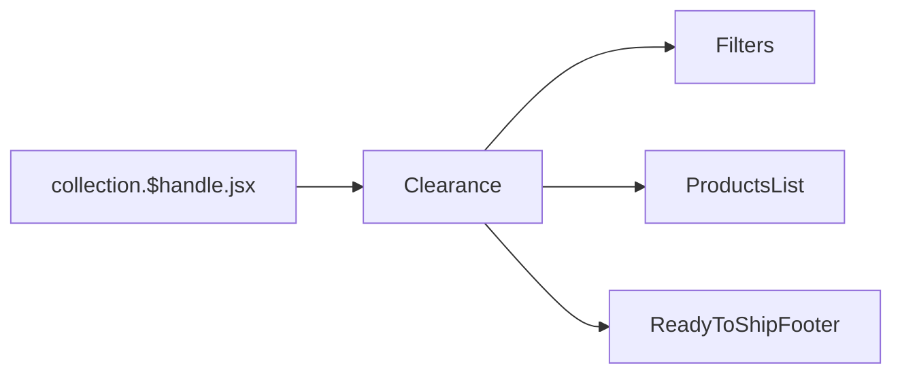

# Collection

[[toc]]

This interface primarily displays some accessories and other items that are "in stock".

## Data Source

The in-stock information is retrieved from `Shopify` through `GraphQL` queries.

> [!NOTE]
> The business logic is similar to that of `RTS`.

Core code:

```javascript
const variables = {
  handle: `collection-clearance`,
};

// Execute the first query to get the collection and metafields
const collectionData = await storefront.query(GetCollectionWithMetafields, {
  variables,
  cache: storefront.CacheLong(),
});

// Extract values from metafields, checking if the value is JSON
const metafieldValues = collectionData.collectionByHandle?.metafields
  ?.map((mf) => {
    if (!mf?.value) return [];

    try {
      // Check if the value is JSON (starts with [ or {)
      if (mf.value.trim().startsWith("{") || mf.value.trim().startsWith("[")) {
        const parsed = JSON.parse(mf.value);
        return Array.isArray(parsed) ? parsed : [parsed]; // Always an array
      } else {
        return []; // If it's just a string, ignore it
      }
    } catch (error) {
      console.error(`Error parsing metafield "${mf.key}":`, mf.value, error);
      return [];
    }
  })
  .flat() // Flatten the arrays
  .filter((id) => id?.startsWith("gid://shopify/Metaobject/")); // Keep only valid GIDs

// Query metaobjects by their GIDs
const metaobjectsData = await storefront.query(GetMetaobjectsByIds, {
  variables: { ids: metafieldValues },
  cache: storefront.CacheLong(),
});
```

## Component Reference Chain



```bash
app\components\Clearance\*
```

>[!NOTE]
>The content of this page is very similar to [Ready To Ship](./data-ready-to-ship.md).