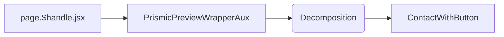

# Contact Us

[[toc]]

## Data Flow

After being maintained in `Prismic`, the data is saved to `Shopify Metaobjects` via `webhook`, and then fetched using the `Storefront API`. [`#aux-contactus`](https://aftershockpc.prismic.io/builder/pages/ZMdk_REAACQAnDmw?s=published)

In the `page.$handle.jsx` file, data is loaded similarly to other `/page/` pages.

```mermaid
flowchart LR
Prismic --> page.$handle.jsx --> Data Analysis --> Specific Handle
```

> [!NOTE]
> Note that the data here is actually synchronized to Shopify's metaobjects via hooks and then called.

## Component Reference Chain



- **PrismicPreviewWrapperAux**

  Wraps the components as a wrapper.

- **AuxSliceRenderer**

  AuxSliceRenderer has a mechanism that decomposes all handles within the pages and references the ContactWithButton component based on the handle.

- **ContactWithButton**

  > [!INFO]
  > This interface uses the Live Chat plugin: [@frontapp/plugin-sdk](https://dev.frontapp.com/reference/installation)

  > [!WARNING]
  > Additionally, as seen from the `root.jsx` entry file, this interface hides the chat information in the bottom-right corner.

  ```jsx
  useEffect(() => {
    if (isKnowledgeHub) {
      loadChatBot();
    } else {
      cleanupChatBot();
    }

    return () => {
      cleanupChatBot();
    };
  }, [isKnowledgeHub, location.pathname]);
  ```

  The data source for this component is `page.$handle.jsx.loader`.