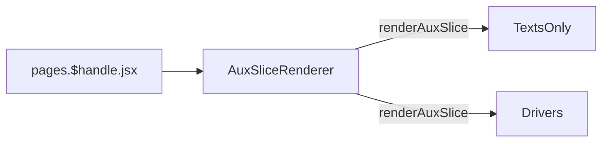

# Drivers

[[toc]]

## Data Source

After being maintained in `Prismic`, the data is saved to `Shopify Metaobjects` via `webhook`, and then fetched using the `Storefront API`. [`#aux-drivers`](https://aftershockpc.prismic.io/builder/pages/YGUNZBAAACAAJhCu?s=published).


## Component Reference Chain



```bash
app\components\Slices\AuxPagesSlices\TextsOnly\index.jsx
app\components\Slices\AuxPagesSlices\Drivers\index.jsx
```