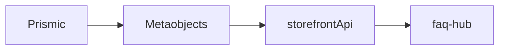

# FAQ Hub

[[toc]]

## Data Flow

The data for this interface is still stored in Prismic, [`#faq-hub`](https://aftershockpc.prismic.io/builder/pages/Y6Q0VhEAACoAJF_n?s=published).

Data changes are monitored via webhooks and synchronized to metaobjects, which are then called by the website.



Core code for fetching data:

```jsx
if (previewData) {
  // code
} else {
  // Load data from Shopify only if there is no preview data
  const variables = {
    handle: { handle: "faq-hub", type: "prismic_cache_landing_page" },
  };

  const tempData = await storefront.query(GET_METAOBJECTS_BY_HANDLE, {
    variables,
    cache: storefront.CacheShort(),
  });

  prismicData = JSON.parse(
    tempData?.metaobject?.fields?.find((field) => field.key === "data")?.value
  );
}
```

> [!DANGER]
> Could this issue be resolved using environment variables? It's too tedious; there's a lot of unnecessary code for the production environment.

**Reference Flow**

- Update the data source in [Prismic](https://prismic.io/).
- After updating, use [Prismic](https://prismic.io/)'s [Webhooks](https://prismic.io/docs/webhooks) to call an API (the API address should have been developed in the admin app).
- Update to Shopify's [Metaobjects](https://admin.shopify.com/store/aftershockpcau/content/metaobjects/entries/prismic_cache_global_data/99848782004).
- Then, use [storefront Api](https://shopify.dev/docs/storefronts/headless/hydrogen/data-fetching) in the [Hydrogen](https://hydrogen.shopify.dev/) project.
- Finally, call it on the website.

> [!INFO]
> It is worth noting that this interface loads all FAQs at once.

## Component Reference Chain

```mermaid
flowchart TD
  faq-hub.jsx --> PrismicPreviewWrapperFaqHub --> FaqHub

  FaqHub --> Parallel Components

  subgraph Parallel Components
    direction LR
    Search
    Header
    CategoriesList
  end

  CategoriesList --> Category --> AccordionItem
```

```jsx
return (
  <PrismicPreviewWrapperFaqHub isPreviewMode={isPreview}>
    <>
      <FaqHub data={content.body} />
      {hiddenArticle}
    </>
  </PrismicPreviewWrapperFaqHub>
);
```

> [!WARNING]
> Here, `hiddenArticle` is displayed as a point for SEO optimization, as such content is easier for SEO to crawl.

- `faq-hub.jsx` serves as the entry file.
- `PrismicPreviewWrapperFaqHub` is the outer wrapper.
  ```
  app\components\PrismicPreviewModes\PrismicPreviewWrapperFaqHub.jsx
  ```
- `FaqHub` is actually the entry point for the main content.
  ```
  app\components\FaqHub\index.jsx
  ```
  Inside the component, the FAQ information is grouped and made searchable.

  The search here uses `filter` instead of `fuse.js`. Code snippet:

  ```jsx
  const filteredData = data
    .map((category) => {
      const filteredItems = category.items.filter((item) =>
        item.question.toLowerCase().includes(searchQuery.toLowerCase())
      );

      return {
        ...category,
        items: filteredItems,
      };
    })
    .filter((category) => category.items.length > 0);
  ```

  - The `Search` component is essentially a UI component with relatively simple functionality. It returns a method to the `FaqHub` component during search operations and echoes it in the HTML.
    ::: code-group
    ```bash
    app\components\FaqHub\Search\index.jsx
    ```

    ```jsx
    <Search searchQuery={searchQuery} setSearchQuery={setSearchQuery} />
    {searchQuery && (
      <div className="w-full max-w-[1440px] px-[48px] py-[16px] text-white">
        <div className="flex justify-between items-center font-dinpro text-[16px] text-[#e4e4e4]">
          Results Found:{' '}
          {filteredData.reduce(
            (count, category) => count + category.items.length,
            0,
          )}
          <div
            className="flex justify-center items-center"
            onClick={() => setSearchQuery('')}
          >
            <IoClose size={24} className="cursor-pointer" />
          </div>
        </div>
        <CategoriesList data={filteredData} searchQuery={searchQuery} />
      </div>
    )}
    ```
    :::
    > [!WARNING]
    > Why wasn't this made into a component?
  - The `Header` component is primarily used to display grouped lists. Clicking on it switches to the specified grouped list, creating an interactive effect with the left aside component.
    ```bash
    app\components\FaqHub\Header\index.jsx
    ```
  - The `CategoriesList` component is actually the content area, displaying FAQ details by folding them within the list.
    ```bash
    app\components\FaqHub\CategoriesList\index.jsx
    ```
    - `Category`
      This component is an accordion-style ItemCard.
      ```bash
      app\components\FaqHub\CategoriesList\Category\index.jsx
      ```