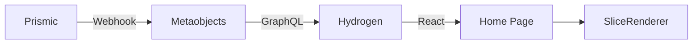
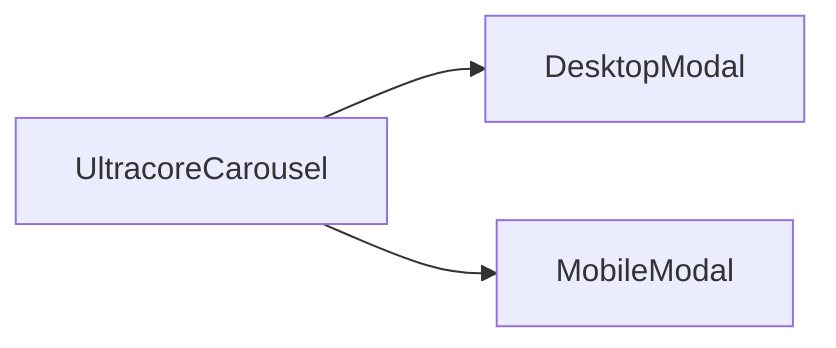
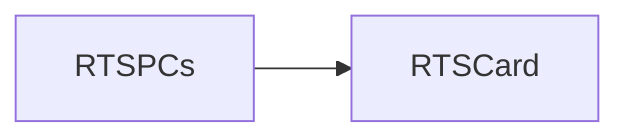

# 首页

[[toc]]

首页的入口文件为 \_index.jsx，在获取到数据后整个结构是拉取到数据之后将数据传入到 SliceRenderer 组件，然后根据不同的类型选用对应的组件呈现。

## 数据源

首页大部分数据源在 Prismic 当中。通过 [storefront Api](https://shopify.dev/docs/storefronts/headless/hydrogen/data-fetching) 从 shopify metaobjects 中以 graphQL 的方式调用。



核心代码：

::: code-group

```javascript
// 数据拉取
const variables = {
  handle: { handle: "homepage-new", type: "prismic_cache_landing_page" },
};

const tempData = await storefront.query(GET_METAOBJECTS_BY_HANDLE, {
  variables,
  cache: storefront.CacheShort(),
});

homePage = JSON.parse(
  tempData?.metaobject?.fields?.find((field) => field.key === "data")?.value
);
```

```graphql
<!-- 查询规则 -->
export const GET_METAOBJECTS_BY_HANDLE = `
  query GetMetaobject($handle: MetaobjectHandleInput!) {
    metaobject(handle: $handle) {
      handle
      type
      fields {
        key
        value
      }
    }
  }
`;
```

```jsx
// SliceRenderer 组件分发
function renderSlice(slice, index) {
  switch (slice.slice_type) {
    case "hero_banner":
      return <HeroBanner data={slice} />;
    case "new_categories":
      return <NewCategories data={slice} />;
    case "limited_edition_slice":
      return <LimitedEditionSlice data={slice} />;
    case "ultracore_carousel":
      return <UltracoreCarousel data={slice} location="home page" />;
    case "embed_video":
      return <EmbedVideo data={slice} />;
    case "new_awards":
      return <NewAwards data={slice} />;
    case "rts_pcs":
      return <RTSPCs data={slice} />;
    case "tik_tok_videos":
      return <TikTokVideos data={slice} />;
    case "three_category":
      return <ThreeCategory data={slice} />;
    case "cta":
      return <CTA data={slice} />;
    case "trusted_partners":
      return <TrustedPartners data={slice} />;
    case "reviews_carousel":
      return <ReviewsCarousel data={slice} />;
    case "reviews_io":
      return <ReviewsIoCarouselWidget data={slice} />;
    case "location_banner":
      return <LocationBanner data={slice} />;
    case "static_code":
      return <StaticCode data={slice} />;
    case "desktops_carousell":
      return <DesktopsCarousell data={slice} />;
    default:
      return null;
  }
}

export function SliceRenderer({ slices }) {
  // code ...
  return (
    <div className="flex flex-col justify-center items-center w-full h-auto bg-[#111111]">
      {slices.map((slice, index) => (
        <div
          className="flex flex-col justify-center items-center w-full h-auto"
          key={index}
          data-slice-index={index}
        >
          {renderSlice(slice, index)}
        </div>
      ))}
    </div>
  );
}
```

:::

## 组件引用结构链

### Banner

Banner 组件使用了 HeroBanner 组件接收数据。

> [!NOTE]
> 这里插件使用了 [Swiper React](https://swiperjs.com/react)

```bash
app\components\Slices\LandingPageSlices\HeroBanner\index.jsx
```

数据是通过 SliceRenderer 组件分发后获取。

### Categories

Categories 使用了 NewCategories 组件

```bash
app\components\Slices\LandingPageSlices\NewCategories\index.jsx
```

数据是通过 SliceRenderer 组件分发后获取。

> [!WARNING]
> 该组件目前存在比较大的性能问题，因为这里滥用了 gsap.js。[查看优化建议](./suggestion#newcategories-的优化方案)

### AFTERSHOCK SPECIAL EDITIONS

> [!NOTE]
> 这里插件使用了 [Swiper React](https://swiperjs.com/react)，基于 Swiper 实现。

> [!DANGER]
> 貌似这里的鼠标悬停等效果都可以使用配置去实现~~

```bash
app\components\Slices\LandingPageSlices\LimitedEditionSlice\index.jsx
```

### Ultra-labs Builds

这里使用了 UltracoreCarousel 组件进行了开发，数据是通过 SliceRenderer 组件分发后获取。

值得注意的是 DesktopModal 和 MobileModal 也使用了 [Swiper 组件](https://swiperjs.com/react)

组件调用链路：



```bash
app\components\Slices\LandingPageSlices\UltracoreCarousel\index.jsx
app\components\Slices\LandingPageSlices\UltracoreCarousel\DesktopModal\index.jsx
app\components\Slices\LandingPageSlices\UltracoreCarousel\MobileModal\index.jsx
```

### Embed Video

这里实际上就是一个视频播放器，而且引入了 [react-player](https://github.com/CookPete/react-player) 用作播放视频。

> [!NOTE]
> Loading 过程是不是需要优化呢？

```bash
app\components\Slices\LandingPageSlices\EmbedVideo\index.jsx
```

### Australia’s #1 Performance PC Company

这里调用了 NewAwards 组件，内部全是 UI 内容。

```bash
app\components\Slices\LandingPageSlices\NewAwards\index.jsx
```

### Ready To Ship PCs

这里调用了 RTSPCs 组件，内部使用 Swiper 构成。并将产品卡片使用 RTSCard 卡片进行了抽象。

引用关系：



> [!NOTE]
> RTSCard 使用了 [framer-motion](https://motion.dev/) 插件，是一款动画库

```jsx
<motion.div
    initial={{y: '100%', opacity: 0}}
    animate={isHovered ? {y: 0, opacity: 1} : {y: '100%', opacity: 0}}
    transition={{duration: 0.5, ease: 'easeInOut'}}
    className="absolute hidden tablet-lg:flex flex-col justify-center items-center gap-[10px] h-[330px] bottom-[60px] left-0 right-0 bg-[#161616cc] px-[25px] rounded-t-[10px] z-10"
>
</div>
```

```bash
app\components\Slices\LandingPageSlices\RTSPCs\index.jsx
app\components\Slices\LandingPageSlices\RTSPCs\RTSCard\index.jsx
```

### PERFORMANCE PCS BUILT TO PERFECTION

该模块主要表示可定制的内容，点击之后跳转到对应的定制界面。实际上这里也使用了 [Swiper 组件](https://swiperjs.com/react)

```bash
app\components\Slices\LandingPageSlices\ThreeCategory\index.jsx
```

### EXPLORE OUR RANGE

该组件主要显示 aftershock 的系列。而这里主要的入口是定制门户。

顶部的 tabs 效果使用原生 active 的方式实现。

> [!WARNING]
> 此处应该加上滑块效果，[修改建议](./suggestion#首页-explore-our-range-desktopscarousell-组件优化建议)

实际上这里也使用了 [Swiper 组件](https://swiperjs.com/react)

```bash
app\components\Slices\LandingPageSlices\DesktopsCarousell\index.jsx
```

### Make Your Dream Rig A Reality Aftershock PCs

该组件主要使用了 [Swiper 组件](https://swiperjs.com/react) 搭配 ifreme 以 embd 的方式播放（获取 ticktok 的视频 ID，类似于抖音视频）。

```bash
app\components\Slices\LandingPageSlices\TikTokVideos\index.jsx
```

### Trusted partners & Customers

该组件使用了无缝滚动。

```bash
app\components\Slices\LandingPageSlices\TrustedPartners\index.jsx
```

### POWERING CREATORS, STREAMERS & INFLUENCERS

该组件使用了 [Swiper 组件](https://swiperjs.com/react)，其他没有任何内容。

```bash
app\components\Slices\LandingPageSlices\ReviewsCarousel\index.jsx
```

### 3 countries. Over 200,000 happy customers

该组件使用了懒加载的方式加载了三方评论插件 [reviews](https://www.reviews.io/)，展示站内的好评如潮信息。点击之后弹出 modal 可以查看详情信息。

```bash
app\components\Slices\LandingPageSlices\ReviewsIoCarouselWidget\index.jsx
```

### Australian Owned and Operated

该组件展示体验店信息，数据完全静态。

```bash
app\components\Slices\LandingPageSlices\LocationBanner\index.jsx
```

### 静态 HTML 导入

```bash
app\components\Slices\AuxPagesSlices\StaticCode\index.jsx
```

除过以上的组件之外，首页还支持静态 HTML 组件或者代码的植入。入口如下：

```jsx
import { useEffect, useRef } from "react";

export function StaticCode({ data }) {
  const { html, css, js } = data.primary;
  const containerRef = useRef(null);

  // Вставка CSS
  useEffect(() => {
    if (css) {
      const style = document.createElement("style");
      style.innerHTML = css;
      document.head.appendChild(style);
      return () => {
        document.head.removeChild(style);
      };
    }
  }, [css]);

  // Вставка HTML и выполнение JS после рендера
  useEffect(() => {
    if (containerRef.current) {
      containerRef.current.innerHTML = html;

      if (js) {
        const script = document.createElement("script");
        script.type = "text/javascript";
        script.textContent = js;
        containerRef.current.appendChild(script);
      }
    }
  }, [html, js]);

  return <div ref={containerRef} />;
}
```
