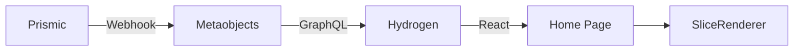
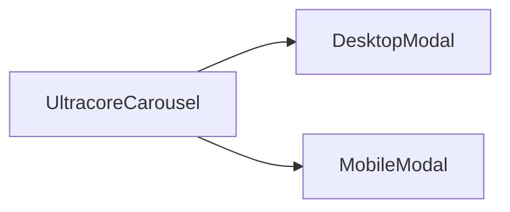
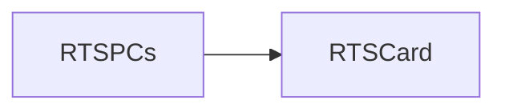

# Homepage

[[toc]]

The entry file for the homepage is \_index.jsx. After fetching the data, the overall structure passes the data into the SliceRenderer component, which then selects corresponding components based on different types for presentation.

## Data Source

Most of the data for the homepage is stored in Prismic. It is fetched via the [storefront API](https://shopify.dev/docs/storefronts/headless/hydrogen/data-fetching) from Shopify's metaobjects using GraphQL.



Core Code:

::: code-group

```javascript
// Data fetching
const variables = {
  handle: { handle: "homepage-new", type: "prismic_cache_landing_page" },
};

const tempData = await storefront.query(GET_METAOBJECTS_BY_HANDLE, {
  variables,
  cache: storefront.CacheShort(),
});

homePage = JSON.parse(
  tempData?.metaobject?.fields?.find((field) => field.key === "data")?.value
);
```

```graphql
<!-- Query rule -->
export const GET_METAOBJECTS_BY_HANDLE = `
  query GetMetaobject($handle: MetaobjectHandleInput!) {
    metaobject(handle: $handle) {
      handle
      type
      fields {
        key
        value
      }
    }
  }
`;
```

```jsx
// SliceRenderer component distribution
function renderSlice(slice, index) {
  switch (slice.slice_type) {
    case "hero_banner":
      return <HeroBanner data={slice} />;
    case "new_categories":
      return <NewCategories data={slice} />;
    case "limited_edition_slice":
      return <LimitedEditionSlice data={slice} />;
    case "ultracore_carousel":
      return <UltracoreCarousel data={slice} location="home page" />;
    case "embed_video":
      return <EmbedVideo data={slice} />;
    case "new_awards":
      return <NewAwards data={slice} />;
    case "rts_pcs":
      return <RTSPCs data={slice} />;
    case "tik_tok_videos":
      return <TikTokVideos data={slice} />;
    case "three_category":
      return <ThreeCategory data={slice} />;
    case "cta":
      return <CTA data={slice} />;
    case "trusted_partners":
      return <TrustedPartners data={slice} />;
    case "reviews_carousel":
      return <ReviewsCarousel data={slice} />;
    case "reviews_io":
      return <ReviewsIoCarouselWidget data={slice} />;
    case "location_banner":
      return <LocationBanner data={slice} />;
    case "static_code":
      return <StaticCode data={slice} />;
    case "desktops_carousell":
      return <DesktopsCarousell data={slice} />;
    default:
      return null;
  }
}

export function SliceRenderer({ slices }) {
  // code ...
  return (
    <div className="flex flex-col justify-center items-center w-full h-auto bg-[#111111]">
      {slices.map((slice, index) => (
        <div
          className="flex flex-col justify-center items-center w-full h-auto"
          key={index}
          data-slice-index={index}
        >
          {renderSlice(slice, index)}
        </div>
      ))}
    </div>
  );
}
```

:::

## Component Reference Chain

### Banner

The Banner component uses the HeroBanner component to receive data.

> [!NOTE]
> The [Swiper React](https://swiperjs.com/react) plugin is used here.

```bash
app\components\Slices\LandingPageSlices\HeroBanner\index.jsx
```

The data is fetched after being distributed by the SliceRenderer component.

### Categories

The Categories component uses the NewCategories component.

```bash
app\components\Slices\LandingPageSlices\NewCategories\index.jsx
```

The data is fetched after being distributed by the SliceRenderer component.

> [!WARNING]
> This component currently has significant performance issues due to the misuse of gsap.js. [View optimization suggestions](./suggestion#newcategories-optimization-solution)

### AFTERSHOCK SPECIAL EDITIONS

> [!NOTE]
> The [Swiper React](https://swiperjs.com/react) plugin is used here, based on Swiper.

> [!DANGER]
> It seems that mouse hover and other effects here could be implemented using configurations.

```bash
app\components\Slices\LandingPageSlices\LimitedEditionSlice\index.jsx
```

### Ultra-labs Builds

The UltracoreCarousel component is used here for development. The data is fetched after being distributed by the SliceRenderer component.

It's worth noting that DesktopModal and MobileModal also use the [Swiper component](https://swiperjs.com/react).

Component call chain:



```bash
app\components\Slices\LandingPageSlices\UltracoreCarousel\index.jsx
app\components\Slices\LandingPageSlices\UltracoreCarousel\DesktopModal\index.jsx
app\components\Slices\LandingPageSlices\UltracoreCarousel\MobileModal\index.jsx
```

### Embed Video

This is essentially a video player, and it uses [react-player](https://github.com/CookPete/react-player) to play videos.

> [!NOTE]
> Does the loading process need optimization?

```bash
app\components\Slices\LandingPageSlices\EmbedVideo\index.jsx
```

### Australia’s #1 Performance PC Company

This section calls the NewAwards component, which contains only UI content.

```bash
app\components\Slices\LandingPageSlices\NewAwards\index.jsx
```

### Ready To Ship PCs

This section calls the RTSPCs component, which internally uses Swiper. The product cards are abstracted using the RTSCard component.

Reference relationship:



> [!NOTE]
> RTSCard uses the [framer-motion](https://motion.dev/) plugin, which is an animation library.

```jsx
<motion.div
    initial={{y: '100%', opacity: 0}}
    animate={isHovered ? {y: 0, opacity: 1} : {y: '100%', opacity: 0}}
    transition={{duration: 0.5, ease: 'easeInOut'}}
    className="absolute hidden tablet-lg:flex flex-col justify-center items-center gap-[10px] h-[330px] bottom-[60px] left-0 right-0 bg-[#161616cc] px-[25px] rounded-t-[10px] z-10"
>
</div>
```

```bash
app\components\Slices\LandingPageSlices\RTSPCs\index.jsx
app\components\Slices\LandingPageSlices\RTSPCs\RTSCard\index.jsx
```

### PERFORMANCE PCS BUILT TO PERFECTION

This module mainly represents customizable content. Clicking on it redirects to the corresponding customization interface. The [Swiper component](https://swiperjs.com/react) is also used here.

```bash
app\components\Slices\LandingPageSlices\ThreeCategory\index.jsx
```

### EXPLORE OUR RANGE

This component mainly displays Aftershock's series. The main entry here is the customization portal.

The tabs effect at the top is implemented using the native active method.

> [!WARNING]
> A slider effect should be added here. [Modification suggestion](./suggestion#homepage-explore-our-range-desktopscarousell-component-optimization-suggestion)

The [Swiper component](https://swiperjs.com/react) is also used here.

```bash
app\components\Slices\LandingPageSlices\DesktopsCarousell\index.jsx
```

### Make Your Dream Rig A Reality Aftershock PCs

This component uses the [Swiper component](https://swiperjs.com/react) with an iframe in an embed format to play TikTok videos (fetching TikTok video IDs, similar to Douyin videos).

```bash
app\components\Slices\LandingPageSlices\TikTokVideos\index.jsx
```

### Trusted partners & Customers

This component uses seamless scrolling.

```bash
app\components\Slices\LandingPageSlices\TrustedPartners\index.jsx
```

### POWERING CREATORS, STREAMERS & INFLUENCERS

This component uses the [Swiper component](https://swiperjs.com/react) and has no other content.

```bash
app\components\Slices\LandingPageSlices\ReviewsCarousel\index.jsx
```

### 3 countries. Over 200,000 happy customers

This component lazily loads the third-party review plugin [reviews](https://www.reviews.io/), displaying rave reviews from the site. Clicking on it opens a modal to view detailed information.

```bash
app\components\Slices\LandingPageSlices\ReviewsIoCarouselWidget\index.jsx
```

### Australian Owned and Operated

This component displays store information and is completely static.

```bash
app\components\Slices\LandingPageSlices\LocationBanner\index.jsx
```

### Static HTML Import

```bash
app\components\Slices\AuxPagesSlices\StaticCode\index.jsx
```

In addition to the above components, the homepage also supports the embedding of static HTML components or code. The entry is as follows:

```jsx
import { useEffect, useRef } from "react";

export function StaticCode({ data }) {
  const { html, css, js } = data.primary;
  const containerRef = useRef(null);

  // Insert CSS
  useEffect(() => {
    if (css) {
      const style = document.createElement("style");
      style.innerHTML = css;
      document.head.appendChild(style);
      return () => {
        document.head.removeChild(style);
      };
    }
  }, [css]);

  // Insert HTML and execute JS after rendering
  useEffect(() => {
    if (containerRef.current) {
      containerRef.current.innerHTML = html;

      if (js) {
        const script = document.createElement("script");
        script.type = "text/javascript";
        script.textContent = js;
        containerRef.current.appendChild(script);
      }
    }
  }, [html, js]);

  return <div ref={containerRef} />;
}
```