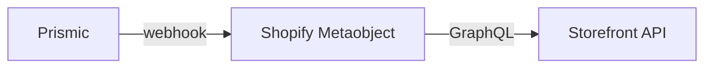
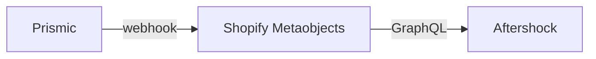
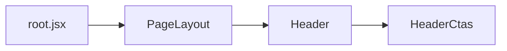
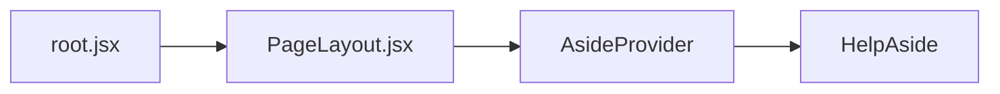
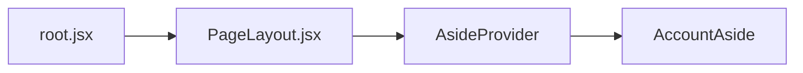
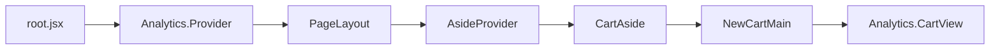
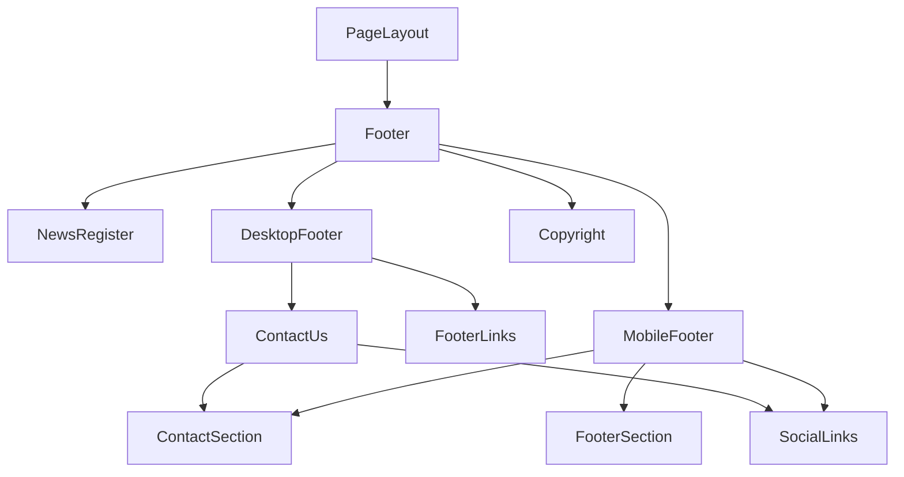

# Layout Global Data Flow

[[toc]]

## Header

### Banner Content

This component is primarily used to notify users of information such as promotional activities. Clicking on it directly navigates to the address.


#### Data Source

The content is currently maintained in [Prismic](https://aftershockpc.prismic.io/builder/pages/Zip6gxcAAKUIv3ry?s=published). The specific business process is as follows:




##### Component Reference Chain

```bash
app\components\Header\ShippingBanner\index.jsx
```

The component is called by the Header component, but the data is injected from root.jsx. Key code:

1. Load all Metaobjects data in the loader of root.jsx.

    This includes shippingBanner data, which is then passed to the PageLayout component.

```jsx
// root.jsx
// Note: This is a code snippet, not the complete file.
// Load in loader
export async function loader(args) {
  const [criticalData, headerTemp, footerTemp] = await Promise.all([
    loadCriticalData(args),
    storefront.query(GET_METAOBJECTS_BY_HANDLE, {
      variables: headerVariables,
      cache: storefront.CacheLong(),
    }),
    storefront.query(GET_METAOBJECTS_BY_HANDLE, {
      variables: footerVariables,
      cache: storefront.CacheLong(),
    }),
  ]);

  const shippingBanner = header?.data?.body?.filter(
    (item) => item.slice_type === "shipping_banner"
  );

  return {
    shippingBanner: shippingBanner?.[0] || null,
  };
}

// Pass data to PageLayout
<PageLayout {...data}>{children}</PageLayout>;
```

2. Call the Header component in the PageLayout component and pass the data.

`AsideProvider` is a global component that records many states, similar to Vue's global state management (Vuex or Pinia), implementing `global state sharing`.

```bash
app\components\Aside\AsideProvider\index.jsx
```

>[!NOTE]
>Usage of [provider](https://react.dev/reference/react/createContext#provider)

```jsx
// PageLayout/index.jsx
// Note: This is a code snippet, not the complete file.
// This is the complete data injection process.
export function PageLayout({
  shippingBanner
}) {
  return (
    <AsideProvider
      {/* Inject data into AsideProvider here */}
      shippingBanner={shippingBanner}
      customerAccessToken={customerAccessToken}
      isCustomerLoggedIn={isCustomerLoggedIn}
    >
      {formattedMenu && (
        <Header
          shippingBanner={shippingBanner}
        />
      )}
    </AsideProvider>
  )
}
```

3. Usage in the Header component.

```jsx
// Header/index.jsx
// Note: This is just a code snippet.
import {useAside} from '../Aside/useAside';

export function Header({
  shippingBanner,
}) {
  // Use global state
  const {type, close, isBannerVisible, isBannerLoaded, closeBanner} = useAside();
  // Use the shippingBanner component
  return (
    {isBannerLoaded && isBannerVisible && (
      <ShippingBanner shippingBanner={shippingBanner} onClose={closeBanner} />
    )}
  )
}
```

### Logo

Top-left logo related code and reference relationships.

##### Data Source

Static data, maintained within the component.

##### Component Reference Chain

```bash
app\components\Header\index.jsx 👇
app\components\Header\LogoLink\index.jsx
```

<details>
<summary>View Code</summary>

```jsx
import { Link } from "@remix-run/react";
import { Image } from "@shopify/hydrogen";
import { useAside } from "~/components/Aside/useAside";

export function LogoLink() {
  const { close, setSelectedGamingCategory, setSelectedWorkstationsCategory } =
    useAside();
  const handleLogoClick = () => {
    close();
    setSelectedGamingCategory(null);
    setSelectedWorkstationsCategory(null);
  };
  return (
    <div
      className="flex justify-center items-center w-[147px] md:w-[167px] h-[36px]"
      onClick={handleLogoClick}
    >
      <Link
        to={"/"}
        className="flex items-center w-[167px] h-[36px]"
        prefetch="viewport"
      >
        {/* Image URL, calling Hydrogen's Image component */}
        <Image
          src="https://cdn.shopify.com/s/files/1/0522/3320/7988/files/header_logo_5d52404a-f89d-4a2b-a73e-7b79d8dd8640.svg?v=1723189737"
          alt="Aftershock Logo"
          width={167}
          height={36}
          loading="eager"
        />
      </Link>
    </div>
  );
}
```

>[!NOTE] 
>[Image Component Documentation](https://shopify.dev/docs/api/hydrogen/latest/components/image)

</details>

### Menu Desktop


#### Data Source

The data is fetched from [Metaobjects](https://admin.shopify.com/store/aftershockpcau/content/metaobjects/entries/prismic_cache_global_data/99848782004).

**Reference Flow**

- Update data source in [Prismic](https://prismic.io/) 👇
- After updating, use [Prismic](https://prismic.io/)'s [Webhooks](https://prismic.io/docs/webhooks) to call an API (the API address should have been developed in the admin app) 👇
- Update to Shopify's [Metaobjects](https://admin.shopify.com/store/aftershockpcau/content/metaobjects/entries/prismic_cache_global_data/99848782004) 👇
- Then use [storefront API](https://shopify.dev/docs/storefronts/headless/hydrogen/data-fetching) in the [Hydrogen](https://hydrogen.shopify.dev/) project 👌



#### Component Reference Chain

1. Call and assembly process in app\root.jsx 👇

```jsx
/** GET_METAOBJECTS_BY_HANDLE
export const GET_METAOBJECTS_BY_HANDLE = `
  query GetMetaobject($handle: MetaobjectHandleInput!) {
    metaobject(handle: $handle) {
      handle
      type
      fields {
        key
        value
      }
    }
  }
`;
 
*/

export async function loader(args) {
  const { storefront, env, customerAccount } = args.context;
  // code...
  const headerVariables = {
    handle: {
      handle: "navigation-main",
      type: "prismic_cache_global_data",
    },
  };

  // Get menu bar information -- headerTemp
  const [criticalData, headerTemp, footerTemp] = await Promise.all([
    loadCriticalData(args),
    storefront.query(GET_METAOBJECTS_BY_HANDLE, {
      variables: headerVariables,
      cache: storefront.CacheLong(),
    }),
    storefront.query(GET_METAOBJECTS_BY_HANDLE, {
      variables: footerVariables,
      cache: storefront.CacheLong(),
    }),
  ]);

  // Parse menu bar information
  const header = JSON.parse(
    headerTemp?.metaobject?.fields?.find((field) => field.key === "data")?.value
  );

  // Format menu bar information. Location of menuFormatting -> helpers\menuFormatting.js
  const formattedMenu = header ? menuFormatting(header) : null;

  // Return in loader
  return {
    formattedMenu: formattedMenu || [],
  };
}

// Inject data in PageLayout component. Data is destructured.
export function Layout({ children }) {
  // code
  const data = useRouteLoaderData("root"); // Parse loader data
  render(<PageLayout {...data}>{children}</PageLayout>);
  // code
}
```

>[!NOTE]
>[Remix React useRouteLoaderData('root') Documentation](https://remix.run/docs/en/main/hooks/use-route-loader-data#userouteloaderdata)
>
>[Hydrogen storefront Documentation](https://shopify.dev/docs/storefronts/headless/hydrogen/data-fetching)
>
>[createStorefrontClient Documentation](https://shopify.dev/docs/api/hydrogen/latest/utilities/createstorefrontclient?utm_source=chatgpt.com)

2. Call in app\components\PageLayout.jsx 👇

```jsx
import { Header } from "./Header";

export function PageLayout({
  // other code ...
  formattedMenu,
  // other code ...
}) {
  return (
    <AsideProvider
      shippingBanner={shippingBanner}
      customerAccessToken={customerAccessToken}
      isCustomerLoggedIn={isCustomerLoggedIn}
    >
      <HelpAside />
      <AccountAside
        isLoggedIn={isLoggedIn}
        isCustomerLoggedIn={isCustomerLoggedIn}
      />
      <CartAside />
      <SearchAside />
      <LanguageAside />
      <MobileMenuAside
        header={header}
        publicStoreDomain={publicStoreDomain}
        formattedMenu={formattedMenu}
        isLoggedIn={isLoggedIn}
        isCustomerLoggedIn={isCustomerLoggedIn}
      />
      {/* Call Header component, inject formattedMenu data into Header component */}
      {formattedMenu && (
        <Header
          isLoggedIn={isLoggedIn}
          publicStoreDomain={publicStoreDomain}
          formattedMenu={formattedMenu}
          shippingBanner={shippingBanner}
          isCustomerLoggedIn={isCustomerLoggedIn}
        />
      )}
      <main>{children}</main>
      <Footer
        publicStoreDomain={publicStoreDomain}
        formattedFooter={formattedFooter}
      />
    </AsideProvider>
  );
}
```

3. Call in app\components\Header\index.jsx 👇

```jsx
// Header component receives formattedMenu parameter
export function Header({
  isLoggedIn,
  publicStoreDomain,
  formattedMenu,
  shippingBanner,
  isCustomerLoggedIn,
}) {
  // other code ...
  return (
    <>
      {isBannerLoaded && isBannerVisible && (
        <ShippingBanner shippingBanner={shippingBanner} onClose={closeBanner} />
      )}
      <header
        className={`flex justify-center items-center w-full h-[66px] p-[5px] mobile-sm:p-[16px] z-20 sticky left-0 transition-all duration-300 ${
          isBannerLoaded && isBannerVisible ? "top-[32px]" : "top-[0]"
        } ${isAsideOpen ? "bg-black tablet-lg:bg-[#242424]" : "bg-[#242424]"}`}
      >
        <div className="flex justify-between items-center py-0 w-full max-w-[1440px]">
          <LogoLink />
          <DesktopMenu
            menuStructure={formattedMenu}
            {/*
              menu={menu}
              primaryDomainUrl={header.shop.primaryDomain.url}
            */}
            publicStoreDomain={publicStoreDomain}
            isAsideOpen={isAsideOpen}
          />
          <HeaderCtas
            isLoggedIn={isLoggedIn}
            cart={cart}
            activeLinkStyle={activeLinkStyle}
            isCustomerLoggedIn={isCustomerLoggedIn}
          />
        </div>
      </header>
    </>
  );
}
```

4. Call in app\components\Header\DesktopMenu\index.jsx

Parameter `menuStructure` is the menu bar data.

```jsx
import { useAside } from "~/components/Aside/useAside";
import { FirstLevelMenu } from "./FirstLevelMenu";
import { memo } from "react";

const DesktopMenu = memo(function DesktopMenu({
  menuStructure,
  menu,
  primaryDomainUrl,
  viewport,
  publicStoreDomain,
  isAsideOpen,
}) {
  return (
    <nav
      className={`hidden tablet-lg:flex w-[60%] h-[66px] justify-evenly items-center text-white ${
        isAsideOpen ? "cursor-default" : ""
      }`}
      role="navigation"
    >
      <FirstLevelMenu menuStructure={menuStructure} />
    </nav>
  );
});

export { DesktopMenu };
```

5. Then the **FirstLevelMenu** component uses the data and ultimately combines with the following components to complete the menu.

   - **FirstLevelMenu**

     app\components\Header\DesktopMenu\FirstLevelMenu\index.jsx

     

   - **SecondLevelMenu**

     app\components\Header\DesktopMenu\SecondLevelMenu\index.jsx

     

   - **ThirdLevelMenu**

     app\components\Header\DesktopMenu\ThirdLevelMenu\index.jsx

     

   - **InfoBox**

     app\components\Header\DesktopMenu\InfoBox\index.jsx

     

   - **RTSMenu**

     app\components\Header\DesktopMenu\ThirdLevelMenu\index.jsx

     

   - **DefaultMenu**

     app\components\Header\DesktopMenu\ThirdLevelMenu\DefaultMenu\index.jsx

     

   - **AccessoriesMenu**

     app\components\Header\DesktopMenu\ThirdLevelMenu\AccessoriesMenu\index.jsx

     

### Menu Mobile

#### Data Source

This data is also fetched from [Metaobjects](https://admin.shopify.com/store/aftershockpcau/content/metaobjects/entries/prismic_cache_global_data/99848782004).

#### Component Reference Chain

1. Call and assembly process in app\root.jsx 👇

```jsx
/** GET_METAOBJECTS_BY_HANDLE
export const GET_METAOBJECTS_BY_HANDLE = `
  query GetMetaobject($handle: MetaobjectHandleInput!) {
    metaobject(handle: $handle) {
      handle
      type
      fields {
        key
        value
      }
    }
  }
`;
 
*/

export async function loader(args) {
  const { storefront, env, customerAccount } = args.context;
  // code...
  const headerVariables = {
    handle: {
      handle: "navigation-main",
      type: "prismic_cache_global_data",
    },
  };

  // Get menu bar information -- headerTemp
  const [criticalData, headerTemp, footerTemp] = await Promise.all([
    loadCriticalData(args),
    storefront.query(GET_METAOBJECTS_BY_HANDLE, {
      variables: headerVariables,
      cache: storefront.CacheLong(),
    }),
    storefront.query(GET_METAOBJECTS_BY_HANDLE, {
      variables: footerVariables,
      cache: storefront.CacheLong(),
    }),
  ]);

  // Parse menu bar information
  const header = JSON.parse(
    headerTemp?.metaobject?.fields?.find((field) => field.key === "data")?.value
  );

  // Format menu bar information. Location of menuFormatting -> helpers\menuFormatting.js
  const formattedMenu = header ? menuFormatting(header) : null;

  // Return in loader
  return {
    formattedMenu: formattedMenu || [],
  };
}

// Inject data in PageLayout component. Data is destructured.
export function Layout({ children }) {
  // code
  const data = useRouteLoaderData("root"); // Parse loader data
  render(<PageLayout {...data}>{children}</PageLayout>);
  // code
}
```

>[!NOTE]
>[Remix React useRouteLoaderData('root') Documentation](https://remix.run/docs/en/main/hooks/use-route-loader-data#userouteloaderdata)
>
>[Hydrogen storefront Documentation](https://shopify.dev/docs/storefronts/headless/hydrogen/data-fetching)
>
>[createStorefrontClient Documentation](https://shopify.dev/docs/api/hydrogen/latest/utilities/createstorefrontclient?utm_source=chatgpt.com)

2. Call in app\components\PageLayout.jsx 👇

```jsx
import { Header } from "./Header";

export function PageLayout({
  // other code ...
  formattedMenu,
  // other code ...
}) {
  return (
    <AsideProvider
      shippingBanner={shippingBanner}
      customerAccessToken={customerAccessToken}
      isCustomerLoggedIn={isCustomerLoggedIn}
    >
      {/* Call MobileMenuAside component and inject formattedMenu data */}
      <MobileMenuAside
        header={header}
        publicStoreDomain={publicStoreDomain}
        formattedMenu={formattedMenu}
        isLoggedIn={isLoggedIn}
        isCustomerLoggedIn={isCustomerLoggedIn}
      />
      <Footer
        publicStoreDomain={publicStoreDomain}
        formattedFooter={formattedFooter}
      />
    </AsideProvider>
  );
}
```

3. Usage in app\components\Aside\MobileMenuAside\index.jsx 👇

```jsx
export function MobileMenuAside({
  // others code
  formattedMenu,
  // others code
}) {
  const mainLinks = formattedMenu
    .filter((item) => item.primary.title.toLowerCase() !== "special offers")
    .map((item) => item.primary);

  const tempMainLinks = formattedMenu
    .filter((item) => item.primary.title.toLowerCase() !== "special offers")
    .map((item) => item);

  const specialOffers = formattedMenu.filter(
    (item) => item.primary.title.toLowerCase() === "special offers"
  );

  // Used inside the Aside component
  <Aside type="mobile" heading="MENU" menuStructure={formattedMenu}>
    {/* Business logic used */}
  </Aside>;
}
```

4. Combined with the **MobileMenuFooter** component, the menu bar design is ultimately completed.

### Search Bar

This search bar queries corresponding product lists based on input content.


#### Data Flow

After the user inputs relevant search keywords, the query is invoked. The query rules are as follows:

1. Formulate query conditions:
   - Query keywords
   - Top 5 most matching data
   - Enable predictive search
2. Formulate the method and address for the call.
3. Execute the query.

```jsx
export const SEARCH_ENDPOINT = "/search";

function executeSearch(event) {
  event.preventDefault();
  if (inputRef?.current?.value) {
    fetchResults({ target: { value: inputRef.current.value } });
  }
}

function fetchResults(event) {
  fetcher.submit(
    { q: event.target.value || "", limit: 5, predictive: true },
    { method: "GET", action: SEARCH_ENDPOINT }
  );
}
```

4. Source of the `/search` interface:

```bash
app\routes\search.jsx
```

Since Remix is a server-side language, it creates a search interface in `search.jsx` to query content.

Core search code:

```javascript
async function predictiveSearch({ request, context }) {
  // Too much code, suggest viewing directly
}
```

>[!NOTE]
>This heavily uses [GraphQL](https://graphql.org/).
>
>Need to review [search](https://shopify.dev/docs/api/storefront/latest/queries/search) related code.
>
>Also check [Hydrogen Graphi](https://shopify.dev/docs/storefronts/headless/hydrogen/data-fetching/graphiql#graphiql).

#### Component Reference Chain

The component's call path is root.jsx/PageLayout/Header/HeaderCtas.



```bash
app\components\Header\HeaderCtas\index.jsx
app\components\Header\HeaderCtas\SearchComponent\index.jsx
app\components\Header\HeaderCtas\SearchToggle\index.jsx
app\components\Search\SearchResults\index.jsx
```

- The SearchResults component uses a Remix component.

```jsx
import { useFetcher } from "@remix-run/react";

const fetcher = useFetcher({ key: "search" });
```

>[!NOTE] 
>[useFetcher(params) Documentation](https://remix.run/docs/en/main/hooks/use-fetcher)

---

### Region Switching

#### Data Source

The data is static, maintained within the project and referenced.

Data path: utils\constants\countryLinks.js

```jsx
export const countryLinks = [
  {
    code: "au",
    name: "Australia",
    flag: "https://cdn.shopify.com/s/files/1/0522/3320/7988/files/flag-australia.png?v=1713807308",
  },
  {
    code: "sg",
    name: "Singapore",
    flag: "https://cdn.shopify.com/s/files/1/0522/3320/7988/files/flag-singapore.png?v=1713807333",
    link: "https://www.aftershockpc.com/",
  },
];
```

#### Component Reference Chain

1. Directly referenced in PageLayout.

```jsx
export function PageLayout() {
  return (
    <AsideProvider>
      <LanguageAside />
    </AsideProvider>
  );
}
```

2. **LanguageAside** component.

Component path: app\components\Aside\LanguageAside\index.jsx

Refer to the specific code for the business process; it is relatively simple.

### Instant Messaging

When clicking to view instant messages, the following options are available:

>[!IMPORTANT]
> 💬 Live Chat online chat tool.
>
> 📚 Knowledge Hub help center.
>
> 🏢 Flagship Showroom showroom information.
>
> 📞 Contact Us contact us.
>
> 🔍 Check Your Build Status.

#### Plugin

[@frontapp/plugin-sdk](https://dev.frontapp.com/reference/installation)

The online chat tool uses [FrontApp](https://front.com/). After injecting relevant code on the official website, users chat with customer service on the frontapp backend from Aftershock.

>[!INFO]
>Perhaps we could later analyze user online chat data to draw conclusions for business planning. [View suggestion plan](./suggestion.md).

>[!WARNING]
> FrontApp ChartId: dcccf16bf7f8867dc9516ad40e69defe

>[!DANGER]
> Can these sensitive information be stored in metaobjects?

<details>
<summary>View imported code</summary>

```jsx
// root.jsx
// Lazy loading process to optimize homepage loading speed.
return (
  <script
    nonce={nonce}
    dangerouslySetInnerHTML={{
      __html: `
      (function() {
        var isMobile = /Android|webOS|iPhone|iPad|iPod|BlackBerry|IEMobile|Opera Mini/i.test(navigator.userAgent) || window.innerWidth < 768;
        var loadScriptsOnIdle = function() {
          if (!isMobile) return;
          
          var loaded = false;
          var loadOnInteraction = function() {
            if (loaded) return;
            loaded = true;
            
            // For mobile - use requestIdleCallback with greater delay to reduce TBT
            var idleCallback = window.requestIdleCallback || function(cb) { return setTimeout(cb, 10000); };
            
            idleCallback(function() {
              // Klaviyo - lazy loading
              var klaviyo = document.createElement('script');
              klaviyo.id = 'klaviyo-js';
              klaviyo.src = 'https://static.klaviyo.com/onsite/js/MvXF9E/klaviyo.js';
              klaviyo.async = true;
              klaviyo.defer = true;
              document.head.appendChild(klaviyo);
              
              // Instant Pixel - lazy loading
              var instant = document.createElement('script');
              instant.id = 'instant-pixel';
              instant.innerHTML = '!function(i,n,s,t,a,u,d){i.InstantConfig=i.InstantConfig||{},d=i.InstantJS=i.InstantJS||{},d.trackQueue=[],d.track=function(){d.trackQueue.push(arguments)},u=n.createElement(s),u.async=!0,u.src=t,a=n.getElementsByTagName(s)[0],a.parentNode.insertBefore(u,a)}(window,document,"script","https://cdn.instant.one/instant.js?siteId=site_d0215b799aeb40159179ee9562bd38c1");';
              document.head.appendChild(instant);
            }, { timeout: 12000 });
          };
          
          // Load on first interaction or after 12 seconds (increased for mobile)
          window.addEventListener('scroll', loadOnInteraction, {passive: true, once: true});
          window.addEventListener('click', loadOnInteraction, {once: true});
          window.addEventListener('touchstart', loadOnInteraction, {passive: true, once: true});
          setTimeout(loadOnInteraction, 12000);
        };
        
        if (document.readyState === 'loading') {
          document.addEventListener('DOMContentLoaded', loadScriptsOnIdle);
        } else {
          loadScriptsOnIdle();
        }
      })();
    `,
    }}
  />
);
```

</details>

<details>
<summary>View initialization code</summary>

```jsx
useEffect(() => {
  if (isKnowledgeHub) {
    loadChatBot();
  } else {
    cleanupChatBot();
  }

  return () => {
    cleanupChatBot();
  };
}, [isKnowledgeHub, location.pathname]);

useEffect(() => {
  // Lazy load chat - only after user interaction
  let chatInitialized = false;
  const initializeChat = () => {
    if (chatInitialized) return;
    chatInitialized = true;

    if (!window.FrontChat) {
      const script = document.createElement("script");
      script.src = "https://chat-assets.frontapp.com/v1/chat.bundle.js";
      script.async = true;
      script.onload = () => {
        window.FrontChat("init", {
          chatId: "dcccf16bf7f8867dc9516ad40e69defe",
          useDefaultLauncher: false,
        });
      };
      document.body.appendChild(script);
    } else {
      window.FrontChat("init", {
        chatId: "dcccf16bf7f8867dc9516ad40e69defe",
        useDefaultLauncher: false,
      });
    }
  };

  // Load chat after first user interaction (scroll, click, touch)
  const loadOnInteraction = () => {
    initializeChat();
    window.removeEventListener("scroll", loadOnInteraction, {
      passive: true,
    });
    window.removeEventListener("click", loadOnInteraction);
    window.removeEventListener("touchstart", loadOnInteraction, {
      passive: true,
    });
  };

  // Load chat with delay after page load (3 seconds)
  const timeoutId = setTimeout(initializeChat, 3000);

  // Or load on user interaction
  window.addEventListener("scroll", loadOnInteraction, {
    passive: true,
    once: true,
  });
  window.addEventListener("click", loadOnInteraction, { once: true });
  window.addEventListener("touchstart", loadOnInteraction, {
    passive: true,
    once: true,
  });

  return () => {
    clearTimeout(timeoutId);
    window.removeEventListener("scroll", loadOnInteraction);
    window.removeEventListener("click", loadOnInteraction);
    window.removeEventListener("touchstart", loadOnInteraction);
    if (window.FrontChat) {
      window.FrontChat("shutdown");
    }
  };
}, [location.pathname]);

const loadChatBot = () => {
  const script = document.createElement("script");
  script.src = "https://chat-assets.frontapp.com/v1/chat.bundle.js";
  script.async = true;

  script.onload = () => {
    setTimeout(() => {
      if (window.FrontChat) {
        window.FrontChat("init", {
          chatId: "8a72f257b6dd910d3480a3c083486bbc",
          useDefaultLauncher: true,
        });
      }
    }, 500);
  };

  document.body.appendChild(script);
};
```

</details>

Configure relevant headers in entry.server.jsx.

```jsx
// Includes frontapp domain information
// Code snippet
import {
  buildCSPHeader,
  mergeCSPDirectives,
  newDirectives,
  parseCSPHeader,
} from "utils/cspUtils";

export default async function handleRequest() {
  const finalDirectives = mergeCSPDirectives(baseDirectives, newDirectives);
  const finalCSPHeader = buildCSPHeader(finalDirectives);
  responseHeaders.set("Content-Security-Policy", finalCSPHeader);
}
```

#### Data Source

1. Live Chat data source is in [FrontApp](https://front.com/), but can be called using [API](https://dev.frontapp.com/reference/installation).
2. [Knowledge Hub](./data-knowledge-hub.md) links to the corresponding page, [functional description](./routes-knowledge-hub.md).
3. [Flagship Showroom](./data-flagship-showroom.md) redirects to the corresponding page upon click.
4. [Contact Us](./data-contact-us.md) redirects to the contact us page upon click.
5. Check Your Build Status redirects to the [order-tracker](./data-order-tracker.md) page after obtaining form data.

#### Component Reference Chain



### User Center

#### Data Source

- Login functionality.
- Registration functionality.

### Component Reference Chain



> [!INFO]
> **AsideProvider** component is a data-sharing component, refer to [React Documentation](https://react.dev/reference/react/createContext#provider) for details.

- AccountAside calls the LoginForm component upon login to handle form submission for user login.

  ```jsx
  const handleSubmit = async (e) => {
    e.preventDefault();
    setLoading(true);
    setError("");
    setMessage("");

    try {
      const response = await fetch("/account/login", {
        method: "POST",
        headers: {
          "Content-Type": "application/json",
        },
        body: JSON.stringify({ email, password }),
      });

      const result = await response.json();

      if (result.success) {
        setMessage("Login successful!");
        // setFormState('profile'); // Switch to profile or desired route
        setIsCustomerLoggedIn(true);
        navigate(window.location.pathname);
      } else {
        setError(result.error || "An error occurred during login.");
      }
    } catch (error) {
      setError("An unexpected error occurred.");
    } finally {
      setLoading(false);
    }
  };
  ```

- AccountAside calls the RegisterForm component upon registration to handle form submission for user registration.

  ```jsx
  const handleSubmit = async (e) => {
    e.preventDefault();
    setLoading(true);
    setError("");
    setMessage("");

    const isValid = await validateForm();
    if (!isValid) {
      setLoading(false);
      return;
    }

    const formData = {
      firstName: firstName.trim(),
      lastName: lastName.trim(),
      email: email.toLowerCase().trim(),
      password,
      confirmPassword,
      subscribe,
    };

    setMessage("Creating your account... Please wait.");

    try {
      const response = await fetch("/account/register", {
        method: "POST",
        headers: { "Content-Type": "application/json" },
        body: JSON.stringify(formData),
      });

      const result = await response.json();

      if (result.success) {
        setMessage(
          result.message || "Account created successfully! Please log in."
        );

        const verificationTimeout = setTimeout(async () => {
          const checkResult = await checkAccountExists(formData.email);
          if (checkResult.exists && checkResult.customer) {
            setMessage((prev) => prev + " Account verified.");
          } else {
            setMessage(
              (prev) =>
                prev +
                " Account created successfully. Verification may take a few minutes."
            );
          }
        }, 1000);

        const redirectTimeout = setTimeout(() => {
          setFormState("login");
        }, 2500);

        timeoutsRef.current.push(verificationTimeout, redirectTimeout);
      } else {
        setError(result.error || "An error occurred. Please try again.");
      }
    } catch {
      setError("An unexpected error occurred. Please try again later.");
    } finally {
      setLoading(false);
    }
  };
  ```

- AccountAside calls the PasswordResetForm component to handle user password reset.

  ```jsx
  <fetcher.Form
    method="post"
    action="/account/passwordReset"
    className="flex flex-col gap-4 w-full"
  >
  <!-- code -->
  </fetcher.Form>
  ```

### Shopping Cart

#### Data Source

1. First obtained from `context` in root.jsx.

```jsx
const { customerAccount, cart } = context;
const customerAccessToken = context.session.get("customerAccessToken");
```

2. Shopping cart data (cartData).

```jsx
async function getCart() {
  return await cart.get();
}
const cartData = await getCart();
```

3. Logic to filter specific products.

```jsx
const nonTracked = cartData.lines.nodes
  .filter(
    (node) =>
      node.merchandise?.product?.handle?.includes("shipping-protection") ||
      node.merchandise?.product?.handle?.includes("payment-fee")
  )
  .map((cl) => cl.id);
```

#### Component Reference Chain

> [!INFO]
> It is important to note that Shopify's Hydrogen components [Analytics.Provider](https://shopify.dev/docs/api/hydrogen/2024-04) and [Analytics.CartView](https://shopify.dev/docs/api/hydrogen/2024-04/components/analytics/analytics-cartview) are used here.



## Footer Component

### Data Source

The `Footer` component's data source is exactly the same as the `Header`'s, as both are fetched from `metaobjects`.

```jsx
const [footerTemp] = await Promise.all([
  storefront.query(GET_METAOBJECTS_BY_HANDLE, {
    variables: footerVariables,
    cache: storefront.CacheLong(),
  }),
]);

const footer = JSON.parse(
  footerTemp?.metaobject?.fields?.find((field) => field.key === "data")?.value
);

const formattedFooter = footer ? footerFormatting(footer?.data?.body) : null;

// Then inject in PageLayout...
<PageLayout {...data}>{children}</PageLayout>;
```

### Component Reference Chain



- NewsRegister is a subscription email component. The core code is to call form submission and initiate subscription:

::: code-group

```javascript
const handleSubmit = async (e) => {
  e.preventDefault();

  if (
    email.match(
      /^[a-zA-Z0-9.!#$%&’*+/=?^_`{|}~-]+@[a-zA-Z0-9-]+(?:\.[a-zA-Z0-9-]+)*$/
    )
  ) {
    setError(false);
    const response = await fetch("/api/newsRegister", {
      method: "POST",
      headers: {
        "Content-Type": "application/x-www-form-urlencoded",
      },
      body: new URLSearchParams({ email }),
    });

    const result = await response.json();
    if (response.ok) {
      setSuccess(true);
      setEmail("");
    } else {
      setError(true);
      setErrorMessage(result.error || "Subscription failed.");
    }
  } else {
    setError(true);
    setErrorMessage("Please enter a valid e-mail address");
  }
};
```

```
app\components\Footer\NewsRegister\index.jsx
```
:::

This service also has a subscription entry interface at app\routes\api.newsRegister.jsx, which updates data to [instant one](https://www.instant.one/) (I'm not entirely sure, as the specific data flow hasn't been seen).

- DesktopFooter displays Footer data on PC.
- MobileFooter displays Footer data on mobile.
- Copyright displays copyright information.
- SocialLinks data is static.