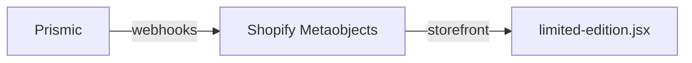
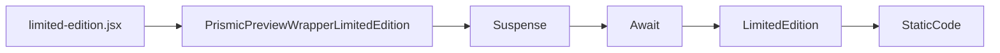

# Limited Edition

## Data Source

The data `Schema` for this interface is maintained in `Prismic`. It is synchronized to Shopify via `Prismic`'s `webhooks`, and then fetched using the `storefront API`. [#limited-edition](https://aftershockpc.prismic.io/builder/pages/ZUsBFRYAACYAGr4e?s=published)

The call structure is as follows:

## Component Reference Chain

>[!NOTE]
>Static HTML code can be injected on this page.

>[!NOTE]
>Plugin (Component) Documentation: [Suspense](https://react.dev/reference/react/Suspense), [react-loading-skeleton](https://github.com/dvtng/react-loading-skeleton), [Await](https://remix.run/docs/en/main/components/await)