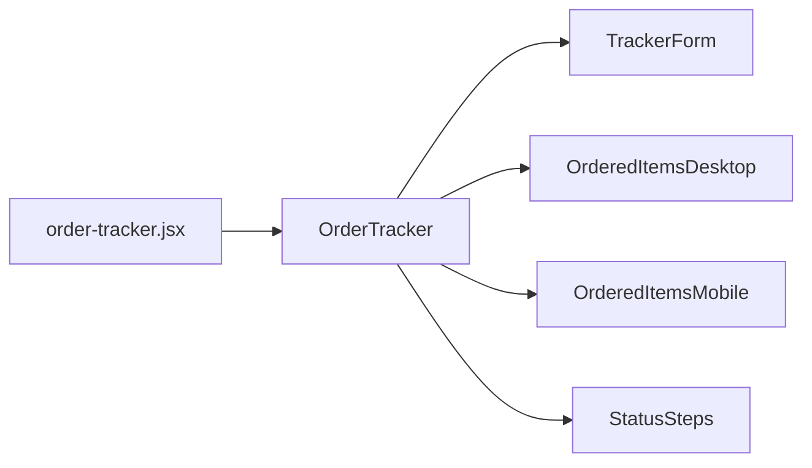

# Order Tracker

[[toc]]

Order Tracking Interface

## Data Source


## Component Reference Chain



>[!NOTE]
>The [Skeleton](https://github.com/dvtng/react-loading-skeleton) component is used here, which is a third-party component.

```bash
app\components\OrderTracker\index.jsx
app\components\OrderTracker\TrackerForm\index.jsx
```

### TrackerForm

- Logged-in State

    Query 100 orders immediately upon page load → Cache in frontend → Search within frontend when user searches.

    ```mermaid
        flowchart LR
        Enter Page --> Load First 100 --> Frontend Query --> Return Result
    ```

- Logged-out State

    User inputs order number and email → Click search → Call API /api/track-order.

    ```mermaid
        flowchart LR
        Enter Page --> OR[Order No] --> API
        Enter Page --> Email --> API

        API --> First 100 --> Frontend Query --> Return Result
    ```

>[!CAUTION]
>Currently, whether logged in or not, there is an issue: users can only search their order information from the first 100 orders. [View alternative solution](./suggestion#trackerform-defect).

### /api/track-order Interface

This interface is a custom interface. The business logic for this interface is located in the routes:

```bash
app\routes\api.track-order.jsx
```