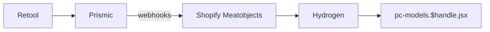
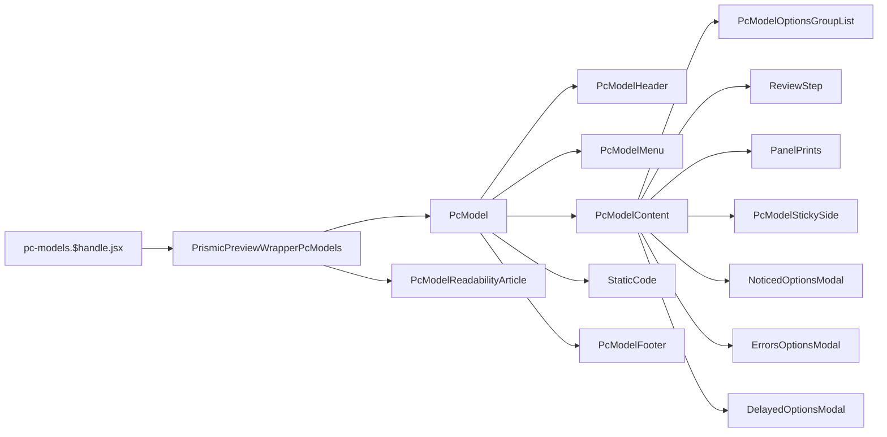

# Custom

[[toc]]

This interface primarily showcases `Aftershock`'s ability to customize products.

## Data Source

The data for pc-models is stored in `Retool`. However, after user operations in `Prismic`, it is synchronized to `Prismic`. Then, `Prismic` synchronizes it to `Shopify Metaobjects` via `webhooks`. Finally, the `Storefront API` is used to fetch the data into `Hydrogen` for rendering.



The `Prismic` data is used in the following places:

1. `Shopify Metaobjects` - `#custom_pc_search_cache`
2. `Shopify Metaobjects` - `#prismic_cache_pc_model_pages`
3. `Shopify Metaobjects` - `#prismic_cache_panel_prints`
4. `Shopify Metaobjects` - `#custom_pc_cache`
5. `Shopify Metaobjects` - `#prismic_cache_panel_prints`

```javascript
// pc-models.$handle.jsx
export async function loader({ params, context }) {
  const query = `
    query GetMetaobject($handle: MetaobjectHandleInput!) {
      metaobject(handle: $handle) {
        handle
        type
        fields {
          key
          value
        }
      }
    }
  `;
  const variables = {
    handle: {handle: params.handle, type: 'custom_pc_search_cache'},
  };

  const tempData = await fetchWithTimeout(// [!code error]
    context.storefront.query(query, {// [!code error]
      variables,// [!code error]
      cache: context.storefront.CacheLong(), //  [!code error]
    }), //  [!code error]
  ); // [!code error]
 // [!code error]
  if (  // [!code error]
    JSON.parse( // [!code error]
      tempData?.metaobject?.fields?.find((field) => field.key === 'data') // [!code error]
        ?.value, // [!code error]
    ).price >= 99999 // [!code error]
  ) { // [!code error]
    return redirect('/404'); // [!code error]
  } // [!code error]


  const prismicVariables = {
    handle: {handle: params.handle, type: 'prismic_cache_pc_model_pages'},
  };

  const tempPrismicData = await context.storefront.query(query, {
    variables: prismicVariables,
    cache: context.storefront.CacheShort(),
  });
}

async function loadCriticalData(params, context, prismicData) {
  const query = `
    query GetMetaobject($handle: MetaobjectHandleInput!) {
      metaobject(handle: $handle) {
        handle
        type
        fields {
          key
          value
        }
      }
    }
  `;

  const variables = {
    handle: {handle: params.handle, type: 'custom_pc_cache'},
  };

  const pcConfigVariables = {
    handle: {handle: 'pc-config', type: 'prismic_cache_global_data'},
  };

  // const prismicVariables = {
  //   handle: {handle: params.handle, type: 'prismic_cache_pc_model_pages'},
  // };

  const panelPrintsVariables = {
    handle: {handle: params.handle, type: 'prismic_cache_panel_prints'},
  };

  const [
    // prismicData,
    pcConfig,
    tempData,
    panelPrintsImages,
  ] = await Promise.allSettled([
    // fetchWithTimeout(
    //   storefront.query(query, {
    //     variables: prismicVariables,
    //     cache: storefront.CacheShort(),
    //   }),
    // ),
    fetchWithTimeout(
      storefront.query(GET_METAOBJECTS_BY_HANDLE, {
        variables: pcConfigVariables,
        cache: storefront.CacheShort(),
      }),
    ),
    fetchWithTimeout(
      storefront.query(query, {variables, cache: storefront.CacheLong()}),
    ),
    fetchWithTimeout(
      storefront.query(GET_METAOBJECTS_BY_HANDLE, {
        variables: panelPrintsVariables,
        cache: storefront.CacheShort(),
      }),
    ),
  ]);
}
```

>[!DANGER]
>Note that the red-marked code above indicates that if the price exceeds `99999`, it is considered out of the allowed range and is discarded.

### Actual Price and Compare-at Price Composition

`Base Price + Component Price`

```javascript
// pc-models.$handle.jsx
setDynamicPrice(basePrice + optionsPrice);
setDynamicCompareAt(baseCompareAt + optionsCompareAt);
```

### Custom Content Submission

- Step 1: Check if the product already exists, specifically if it contains the existing combination.
  - `Exists`: Check if the price matches the current one; if not, update the price. Then perform a search.
  - `Does Not Exist`: Create the product, then perform a search.

- Step 2: Return the existing product object and add it to the cart.

Three `APIs` are used here:
```bash
/api/searchProduct --> api.searchProduct.jsx
/api/updateProductPrice --> api.updateProductPrice.jsx
/api/createProduct --> api.createProduct.jsx
```

### Core Content

#### [Apollo](https://www.apollographql.com/docs/)

Since users do not have permission to create customized products independently, `Apollo` is used here to create a virtual admin, calling the `admin` service to perform create, update, and search operations.

This is quite innovative.

```javascript
import {ApolloClient, InMemoryCache, HttpLink} from '@apollo/client/core';

export const createAdminClient = (shopifyAdminURL, shopifyAccessToken) => {
  return new ApolloClient({
    link: new HttpLink({
      uri: shopifyAdminURL,
      headers: {
        'X-Shopify-Access-Token': shopifyAccessToken,
        'Content-Type': 'application/json',
        Accept: 'application/json',
        'User-Agent': 'MyApp/1.0',
      },
    }),
    cache: new InMemoryCache(),
  });
};
```

### Configuration Validation Logic

#### Inventory Check (Out of Stock)

- Check if there are out-of-stock components in the oosIds array.
- If yes, automatically jump to the configuration step of the first out-of-stock component.
- Add all out-of-stock components to noticedOptions to notify the user.
---
#### Error Deduplication Mechanism

- Use isDuplicateError to prevent duplicate errors.
- Compare based on specific error attributes (from, to, attrName, etc.).

#### Configuration Logic Check

---
- ##### Water Cooling System and GPU Customization Check

  - Check if a water-cooled CPU cooling system is selected.
  - Check if GPU customization is selected.
  - If GPU customization is selected but water cooling is not, suggest upgrading to water cooling.

- ##### High-Performance GPU Cable Prompt

  - Check if there is a GPU with power consumption >650W.
  - If there is a high-power GPU and no basic cable is selected, prompt that a cable sleeve is missing.

- ##### Operating System and RAM Compatibility

  - Check if the operating system supports sufficient RAM size.
  - Use TEMPLATES to generate standardized error messages.

- ##### Component Attribute Validation (Core Logic)

  - USB-C header missing prompt.
  - Motherboard heat sink and SSD cooling requirements.
  - Gen5 SSD speed limit check.
  - Performance prompt for pairing a low-end motherboard with a Gen5 SSD.

- ##### Custom Item Mutual Exclusion Check

  - Panel printing and Ultra-Labs customization cannot be selected simultaneously.

## Component Reference Chain



- PcModelReadabilityArticle: Hidden element for SEO purposes (hidden HTML).
- PcModelMenu: Sticky tabs effect.
- PcModelContent: Contains configuration options and other content.
- PcModelFooter: Form submission content.