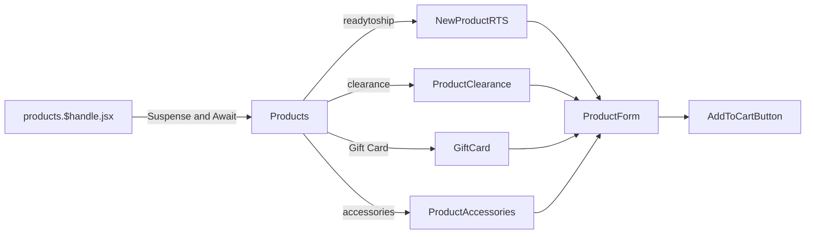
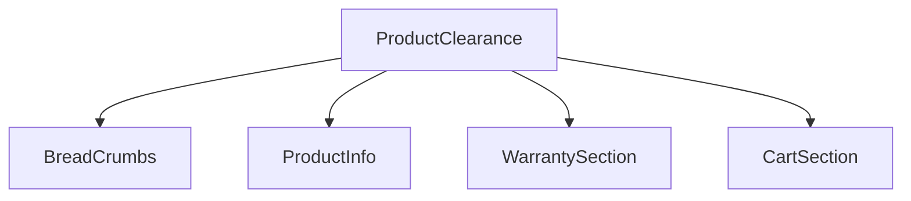
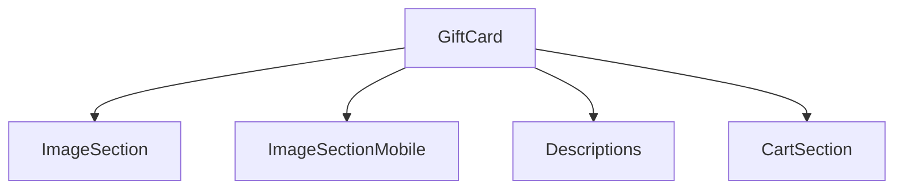
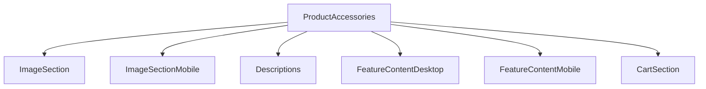

# Products Product Details Page

[[toc]]

This interface covers product information for pages such as `RTS`, `Workstation`, `Laptop`, and `Accessories`.

## Data Source

1. Fetch product information.

```javascript
// Fetch product information
async function loadCriticalData(context, params) {
  const { storefront } = context;
  const handle = params.handle; // Params from the address bar
  const variables = {
    productHandle: handle,
  };
  const productData = await storefront.query(PRODUCT_BY_HANDLE_QUERY, {
    variables,
    cache: storefront.CacheLong(), // Ensure fetching from cache
  });

  // Fetch FPS configuration, only valid for "ready to ship"
  let fpsAdminPerformance = [];
  if (productData.product.productType?.toLowerCase() === "ready to ship") {
    fpsAdminPerformance = await fetchRtsFpsFromAdmin(storefront, handle);
  }

  // ...
}
```

2. Fetch related information based on the product.
   - RTS
     - `Panel Print`,
     - `Disclaimer`,
     - `Configurates`,
     - `Design Promo Page`,
     - `Upsell Categories With Products`,
     - `RTS Bottom Banner`,
     - `Static Code`
   - Accessories
     - `variants`
     - `recommended builds`
     - `accessories`
3. Continue fetching and parsing/deconstructing other product-related information.
4. 😂 After a huge number of queries, it finally reaches the loader. This process is `quite overwhelming`!

>[!WARNING]
>The `toStaticCode` method needs optimization. [View optimization plan](./suggestion.md#tostaticcode-optimization-plan).

>[!DANGER]
>Strongly suggested: Separate business logic here for easier maintenance. The business code is quite daunting!! [Optimization suggestion](./suggestion.md#product-details-business-logic-optimization).

## Component Reference Chain

Components are distinguished and rendered based on the product's `productType`. Known `productType` values are:

- `readytoship`
- `clearance`
- `Gift Card`
- `accessories`

In the rendering logic, this is divided into several different pages and `abstracted` for processing.



```bash
app\components\Products\NewProductRTS\*
app\components\Products\ProductClearance\*
app\components\Products\GiftCard\*
app\components\Products\ProductsAccessories
```

>[!NOTE]
>The `Analytics` component is used here. [Documentation portal](https://shopify.dev/docs/api/hydrogen/2024-04/components/analytics/analytics-productview).

### Clearance

Only product information is passed, no bundles, directly added to cart and checkout.



### GiftCard



### ProductAccessories



### RTS Component Data Update Flow Diagram

#### Core Data Flow Architecture

```
┌─────────────────────────────────────────────────────────────────────────────┐
│                           NewProductRTS (Root Component)                    │
│                                                                             │
│  ┌─────────────────────┬─────────────────────┬──────────────────────┐      │
│  │   useState State    │     useRef Refs      │     Props Received     │      │
│  ├─────────────────────┼─────────────────────┼──────────────────────┤      │
│  │ • activeProducts    │ • leftColRef        │ • data              │      │
│  │ • selectedPc        │ • productDetailsRef │ • print             │      │
│  │ • selectedDesign    │ • headingRef        │ • disclaimer        │      │
│  │ • selectedStep      │ • reviewsWidgetRef  │ • fpsPerformance    │      │
│  │ • showCartMobile    │ • cartMobileRef     │ • configurates      │      │
│  │ • imgObj            │                     │ • designs           │      │
│  │ • cartAnimClass     │                     │ • upsellProductsNew │      │
│  │ • bttAnimClass      │                     │ • rtsBottomBanner   │      │
│  │ • cartRendered      │                     │ • staticCode        │      │
│  │ • bttRendered       │                     │                      │      │
│  │ • showBackToTop     │                     │                      │      │
│  └─────────────────────┴─────────────────────┴──────────────────────┘      │
└─────────────────────────────────────────────────────────────────────────────┘
                                  ↓ State Lifting
                                  ↓ Callback Passing
                                  ↓ Props Distribution
                                  │
┌─────────────────────────────────────────────────────────────────────────────┐
│                      Child Component Data Reception & Operations             │
└─────────────────────────────────────────────────────────────────────────────┘
                                  │
        ┌─────────────────────────┼─────────────────────────┐
        │                         │                         │
        ▼                         ▼                         ▼
┌───────────────┐       ┌──────────────────┐       ┌─────────────────┐
│ Configurator  │       │ Product Display  │       │ Cart &          │
│ Components    │       │ & Info Components │       │ Interaction     │
├───────────────┤       ├──────────────────┤       │ Components      │
│ • RtsConfigurator│       │ • ImageSection      │       ├─────────────────┤
│ • RtsDesktopSteps│       │ • InfoSection       │       │ • CartSection       │
│ • PcSummary      │       │ • StickyInfo        │       │ • CartSectionMobile │
│ • DesignSummary  │       │ • ProductDetails    │       │ • ScrollToTopButton │
│                 │       │ • ProductDetailsMobile│       │                     │
└───────────────┘       └──────────────────┘       └─────────────────┘
        │                         │                         │
        │                         │                         │
        ▼                         ▼                         ▼
┌─────────────────────────────────────────────────────────────────────────────┐
│                       UpsellProducts (Upsell Hub)                           │
│                                                                             │
│      ┌──────────────┬──────────────┬──────────────┬──────────────┐         │
│      │  Coolants    │   Bundles    │ CustomDesign │ Accessories  │         │
│      │  (Coolants)  │   (Bundles)  │  (CustomDesign)│  (Accessories) │         │
│      └──────────────┴──────────────┴──────────────┴──────────────┘         │
│                                                                             │
│  Receives: upsellProductsNew, activeProducts, setActiveProducts, setImgObj  │
│                                                                             │
│  Function: Categorically displays upsell products, provides add/remove      │
│            to cart functionality                                            │
└─────────────────────────────────────────────────────────────────────────────┘
```

#### Detailed Data Update Flow

##### 1. Cart Update Flow (Core Interaction)

```
User clicks "Add Product" → Triggers child component event
        ↓
Child component calls setActiveProducts([...activeProducts, newProduct])
        ↓
setActiveProducts updates NewProductRTS's activeProducts state
        ↓
React triggers NewProductRTS re-render
        ↓
All child components receiving activeProducts re-render:
    ┌─────────────────────┬─────────────────────┬─────────────────────┐
    │ UpsellProducts      │ CartSection         │ CartSectionMobile   │
    ├─────────────────────┼─────────────────────┼─────────────────────┤
    │ • Displays newly    │ • Updates cart      │ • Updates mobile    │
    │   added product     │   quantity          │   cart quantity     │
    │ • Updates selected  │ • Recalculates      │ • Recalculates      │
    │   state             │   total price       │   total price       │
    │                     │ • Shows latest      │ • Shows latest      │
    │                     │   product list      │   product list      │
    └─────────────────────┴─────────────────────┴─────────────────────┘
```

##### 2. RTS Configurator Flow

```
User selects PC config → RtsConfigurator component
        ↓
Calls setSelectedPc(newPc) and setActiveProducts([newPc])
        ↓
NewProductRTS updates selectedPc and activeProducts
        ↓
Re-render triggers:
    ┌─────────────────────┬─────────────────────┬─────────────────────┐
    │ PcSummary           │ RtsDesktopSteps     │ CartSection         │
    ├─────────────────────┼─────────────────────┼─────────────────────┤
    │ • Displays selected │ • Updates step      │ • Updates PC in cart│
    │   PC details        │   status            │ • Recalculates price│
    │ • Shows price &     │ • Highlights        │                     │
    │   specs             │   current step      │                     │
    └─────────────────────┴─────────────────────┴─────────────────────┘
        ↓
User selects design → Calls setSelectedDesign(newDesign)
        ↓
Re-render triggers DesignSummary to show design details
```

##### 3. Image Object Update Flow

```
User uploads image in CustomDesign
        ↓
CustomDesign calls setImgObj(newImgObj)
        ↓
NewProductRTS updates imgObj state
        ↓
Re-renders related components:
    ┌─────────────────────┬─────────────────────┐
    │ ImageSection        │ Other components    │
    ├─────────────────────┤ needing images      │
    │ • Displays custom   │ • Uses updated      │
    │   image             │   image object      │
    │ • Updates image     │                     │
    │   preview           │                     │
    └─────────────────────┴─────────────────────┘
```

##### 4. Scroll Interaction Flow

```
User scrolls the page
        ↓
useEffect listens to scroll events
        ↓
Calculates showCartMobile based on headingRef position
        ↓
Calculates showBackToTop based on pds-top-sentinel position
        ↓
Updates state triggers animations:
    ┌─────────────────────┬─────────────────────┐
    │ CartSectionMobile   │ ScrollToTopButton   │
    ├─────────────────────┼─────────────────────┤
    │ • Slide in/out      │ • Fade in/out       │
    │   animation         │   animation         │
    │ • Conditional       │ • Conditional       │
    │   rendering         │   rendering         │
    └─────────────────────┴─────────────────────┘
```

#### Data Flow Mapping Table

| Data State | Defined In | Main Users | Update Trigger | Affected Scope |
|------------|------------|------------|----------------|----------------|
| `activeProducts` | NewProductRTS | UpsellProducts, CartSection | setActiveProducts | Cart, total price, product list |
| `selectedPc` | NewProductRTS | RtsConfigurator, PcSummary | setSelectedPc | PC configurator, summary display |
| `selectedDesign` | NewProductRTS | RtsConfigurator, DesignSummary | setSelectedDesign | Design selector, summary display |
| `selectedStep` | NewProductRTS | RtsConfigurator, RtsDesktopSteps | setSelectedStep | Step navigation, UI state |
| `imgObj` | NewProductRTS | CustomDesign, ImageSection | setImgObj | Image display, custom design |
| `showCartMobile` | NewProductRTS | CartSectionMobile | Scroll listener | Mobile cart display |
| `showBackToTop` | NewProductRTS | ScrollToTopButton | IntersectionObserver | Back to top button |

#### Component Communication Matrix

```
┌─────────────────┬─────────────────────────────────────────────────────────────┐
│   Child Comp.   │           Parent State It Can Modify                        │
├─────────────────┼─────────────────────────────────────────────────────────────┤
│ RtsConfigurator │ • setSelectedPc    • setSelectedDesign                     │
│                 │ • setActiveProducts • setSelectedStep                      │
├─────────────────┼─────────────────────────────────────────────────────────────┤
│ UpsellProducts  │ • setActiveProducts (via child components)                 │
│   ├─ Coolants   │ • setActiveProducts                                        │
│   ├─ Bundles    │ • setActiveProducts                                        │
│   ├─ CustomDesign│ • setActiveProducts • setImgObj                           │
│   └─ Accessories│ • setActiveProducts                                        │
├─────────────────┼─────────────────────────────────────────────────────────────┤
│ CartSection     │ • setActiveProducts • setSelectedStep                      │
├─────────────────┼─────────────────────────────────────────────────────────────┤
│ CartSectionMobile│ • setActiveProducts • setSelectedStep                     │
└─────────────────┴─────────────────────────────────────────────────────────────┘
```

#### Key Data Flow Characteristics

##### 1. **Enhanced Unidirectional Data Flow**
```
Parent state → Props → Child component → Event → Callback → Update parent state
```

##### 2. **Centralized State Lifting**
- All shared states are defined in `NewProductRTS`
- Child components obtain data and update functions via props
- Avoids deep prop drilling issues

##### 3. **Real-time Synchronization Mechanism**
- Cart state updates immediately synchronized to all related components
- Configuration selections instantly reflected in summary and cart
- Scroll interactions provide immediate feedback

##### 4. **Layered Data Passing**
```
Products (Grandparent) → NewProductRTS (Parent) → UpsellProducts (Child) → Accessories (Grandchild)
    ↓                     ↓                     ↓                     ↓
Data preprocessing      State management      Data categorization    Specific operations
```

This architecture ensures:
1. **Data Consistency** - Single source of truth, avoiding state conflicts
2. **Maintainability** - Centralized state logic, easy to debug
3. **Scalability** - Adding new features only requires new states and callbacks
4. **Responsiveness** - Immediate user operation feedback, smooth experience

### Additional Notes

All product detail pages can inject static `HTML` to describe product content.