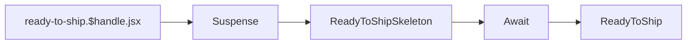
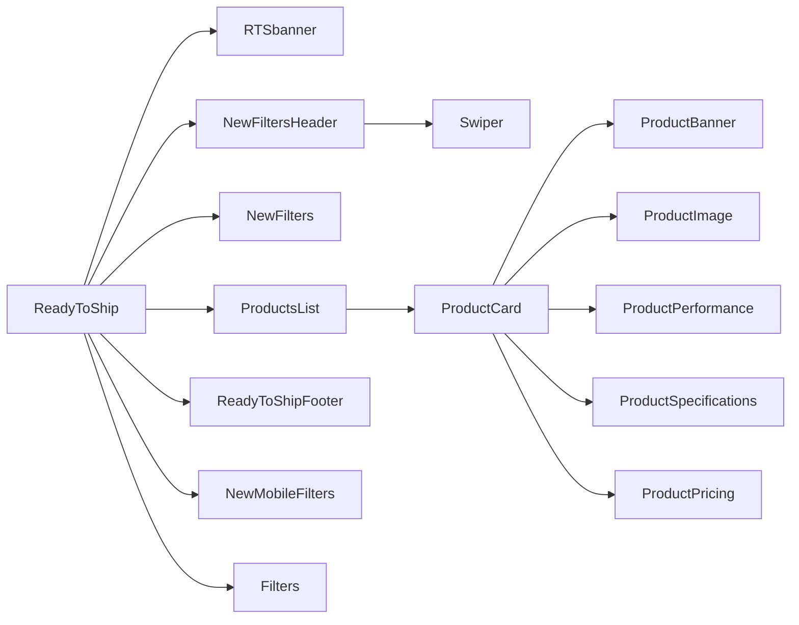

# Ready To Ship

[[toc]]

## Data Source

>[!DANGER]
>Note: The `handle` for RTS is maintained in `Shopify` Collections. The configuration format is `ready-to-ship/${handle}`.

RTS product data is fetched from Shopify as "in-stock" information, directly queried via `GraphQL` from `Shopify`.

> [!NOTE] 
> `Ready To Ship`, abbreviated as `RTS`, means "in stock".

Core Code

- Querying frame rate information

```javascript
// ready-to-ship.$handle.jsx loadCriticalData
const res = await storefront.query(GET_ADMIN_PANEL_METAOBJECTS, {
  variables: { type: "admin_panel_data", first: 10 },
  cache: storefront.CacheNone(),
});

const panelNode = res?.metaobjects?.nodes?.find(
  (n) => n?.handle === "rts-fps-managment" // [!code error]
);
```

> [!DANGER]
> The execution result of this code is problematic because the fetched data does not contain a `handle` field, which hinders subsequent business logic.

- Querying product information

```javascript
// Execute the first query to get the collection and metafields
const collectionData = await storefront.query(GetCollectionWithMetafields, {
  variables,
  cache: storefront.CacheLong(),
});

// Extract values from metafields, checking if the value is JSON
const metafieldValues = collectionData.collectionByHandle?.metafields
  ?.map((mf) => {
    if (!mf?.value) return [];

    try {
      // Check if the value is JSON (starts with [ or {)
      if (mf.value.trim().startsWith("{") || mf.value.trim().startsWith("[")) {
        const parsed = JSON.parse(mf.value);
        return Array.isArray(parsed) ? parsed : [parsed]; // Always an array
      } else {
        return []; // If it's just a string, ignore it
      }
    } catch (error) {
      console.error(`Error parsing metafield "${mf.key}":`, mf.value, error);
      return [];
    }
  })
  .flat() // Flatten the arrays
  .filter((id) => id?.startsWith("gid://shopify/Metaobject/")); // Keep only valid GIDs

// Query metaobjects by their GIDs
const metaobjectsData = await storefront.query(GetMetaobjectsByIds, {
  variables: { ids: metafieldValues },
  cache: storefront.CacheLong(),
});
```
This completes the query for product information.

>[!WARNING]
>Operations on arrays require significant optimization in the future, as this can noticeably improve performance.

## Component Reference Chain

Query based on the handle, then use `Suspense`, `Await`, `ReadyToShipSkeleton` components for skeleton screen, and finally render with the `ReadyToShip` component.



```bash
app\routes\ready-to-ship.$handle.jsx
```

>[!NOTE]
>Plugin (Component) Documentation: [Suspense](https://react.dev/reference/react/Suspense), [react-loading-skeleton](https://github.com/dvtng/react-loading-skeleton), [Await](https://remix.run/docs/en/main/components/await)

### ReadyToShip



```bash
app\components\ReadyToShip\RTSbanner\index.jsx
app\components\ReadyToShip\ProductCard\*
app\components\Shared\ReadyToShipFooter\*
app\components\Accessories\NewFilters\*
```