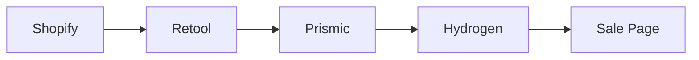
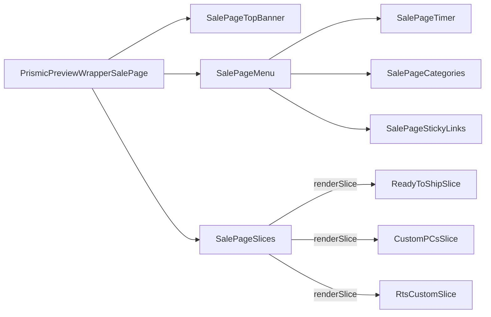

# Sale

[[toc]]

## Data Source

All data for this interface originates from `Prismic`. It uses a `schema` data template. Once configured, `Prismic` selects PC Models from [Retool](https://retool.com/).

>[!WARNING]
>It's still necessary to understand how to fetch PC Models from Retool.



```javascript
// app\routes\sale.$handle.jsx
const page = await prismicClient.getByUID("sale_page", handle, {
  ref: previewRef,
});
```

## Component Reference Chain



>[!NOTE]
>Here, the animation effects use [gsap.js](https://gsap.com/), and the results are quite beautiful.

```bash
app\components\PrismicPreviewModes\PrismicPreviewWrapperSalePage.jsx
app\components\SalePage\SalePageTopBanner\index.jsx
app\components\Slices\SalePageSlices\index.jsx
app\components\SalePage\SalePageMenu\SalePageTimer\index.jsx
app\components\SalePage\SalePageMenu\SalePageCategories\index.jsx
app\components\SalePage\SalePageMenu\SalePageStickyLinks\index.jsx
app\components\Slices\SalePageSlices\ReadyToShipSlice\index.jsx
app\components\Slices\SalePageSlices\CustomPCsSlice\index.jsx
app\components\Slices\SalePageSlices\RtsCustomSlice\index.jsx
```