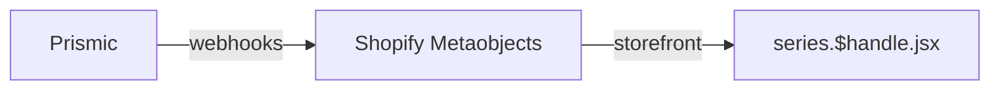
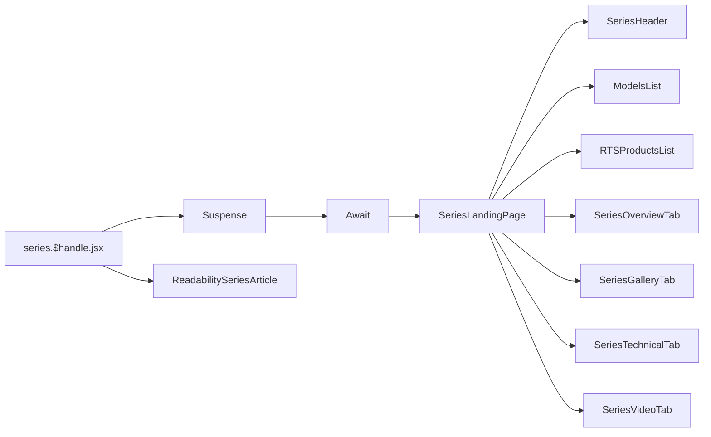

# Series (SLP)

[[toc]]

## 数据源

该界面的 `Schema` 数据结构在 `Prismic` 当中维护。

调用结构如下：



核心代码：

```javascript
// Загружаем данные из Shopify только если нет preview данных
export async function loader(args) {
  const { request, context, params } = args;
  let handle = params.handle;

  if (handle === "focus-pix4d") {
    handle = "photogrammetry";
  }
  const variables = {
    handle: {
      handle: "slp-" + handle,
      type: "prismic_cache_series_pages",
    },
  };
  
  // 调用的时候使用了缓存
  const result = await context.storefront.query(GET_METAOBJECTS_BY_HANDLE, {
    variables,
    cache: context.storefront.CacheShort(),
  });

  return {
    /** code */
  };
}
```

## 组件引用结构链

依据handle查询，之后使用 `Suspense`，`Await`，`SeriesSkeletons`，组件做骨架屏，而后使用 `SeriesLandingPage` 组件渲染。



>[!NOTE]
>插件（组件）文档传送门: [Suspense](https://zh-hans.react.dev/reference/react/Suspense)、[react-loading-skeleton](https://github.com/dvtng/react-loading-skeleton)、[Await](https://remix.org.cn/docs/en/main/components/await)

