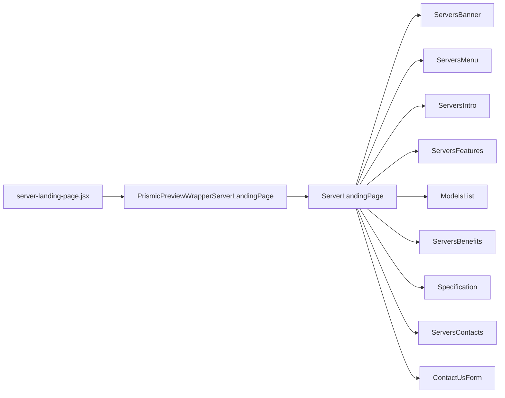

# Custom Servers

[[toc]]

This interface primarily displays customizable server information.

## Data Source


The data fetching here is quite interesting.

1. First request fetches from Prismic.
2. Data is cached in Hydrogen/Oxygen.
3. Subsequent requests fetch from cache.
4. Only fetch from Prismic API again after cache expires.

Here is the page information fetching:
```javascript
prismicData = await fetchWithCache({
  client,
  withCache,
  cacheKey: ['prismic-serverslp', 'server-landing-page'],
  cacheStrategy: storefront.CacheLong(),
  fetcher: () => client.getByUID('serverslp', 'server-landing-page'),
}).catch((error) => {
  console.error(
  'Error fetching server landing page data from Prismic:',
  error,
  );
  return null;
});
```

Here is the custom product information fetching, the specific code is similar to above:

```javascript
const featuresData = await fetchWithCache({
  client,
  withCache,
  cacheKey: ['prismic-pc-models-features', ...pcModelsFeaturesIds],
  cacheStrategy: storefront.CacheLong(),
  fetcher: () => client.getAllByIDs(pcModelsFeaturesIds),
}).catch((error) => {
  console.error(
    'Error fetching PC models features data from Prismic:',
    error,
  );
  return null;
});
```

Finally, use `Promise.all` to fetch all product lists.

```javascript
const pcModelsRedisData = await Promise.all(
  pcModelsSlugs.map(async (slug) => {
    try {
      const response = await storefront.query(query, {
        variables: {
          handle: {
            handle: slug,
            type: 'custom_pc_cache',
          },
        },
        cache: storefront.CacheLong(),
      });

      if (!response?.metaobject?.fields) {
        console.warn(`No fields found for slug: ${slug}`);
        return null;
      }

      return JSON.parse(response.metaobject.fields[1].value);
    } catch (error) {
      console.error(`Error fetch metaobject для slug: ${slug}`, error);
      return null;
    }
  }),
);
```

>[!DANGER]
>**A forced solution**: There's no way to get the product list via `handles`. Another method is to fetch all at once and filter using the `filter` method. But that also seems quite costly.

>[!NOTE]
>😒 The `withCache.run` method is used here; haven't found the documentation yet.

## Component Reference Chain

