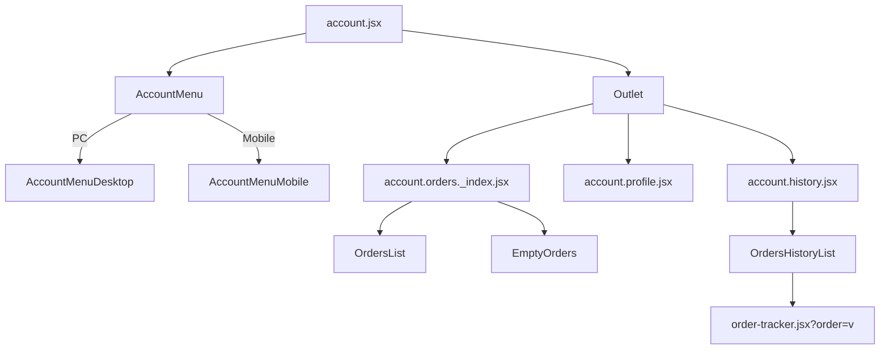

# My Account

[[toc]]

User Personal Center

> [!DANGER]
> This interface can only be viewed and operated when the user is logged in.

## Data Source

The data for this interface is queried from the Shopify Storefront API to fetch user data.

1. Query current user information when the interface initializes.
   ```javascript
   // account.jsx core code
   export async function loader({ context }) {
     const response = await context.storefront.query(CUSTOMER_DETAILS_QUERY, {
       variables: { customerAccessToken },
     });
   }
   ```
2. The current user's order information is included in the initial interface data.
3. Re-fetch user's personal information when switching interfaces; it can be edited.
   ```javascript
   // account.profile.jsx data fetching code
   export async function action({ request, context }) {
     const response = await storefront.query(CUSTOMER_DETAILS_QUERY, {
       variables: { customerAccessToken },
     });
   }
   ```
4. Fetch user's historical order information when switching interfaces.
   ```javascript
   // account.history.jsx
   const response = await storefront.query(CUSTOMER_ORDERS_QUERY, {
     variables: {
       customerAccessToken,
       first,
       after,
     },
   });
   ```

>[!WARNING]
>Can the `Outlet` component cache user's personal information to avoid repeated calls?

## Component Reference Chain



This interface uses the `Outlet` loading technique.

> [!NOTE] 
>Direct link to [Outlet](https://remix.run/docs/en/main/components/outlet) documentation. Provides context values for the element tree under the outlet. Used when a parent route needs to provide values to child routes.

```bash
app\routes\account.jsx
app\components\Account\AccountMenu\AccountMenuDesktop\index.jsx
app\components\Account\AccountMenu\AccountMenuMobile\index.jsx
app\routes\account.orders._index.jsx
app\components\Account\OrdersList\index.jsx (EmptyOrders)
app\routes\account.history.jsx
app\components\Account\OrdersHistoryList\index.jsx
```