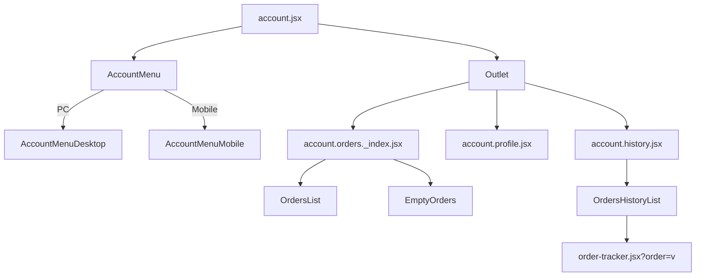

# My Account

[[toc]]

用户个人中心

> [!DANGER]
> 该界面只有用户登录状态下才可以查看和操作。

## 数据源

该界面的数据是从 Shopify Storefront Api 中查询用户的数据。

1. 界面初始化时查询当前用户的信息
   ```javascript
   // account.jsx 核心代码
   export async function loader({ context }) {
     const response = await context.storefront.query(CUSTOMER_DETAILS_QUERY, {
       variables: { customerAccessToken },
     });
   }
   ```
2. 当前用户的订单信息包含在界面初始化的信息当中。
3. 界面切换时重新获取用户的个人信息，可编辑。
   ```javascript
   // account.profile.jsx 拉取数据代码
   export async function action({ request, context }) {
     const response = await storefront.query(CUSTOMER_DETAILS_QUERY, {
       variables: { customerAccessToken },
     });
   }
   ```
4. 界面切换时获取用户的历史订单信息
   ```javascript
   // account.history.jsx
   const response = await storefront.query(CUSTOMER_ORDERS_QUERY, {
     variables: {
       customerAccessToken,
       first,
       after,
     },
   });
   ```

>[!WARNING]
>`Outlet` 组件是否可以缓存用户的个人信息，这样可以避免重复调用。

## 组件引用结构链



该界面使用了 `Outlet` 的加载技术。

> [!NOTE] 
>[Outlet](https://remix.org.cn/docs/en/main/components/outlet) 文档地址直通车。为 outlet 下面的元素树提供上下文值。当父路由需要向子路由提供值时使用。

```bash
app\routes\account.jsx
app\components\Account\AccountMenu\AccountMenuDesktop\index.jsx
app\components\Account\AccountMenu\AccountMenuMobile\index.jsx
app\routes\account.orders._index.jsx
app\components\Account\OrdersList\index.jsx(EmptyOrders)
app\routes\account.history.jsx
app\components\Account\OrdersHistoryList\index.jsx
```
