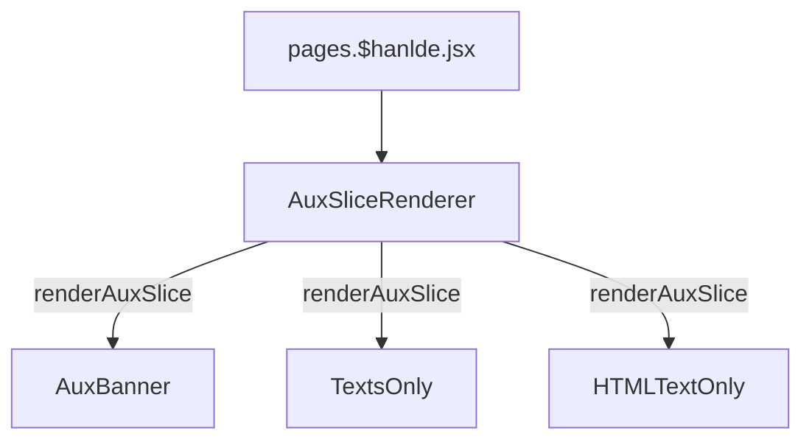

# Warranty

## 数据源

数据源在Prismic当中。[`#aux-warranty`](https://aftershockpc.prismic.io/builder/pages/YGULLxAAACMAJgbx?s=published)

## 组件引用结构链



```bash
app\components\Slices\AuxPagesSlices\AuxBanner\index.jsx
app\components\Slices\AuxPagesSlices\TextsOnly\index.jsx
app\components\Slices\AuxPagesSlices\HTMLTextOnly\index.jsx
```
