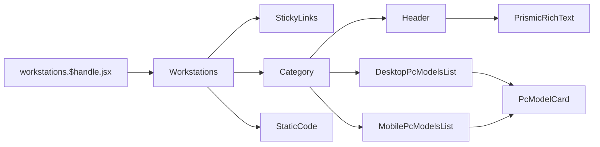

# Workstations

[[toc]]

This interface primarily displays custom collection products related to `workstations`.

## Data Source

The Schema data model for this interface is completed in `Prismic`, then updated to `Shopify Metaobjects` via Prismic's `webhook`, and finally fetched using the `Storefront API`. It is then rendered using `Remix+React`.


### 1. First, fetch the Prismic-cached page data.

```javascript
const variables = {
  handle: {
    handle: "ws-" + params.handle,
    type: "prismic_cache_workstations_page",
  },
};

const tempData = await storefront.query(GET_METAOBJECTS_BY_HANDLE, {
  variables,
  cache: storefront.CacheShort(),
});
```

### 2. Fetch all PC Models.

```javascript
async function loadCriticalData(context, params, prismicData, previewData) {
  fetchAllPcModels();
}
```

### 3. Fetch all corresponding Features Lists using Promise.all.

The `loadCriticalData` method is generally a helper data-loading function for `loader` in this project.

```javascript
async function loadCriticalData(context, params, prismicData, previewData) {
  const METAOBJECT_QUERY = `
      query GetMetaobject($handle: MetaobjectHandleInput!) {
        metaobject(handle: $handle) {
          fields {
            key
            value
          }
        }
      }
    `;
  fetchFeaturesForModels();
}
```

> [!DANGER] 
>The `fetchFeaturesForModels` method uses `Promise.all` to load all relevant `models` data. Currently, it uses the `METAOBJECT_QUERY` query method, which could be replaced with `metaobjects`. [**View alternative solution**](./suggestion.md#workstations-page-fetchfeaturesformodels-method-alternative) 😘

## Component Reference Chain

