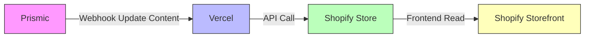

# AftershockPC-AU-Hydrogen

[[toc]]

## Overview

This project is based on `Shopify Hydrogen` + `Remix + React`, combined with various modern frontend tools and third-party services, to achieve a high-performance, scalable e-commerce frontend development experience.

## Project Tools

### [Prismic](https://prismic.io/)

`Prismic` is a Content Management System (CMS) that can integrate with `Shopify` via `API` to combine content with e-commerce functionality.

If we compare the entire digital store to a physical store, `Shopify` is the backend warehouse, cash register, and inventory system, ensuring efficient and reliable transactions; while `Prismic` is the front window design, product display, and shopping guide manual, responsible for attracting customers, telling brand stories, and enhancing the experience. The two work together to create a store that is both beautiful and sells well.

### [Vercel](https://vercel.com/)
### [Shopify Store](https://admin.shopify.com/store/aftershockpcau)
### [Shopify Storefront API](https://shopify.dev/docs/api/storefront/latest)

## Project Tools Relationship Diagram




## NodeJS Environment Requirements

Currently using `v22.21.0`.

``` json
"engines": {
  "node": ">=18.0.0"
}

```

## Quick Start

>[!NOTE]
>[Official Quick Start](https://shopify.dev/docs/storefronts/headless/hydrogen/getting-started)

### 1. First, link to Shopify.
``` bash
npx shopify hydrogen link
```
### 2. Run the start command.
``` bash
npm run dev
```

### 3. Deploy to Oxygen.
```bash
npx shopify hydrogen deploy
```

>[!WARNING]
>😒 Currently unsure how to deploy to the staging server.

## Development Tools

Recommended to use `VSCode`.