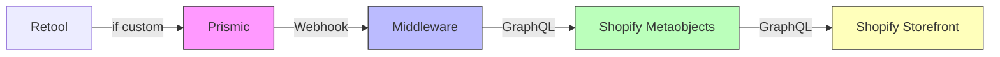

# AftershockPC-AU-Hydrogen

[[toc]]

## Overview

This project is based on `Shopify Hydrogen` + `Remix + React`, combined with various modern frontend tools and third-party services, to achieve a high-performance, scalable e-commerce frontend development experience.

## Tools Used in the Project

Before diving into development and exploration, it's essential to understand the tools used in the project and their purposes to grasp the project's structure.

### [Prismic CMS](https://prismic.io/)

`Prismic` is a Content Management System (CMS) that integrates with `Shopify` via `API` to combine content with e-commerce functionality. Currently, the original layout data for Aftershock is stored here.

>[!IMPORTANT]
> **Operations**: Create, update, and publish web pages using the page builder.
>
> **Developers**: Configure website pages, slices, and fields.

### Middleware

To sync page data generated by `Prismic` to `Shopify Metaobjects`, the original development team deployed a NestJS (Node.js-based) project on [`Vercel`](https://vercel.com/) as middleware. This project receives data from `webhook` calls and transmits it to `Shopify` via the `Shopify Admin API`. **Currently under exploration...**

>[!TIP]
> Think of it as a relay station for transferring data from `Prismic` to `Shopify`.

>[!DANGER]
> 😒 The source code for this project has not been obtained yet.

### Retool

One of the standout features of Aftershock is the ability to customize your PC. This requires a place to store the customization data, which is where `Retool` comes in. When creating customization data for a PC in Prismic, it is created as a slice and bound to the PC Models page as one of the list elements. Prismic then updates the data to Shopify's Metaobjects via Webhooks to ensure data security. Finally, Hydrogen fetches this data.


### [Shopify Metaobjects](https://admin.shopify.com/store/aftershockpcau)

Metaobjects = "Custom Data Models" in Shopify.

>[!IMPORTANT]
> You can think of it as:
>
> A "no-code CMS data modeling system" provided by Shopify, used to create data tables of any structure (similar to Prismic, Sanity, Notion Database, Strapi).

### [Shopify Storefront API](https://shopify.dev/docs/api/storefront/latest)

The `Storefront API` is accessed via `GraphQL` to fetch relevant data from `Shopify`, such as `Metaobjects`, `RTS`, and other data.

## Relationship Diagram of Tools



## NodeJS Environment Requirements

Currently using `v22.21.0` locally.

``` json
"engines": {
  "node": ">=18.0.0"
}

```

## Quick Start

>[!NOTE]
> [Official Quick Start](https://shopify.dev/docs/storefronts/headless/hydrogen/getting-started)

### 1. Link to Shopify

Why is this step placed first? Because you never know when the connection to Shopify might break, and you might lose global variables, which can be problematic. So, if unsure, bind the project before running it.

``` bash
npx shopify hydrogen link
```

### 2. Run the Start Command


``` bash
npm run dev
```

### 3. Deploy to Oxygen

```bash
npx shopify hydrogen deploy
```

>[!WARNING]
> 😒 Currently unsure how to deploy to the staging server.

## Development Tools

It is recommended to use `VSCode`.